cartographer系统集成

# 背景介绍

## 项目背景

    本人是图像处理专业的研究生，具有多年的slam的工作经验，所在的项目组家扫出货量超过10000台，商扫出货量超过100台。在复杂场景，SLAM系统长时间高强度的稳定运行，表现出较好的鲁棒性。
    
    随着激光性能的提升和成本的降低，cartographer在室内2D环境，成为室内机器人的主流slam软件。但是其在工程上具有很高的集成难度，不易上手，也不易修改。为此，我们做一个理论的教学视频，使初学者可以快速学习slam原理；同时大幅删节冗余部分，去除不必要的依赖库，减少编译难度；并且优化性能，在非常低端的设备上实现较为复杂功能。
    
    最后一章也将对行业痛点，几个难题进行收录和探讨，部分已经解决的问题将公布源代码。我们也将建立讨论小组共同研究进步。
    
    本教学视频，所有课件和源代码会同步到github和gitee上。
    
    码云的下载地址为：https://gitee.com/slam-xiay/cartographer.git
    
    GitHub的下载地址为：https://github.com/slam-xiay/cartographer.git

# 平台搭建

## 平台目标

    目标硬件平台是rk3326,rk3399或rk3588，目标的软件平台为ubuntu20.04。为了方便今后的交叉编译，使用docker作为虚拟机，使用ubuntu 20.04作为系统，使用linux/arm64/v8平台。进行数据保存与码云服务器进行同步。每次工作均保存成一个commit进行上传。

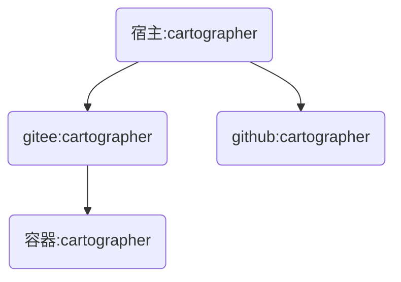

## docker安装

在宿主ubuntu20.04安装docker

```
sudo apt-get update 
sudo apt-get install docker-ce docker-ce-cli containerd.io docker-buildx-plugin docker-compose-plugin
service docker restart
```

使用命令查看docker的状态

```
xiay@xiay:~$ docker ps -a
CONTAINER ID   IMAGE          COMMAND       CREATED        STATUS                  PORTS                                           NAMES
4c6e47dc5943   ubuntu:20.04   "/bin/bash"   19 hours ago   Up 5 hours              0.0.0.0:11311->11311/tcp, :::11311->11311/tcp   slam
693a00d93625   f78909c2b360   "/bin/bash"   2 months ago   Exited (0) 4 days ago                                                   ubuntu20
xiay@xiay:~$ docker images -a
REPOSITORY                   TAG       IMAGE ID       CREATED         SIZE
arm64v8/ubuntu               20.04     3048ba078595   6 weeks ago     65.7MB
ubuntu                       20.04     3048ba078595   6 weeks ago     65.7MB
dockcross/linux-arm64        latest    b926af811944   3 months ago    2.08GB
ubuntu                       <none>    fde9c12d7d3f   3 months ago    65.7MB
<none>                       <none>    f78909c2b360   3 months ago    72.8MB
bestwu/wechat                latest    0f0d1eee0079   7 months ago    2.87GB
ubuntu                       22.04     c6b84b685f35   7 months ago    77.8MB
ubuntu                       latest    c6b84b685f35   7 months ago    77.8MB
ubuntu                       <none>    6df894023726   8 months ago    72.8MB
multiarch/qemu-user-static   latest    3539aaa87393   14 months ago   305MB
```

## 容器配置

选择20.04的镜像，arm64v8的平台，平台需要自带gitlab。

```
docker run --rm --privileged multiarch/qemu-user-static --reset -p yes
```

```
docker run \
 -itd  \
 --restart always \
 --privileged=true \
 --name slam \
 --platform linux/arm64/v8 \
 ubuntu:20.04
```

通过attach命令进入容器。

```
$ sudo docker attach slam
$ sudo docker exec -it slam /bin/bash
```

查看服务器架构，确认是arm架构

```
root@78052cf4cba4:/# uname -m
aarch64
```

## 基础包安装

```
apt-get update
apt-get install sudo ssh vim wget g++ cmake git
wget http://fishros.com/install -O fishros && . fishros
```

选择换源并安装ros1

```
RUN Choose Task:[请输入括号内的数字]
---众多工具，等君来用---
ROS相关:
  [1]:一键安装(推荐):ROS(支持ROS/ROS2,树莓派Jetson)
  [3]:一键安装:rosdep(小鱼的rosdepc,又快又好用)
  [4]:一键配置:ROS环境(快速更新ROS环境设置,自动生成环境选择)
  [9]:一键安装:Cartographer(18 20测试通过,16未测. updateTime 1
  20240125)
  [11]:一键安装:ROS Docker版(支持所有版本ROS/ROS2)
  [16]:一键安装：系统自带ROS (！！警告！！仅供特殊情况下使用)
常用软件:
  [2]:一键安装:github桌面版(小鱼常用的github客户端)
  [6]:一键安装:NodeJS环境
  [7]:一键安装:VsCode开发工具
  [8]:一键安装:Docker
  [10]:一键安装:微信(可以在Linux上使用的微信)
  [12]:一键安装:PlateformIO MicroROS开发环境(支持Fishbot)
  [14]:一键安装:科学上网代理工具
  [15]:一键安装：QQ for Linux
配置工具:
  [5]:一键配置:系统源(更换系统源,支持全版本Ubuntu系统)
  [13]:一键配置:python国内源
[0]:quit
请输入[]内的数字以选择:1

RUN Choose Task:[请输入括号内的数字]
新手或首次安装一定要一定要一定要换源并清理三方源，换源!!!系统默认国外源容易失败!!
[1]:更换系统源再继续安装
[2]:不更换继续安装
[0]:quit
请输入[]内的数字以选择:1

RUN Choose Task:[请输入括号内的数字]
请选择换源方式,如果不知道选什么请选2
[1]:仅更换系统源
[2]:更换系统源并清理第三方源
[0]:quit
请输入[]内的数字以选择:2

RUN Choose Task:[请输入括号内的数字]
请选择你要安装的ROS版本名称(请注意ROS1和ROS2区别):
[1]:noetic(ROS1)
[2]:foxy(ROS2)
[3]:galactic(ROS2)
[4]:rolling(ROS2)
[0]:quit
请输入[]内的数字以选择:1

RUN Choose Task:[请输入括号内的数字]
请选择安装的具体版本(如果不知道怎么选,请选1桌面版):
[1]:noetic(ROS1)桌面版
[2]:noetic(ROS1)基础版(小)
[0]:quit
请输入[]内的数字以选择:2

Please select the geographic area in which you live. Subsequent configuration questions will narrow this down by presenting a list of cities, representing the time zones in which they are located.
6. Asia 
Geographic area: 6

Please select the city or region corresponding to your time zone.
70. Shanghai 
Time zone: 70
```

使用roscore命令判断是否装好ros

```
root@44cf1a96d70f:/# roscore
.. logging to /root/.ros/log/3d872440-f0cd-11ee-bbc2-8df8ab58e450/roslaunch-44cf1a96d70f-21762.log
Checking log directory for disk usage. This may take a while.
Press Ctrl-C to interrupt
Done checking log file disk usage. Usage is <1GB.

started roslaunch server http://44cf1a96d70f:40561/
ros_comm version 1.16.0
```

修改宿主的~/.bashrc

```
export ROS_MASTER_URI=http://172.17.0.2:11311
```

然后激活环境变量

```
source ~/.bashrc
```

用rostopic查看

```
(base) xiay@xiay:~$ rostopic list
/rosout
/rosout_agg
```

可以看到东西说明，环境配置成功。

## 安装cartographer

官网链接

https://google-cartographer.readthedocs.io/en/latest/

```
cd ~
apt-get install git
git clone https://github.com/cartographer-project/cartographer.git
```

生成公钥，在码云和github空间设置公钥

```
root@8792bb9a3467:~/cartographer# ssh-keygen           
Generating public/private rsa key pair.
Enter file in which to save the key (/root/.ssh/id_rsa): 
Created directory '/root/.ssh'.
Enter passphrase (empty for no passphrase): 
Enter same passphrase again: 
Your identification has been saved in /root/.ssh/id_rsa
Your public key has been saved in /root/.ssh/id_rsa.pub
The key fingerprint is:
SHA256:21UbEjBTxYUpAnKbWTRHt0Wl/VEiCJVfbT88ROtw2PY root@8792bb9a3467
The key's randomart image is:
+---[RSA 3072]----+
|      . +=O**o=BB|
|       o =+=.+BB=|
|        +  o.=BBo|
|            .o=*=|
|        S   . ..E|
|         o .     |
|        . .      |
|                 |
|                 |
+----[SHA256]-----+
root@8792bb9a3467:~/cartographer# cat ~/.ssh/id_rsa.pub 
ssh-rsa AAAAB3NzaC1yc2EAAAADAQABAAABgQDJ6IAaW2TlQBpehHeJY5TGglYK+DKRZ05FLqYFQyxQ9K9MZQV0+h6gSIrrb0Fkq8vtLw5eN8vGTanCGUY5VhutHSV/hsvYCkpD+ZV71v38yH5lokQivwPEmtS4ST+4a+TgWWCNPrIJGwOlzZbOcW7Lh0NcyERgcr53OLK8i32wdDHbBJ7fpGCsxnfsD1bfw8exrxV0TqbkNK2nB5tLC0l3h2QdmwBNCBIR63iIDuhxzHwSwS7WnW8pgYebIOIGiJTgFjSo3ijVXkiVUCRQK9uOl5zWferxGCj6LxYiS/prAWM5DAxyW19fC6yy3HKsGILpWAcnsrALVgGMh6j6iFhvH4KJy9kyy7iDxVDAuSXEWmCgIuzlYp85JPryMUDcoGEcu29qoUXy1nSw9ucIcgQ6+6plpTN/Vmr/kl6FKJpEOPeUev8UUHrzXsObpcwPm6rgFtHM+98E5NWNJGg2j68Gl69vmJCNW/5BtMCt935N+DWDRoseH5TEqpWmKEElB10= root@8792bb9a3467
```

把打印的内容复制填入github的ssh公钥。

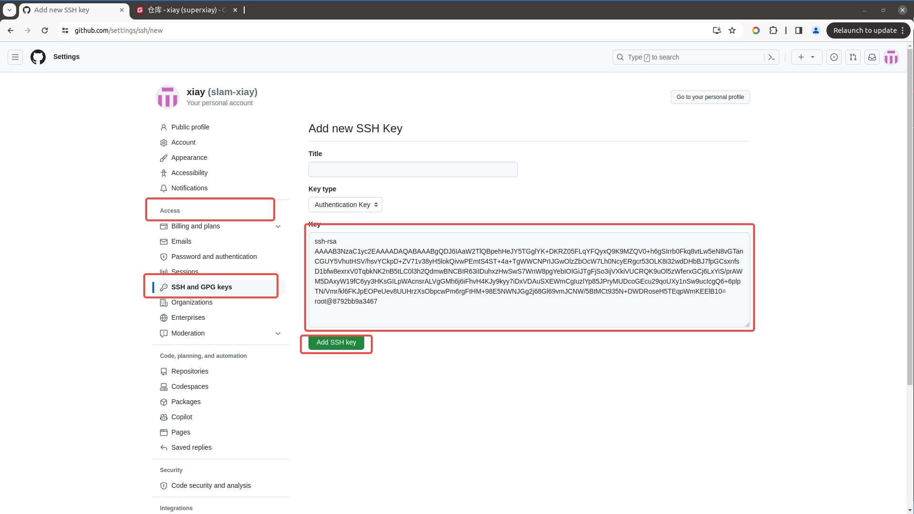

把打印的内容复制填入gitee的ssh公钥

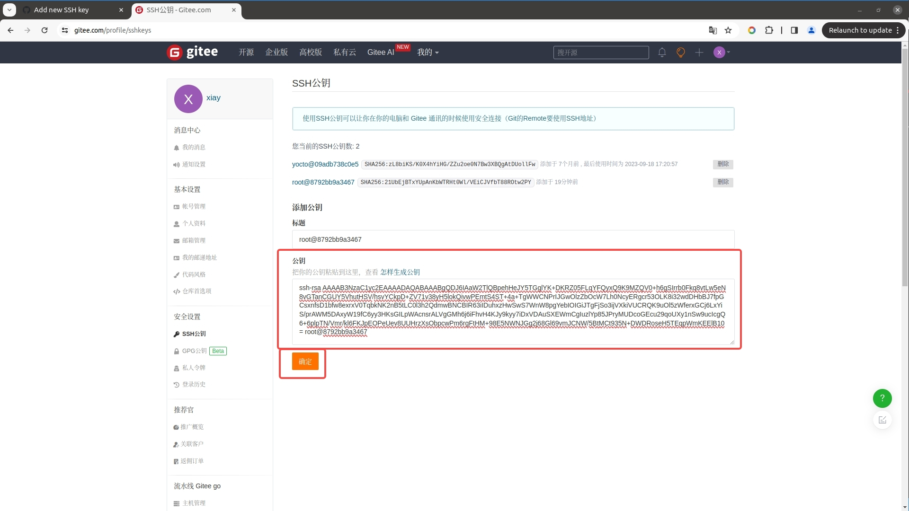

通过git remote 命令修改两个源的位置

```
git remote set-url origin git@gitee.com:slam-xiay/cartographer.git
git remote set-url github git@github.com:slam-xiay/cartographer.git
git remote add github git@github.com:slam-xiay/cartographer.git
```

通过remote -v查看两个源的位置

```
root@8792bb9a3467:~/cartographer# git remote -v
github	git@github.com:slam-xiay/cartographer.git (fetch)
github	git@github.com:slam-xiay/cartographer.git (push)
origin	git@gitee.com:slam-xiay/cartographer.git (fetch)
origin	git@gitee.com:slam-xiay/cartographer.git (push)
```

修改权限后上传

```
root@44cf1a96d70f:~/cartographer# git push -f origin master
root@44cf1a96d70f:~/cartographer# git push -f github master
```

## 配置ssh

目的是宿主通过ssh登录docker容器不需要密码

安装配置ssh

```
sudo apt-get install ssh openssh-server openssh-client
sed -i "s/#PubkeyAuthentication/PubkeyAuthentication/g" /etc/ssh/sshd_config
sed -i "s/#uthorizedKeysFile/uthorizedKeysFile/g" /etc/ssh/sshd_config
mkdir -p /root/.ssh/
ssh-keygen
service ssh restart
```

在宿主生成公钥

```
ssh-keygen
```

在宿主打印公钥

```
cat ~/.ssh/id_rsa.pub
```

复制宿主的公钥到容器的/root/.ssh/authorized_keys

通过ssh免秘钥登录主机

```
ssh root@172.17.0.2
```

## 编译脚本

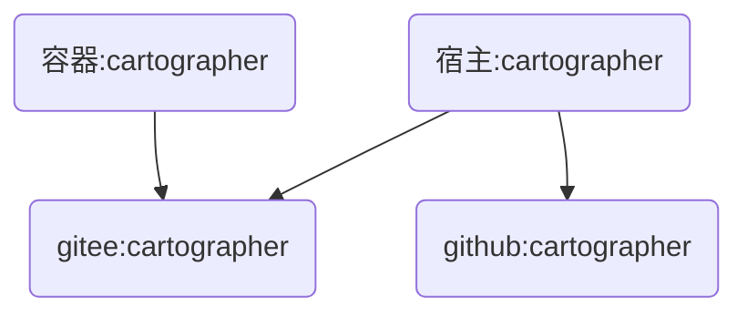

工作下载和使用就略过了，我们在宿主主机下载一个备份

```
cd ~
mkdir -p gamma
cd gamma 
git clone https://gitee.com/slam-xiay/cartographer.git
cd cartographer
```

新建一个build.sh

```
touch build.sh
chmod +x ./build.sh 
```

编辑build.sh内容

业务流程如下

```
确保docker开启，ssh开启。
上传宿主的cartographer内容到gitee服务器。
登录容器的cartographer，下载gitee服务器的cartographer。
编译容器的cartographer。
```

由于我们还没有先对cartographer进行编译和精简，后续未完成的流程等ros接口那个章节再补充。

```
docker start slam
docker exec slam service ssh start

reset
pushd ~/gamma/cartographer/
git add .
git commit -m "modify cartographer"
git push origin master -f
popd

ssh root@172.17.0.2 'cd /root/gamma/cartographer/ &&git reset --hard origin/master && git pull origin master && sync'
ssh root@172.17.0.2 'rm /root/gamma/cartographer/build/libcartographer.a && sync'
ssh root@172.17.0.2 'cd /root/gamma/cartographer/build && cmake .. && make -j16 install'
```

这个编译完是这个效果则表示编译成功

```
~/gamma/cartographer ~/gamma/cartographer
On branch master
Your branch is up to date with 'origin/master'.

nothing to commit, working tree clean
Everything up-to-date
~/gamma/cartographer
HEAD is now at cea9da4 modify cartographer
From https://gitee.com/slam-xiay/cartographer
 * branch            master     -> FETCH_HEAD
Already up to date.
/usr/bin/rm: cannot remove '/root/gamma/cartographer/build/libcartographer.a': No such file or directory
-- The CXX compiler identification is GNU 9.4.0
-- Check for working CXX compiler: /usr/bin/c++
-- Check for working CXX compiler: /usr/bin/c++ -- works
-- Detecting CXX compiler ABI info
-- Detecting CXX compiler ABI info - done
-- Detecting CXX compile features
-- Detecting CXX compile features - done
-- Build type: Release
Files /root/gamma/cartographer/build/AllFiles.cmake and - differ
CMake Warning at /usr/src/googletest/googlemock/CMakeLists.txt:43 (project):
  VERSION keyword not followed by a value or was followed by a value that
  expanded to nothing.


CMake Warning at /usr/src/googletest/googletest/CMakeLists.txt:54 (project):
  VERSION keyword not followed by a value or was followed by a value that
  expanded to nothing.


-- Found PythonInterp: /usr/bin/python3.8 (found version "3.8.10") 
-- Looking for pthread.h
-- Looking for pthread.h - found
-- Performing Test CMAKE_HAVE_LIBC_PTHREAD
-- Performing Test CMAKE_HAVE_LIBC_PTHREAD - Failed
-- Looking for pthread_create in pthreads
-- Looking for pthread_create in pthreads - not found
-- Looking for pthread_create in pthread
-- Looking for pthread_create in pthread - found
-- Found Threads: TRUE  
-- Found GMock: gmock_main;-lpthread  
CMake Error at CMakeLists.txt:32 (find_package):
  By not providing "Findabsl.cmake" in CMAKE_MODULE_PATH this project has
  asked CMake to find a package configuration file provided by "absl", but
  CMake did not find one.

  Could not find a package configuration file provided by "absl" with any of
  the following names:

    abslConfig.cmake
    absl-config.cmake

  Add the installation prefix of "absl" to CMAKE_PREFIX_PATH or set
  "absl_DIR" to a directory containing one of the above files.  If "absl"
  provides a separate development package or SDK, be sure it has been
  installed.


-- Configuring incomplete, errors occurred!
See also "/root/gamma/cartographer/build/CMakeFiles/CMakeOutput.log".
See also "/root/gamma/cartographer/build/CMakeFiles/CMakeError.log".
```

纯净的cartographer是没有gtest、gmock、absl库。

我们在.gitignore补充一些文件，让我们本地的vscode配置不影响库文件

```
build
bazel-*
.vscode
.bazelci
settings.json
```

做好这些以后，用vscode打开cartographer，并保存。

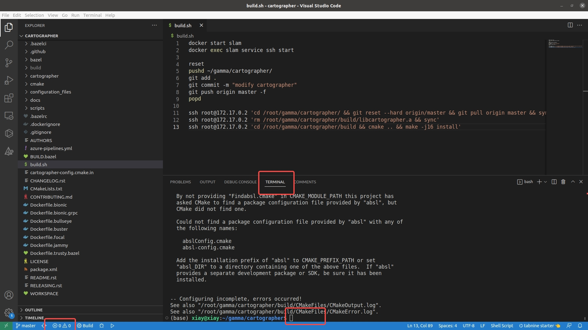

以此点红框位置打开终端，并调用build.sh则表示我们同步成功。

根据个人习惯决定是否打开保存修改格式。这不是我们的重点，关注的人多的话，关于自动调整格式我们专门做一集。

# 编译优化

## 安装依赖

```
apt-get install sudo ssh vim wget g++ cmake git google-mock python3-sphinx libboost-iostreams-dev libcairo2-dev libceres-dev libgflags-dev libgoogle-glog-dev liblua5.2-dev googletest libeigen3-dev  -y
```

### 安装package依赖

安装package.xml里声明的依赖。

```
  <build_depend>git</build_depend>
  <build_depend>google-mock</build_depend>
  <build_depend>gtest</build_depend>
  <build_depend>python3-sphinx</build_depend>
  <depend>libboost-iostreams-dev</depend>
  <depend>eigen</depend>
  <depend>libabsl-dev</depend>
  <depend>libcairo2-dev</depend>
  <depend>libceres-dev</depend>
  <depend>libgflags-dev</depend>
  <depend>libgoogle-glog-dev</depend>
  <depend>liblua5.2-dev</depend>
  <depend>protobuf-dev</depend>
```

使用apt-get安装可以找到的依赖

```
apt-get install google-mock python3-sphinx libboost-iostreams-dev libcairo2-dev libceres-dev libgflags-dev libgoogle-glog-dev 
```

其他几个是报错的，我单独安装

```
Note, selecting 'liblua5.2-dev' for regex 'lua5.2-dev'
E: Unable to locate package protobuf-dev
E: Unable to locate package gtest
E: Unable to locate package eigen
E: Unable to locate package libabsl-dev
```

我们使用变通的方式进行安装

```
apt-get install liblua5.2-dev googletest libeigen3-dev 
```

### absl安装

只有abseil不能安装，我们使用手动安装

```
 cd ~/gamma/
 git clone git@gitee.com:slam-xiay/abseil-cpp.git
 cd abseil-cpp
 git checkout 215105818dfde3174fe799600bb0f3cae233d0bf
 mkdir build
 cd build
 cmake \
  -DCMAKE_CXX_STANDARD=17 \
  -DCMAKE_INSTALL_PREFIX=usr \
  -DCMAKE_BUILD_TYPE=Release \
  ..
 make -j16 install
```

### Protobuf安装

```
cd ~/gamma/
git clone git@github.com:protocolbuffers/protobuf.git
git checkout tags/v3.4.1
mkdir build
cd build
cmake \
  -DCMAKE_CXX_STANDARD=17 \
  -DCMAKE_INSTALL_PREFIX=usr \
  -DCMAKE_POSITION_INDEPENDENT_CODE=ON \
  -DCMAKE_BUILD_TYPE=Release \
  -Dprotobuf_BUILD_TESTS=OFF \
  ../cmake
make -j16 install
```

## 模块优化

```
abseil 215105818dfde3174fe799600bb0f3cae233d0bf
protobuf v3.4.1
```

安装完abseil 和protobuf，我们先不管报错，开始优化模块，优化完模块这些问题也将一并解决。

### 删除WIN32分支

修改cartographer下的cmakelist.txt

```
# if(WIN32)
#   list(APPEND BOOST_COMPONENTS zlib)
#   set(Boost_USE_STATIC_LIBS FALSE)
# endif()

# if(WIN32)
#   # On Windows, Protobuf is incorrectly found by the bundled CMake module, so prefer native CMake config.
#   set(protobuf_MODULE_COMPATIBLE TRUE CACHE INTERNAL "")
#   find_package(Protobuf 3.0.0 CONFIG)
# else()
  find_package(Protobuf 3.0.0 REQUIRED)
# endif()

# if (NOT WIN32)
  PKG_SEARCH_MODULE(CAIRO REQUIRED cairo>=1.12.16)
# else()
#   find_library(CAIRO_LIBRARIES cairo)
# endif()

# if (WIN32)
#   find_package(glog REQUIRED)
#   set(GLOG_LIBRARY glog::glog)
# else()
  set(GLOG_LIBRARY glog)
# endif()

#if(WIN32)
#   # Needed to fix conflict with MSVC's error macro.
#   target_compile_definitions(${PROJECT_NAME} PUBLIC -DGLOG_NO_ABBREVIATED_SEVERITIES)
# endif()

# if (NOT WIN32)
  target_link_libraries(${PROJECT_NAME} PUBLIC pthread)
# endif()

# if (WIN32)
#   target_compile_definitions(${TEST_LIB} PUBLIC -DGTEST_LINKED_AS_SHARED_LIBRARY)
# endif()
```

### 删除MSVC分支

在CMakeList.txt里删除

```
# if(MSVC)
#   # Needed for VS 2017 5.8
#   target_compile_definitions(${PROJECT_NAME} PUBLIC -D_ENABLE_EXTENDED_ALIGNED_STORAGE -D_USE_MATH_DEFINES)
# endif()
```

### 删除GRPC分支

在CMakeList.txt里删除

```
# option(BUILD_GRPC "build Cartographer gRPC support" false)
# set(CARTOGRAPHER_HAS_GRPC ${BUILD_GRPC})
# if (${BUILD_GRPC})
#   find_package(async_grpc REQUIRED)
# endif()

# if(${BUILD_GRPC})
#   set(ALL_GRPC_SERVICE_SRCS)
#   set(ALL_GRPC_SERVICE_HDRS)
#   foreach(ABS_FIL ${ALL_GRPC_SERVICES})
#     file(RELATIVE_PATH REL_FIL ${PROJECT_SOURCE_DIR} ${ABS_FIL})
#     get_filename_component(DIR ${REL_FIL} DIRECTORY)
#     get_filename_component(FIL_WE ${REL_FIL} NAME_WE)

#     list(APPEND ALL_GRPC_SERVICE_SRCS "${PROJECT_BINARY_DIR}/${DIR}/${FIL_WE}.pb.cc")
#     list(APPEND ALL_GRPC_SERVICE_HDRS "${PROJECT_BINARY_DIR}/${DIR}/${FIL_WE}.pb.h")

#     add_custom_command(
#       OUTPUT "${PROJECT_BINARY_DIR}/${DIR}/${FIL_WE}.pb.cc"
#              "${PROJECT_BINARY_DIR}/${DIR}/${FIL_WE}.pb.h"
#       COMMAND  ${PROTOBUF_PROTOC_EXECUTABLE}
#       ARGS --cpp_out  ${PROJECT_BINARY_DIR}
#         -I ${PROJECT_SOURCE_DIR}
#         ${ABS_FIL}
#       DEPENDS ${ABS_FIL}
#       COMMENT "Running C++ protocol buffer compiler on ${ABS_FIL}"
#       VERBATIM
#     )
#   endforeach()
#   set_source_files_properties(${ALL_GRPC_SERVICE_SRCS} ${ALL_GRPC_SERVICE_HDRS} PROPERTIES GENERATED TRUE)
#   list(APPEND ALL_LIBRARY_HDRS ${ALL_GRPC_SERVICE_HDRS})
#   list(APPEND ALL_LIBRARY_SRCS ${ALL_GRPC_SERVICE_SRCS})
# endif()


# if(${BUILD_GRPC})
#   google_binary(cartographer_grpc_server
#     SRCS
#       cartographer/cloud/map_builder_server_main.cc
#   )
#   target_link_libraries(cartographer_grpc_server PUBLIC grpc++)
#   target_link_libraries(cartographer_grpc_server PUBLIC async_grpc)
#   if(${BUILD_PROMETHEUS})
#     target_link_libraries(cartographer_grpc_server PUBLIC ${ZLIB_LIBRARIES})
#     target_link_libraries(cartographer_grpc_server PUBLIC prometheus-cpp-core)
#     target_link_libraries(cartographer_grpc_server PUBLIC prometheus-cpp-pull)
#   endif()
# endif()

# if(${BUILD_GRPC})
#   target_link_libraries(${PROJECT_NAME} PUBLIC grpc++)
#   target_link_libraries(${PROJECT_NAME} PUBLIC async_grpc)
# endif()

# if(${BUILD_GRPC})
#   target_link_libraries("${TEST_TARGET_NAME}" PUBLIC grpc++)
#   target_link_libraries("${TEST_TARGET_NAME}" PUBLIC async_grpc)
# endif()
```

同时，文中提到ALL_GRPC_FILES在file(GLOB_RECURSE ALL_GRPC_FILES "cartographer/cloud/*")

也就是说cartographer/cloud文件夹中的文件，我们一起删除。

```
rm cartographer/cloud -rf
```

然后在CMakeList里删除相关的文件

```
# file(GLOB_RECURSE ALL_GRPC_FILES "cartographer/cloud/*")
# list(REMOVE_ITEM ALL_GRPC_FILES ${ALL_PROMETHEUS_FILES})
# if (NOT ${BUILD_GRPC})
#   list(REMOVE_ITEM ALL_LIBRARY_HDRS ${ALL_GRPC_FILES})
#   list(REMOVE_ITEM ALL_LIBRARY_SRCS ${ALL_GRPC_FILES})
#   list(REMOVE_ITEM TEST_LIBRARY_HDRS ${ALL_GRPC_FILES})
#   list(REMOVE_ITEM TEST_LIBRARY_SRCS ${ALL_GRPC_FILES})
#   list(REMOVE_ITEM ALL_TESTS ${ALL_GRPC_FILES})
#   list(REMOVE_ITEM ALL_EXECUTABLES ${ALL_GRPC_FILES})
# endif()

# if (NOT ${BUILD_GRPC})
#   list(REMOVE_ITEM ALL_PROTOS ${ALL_GRPC_FILES})
# endif()
```

在cartographer-config.cmake.in里删除

```
#set(CARTOGRAPHER_HAS_GRPC @CARTOGRAPHER_HAS_GRPC@)
#if(CARTOGRAPHER_HAS_GRPC)
#   find_package(async_grpc ${QUIET_OR_REQUIRED_OPTION})
#endif()
#if (WIN32)
#    find_package(glog REQUIRED)
#endif()
```

删除lua文件

```
rm cartographer/configuration_files/map_builder_server.lua
```

### 删除PROMETHEUS分支

在CMakeLists.txt里删除

```
#option(BUILD_PROMETHEUS "build Prometheus monitoring support" false)
#if(${BUILD_PROMETHEUS})
#   find_package( ZLIB REQUIRED )
# endif()

# if (NOT ${BUILD_PROMETHEUS})
#   list(REMOVE_ITEM ALL_LIBRARY_HDRS ${ALL_PROMETHEUS_FILES})
#   list(REMOVE_ITEM ALL_LIBRARY_SRCS ${ALL_PROMETHEUS_FILES})
#   list(REMOVE_ITEM TEST_LIBRARY_HDRS ${ALL_PROMETHEUS_FILES})
#   list(REMOVE_ITEM TEST_LIBRARY_SRCS ${ALL_PROMETHEUS_FILES})
#   list(REMOVE_ITEM ALL_TESTS ${ALL_PROMETHEUS_FILES})
#   list(REMOVE_ITEM ALL_EXECUTABLES ${ALL_PROMETHEUS_FILES})
# endif()

# if(${BUILD_PROMETHEUS})
#   target_link_libraries(${PROJECT_NAME} PUBLIC ${ZLIB_LIBRARIES})
#   target_link_libraries(${PROJECT_NAME} PUBLIC prometheus-cpp-core)
#   target_link_libraries(${PROJECT_NAME} PUBLIC prometheus-cpp-pull)
#   target_compile_definitions(${PROJECT_NAME} PUBLIC USE_PROMETHEUS=1)
# endif()

# if(${BUILD_PROMETHEUS})
#   target_link_libraries("${TEST_TARGET_NAME}" PUBLIC ${ZLIB_LIBRARIES})
#   target_link_libraries("${TEST_TARGET_NAME}" PUBLIC prometheus-cpp-core)
#   target_link_libraries("${TEST_TARGET_NAME}" PUBLIC prometheus-cpp-pull)
# endif()
```

同时涉及一个变量的文件 ALL_PROMETHEUS_FILES，在cartographer/cloud/metrics/prometheus/*

由于上文已经删除了所有cloud下的文件所以我们不再重复删除。

### 删除Sphinx分支

```
# # Only build the documentation if we can find Sphinx.
# find_package(Sphinx)
# if(SPHINX_FOUND)
#   add_subdirectory("docs")
# endif()
```

删除docs文件夹

```
rm -rf cartographer/docs
```

### 删除文件

```
rm .github -rf
rm .bazelci -rf
rm scripts -rf
rm .bazelrc
rm .dockerignore
rm AUTHORS
rm azure-pipelines.yml
rm BUILD.bazel
rm CHANGELOG.rst
rm CONTRIBUTING.md
rm Dockerfile.*
rm README.rst
rm RELEASING.rst
rm WORKSPACE
rm bazel -rf
rm docs -rf
rm cartographer/BUILD.bazel
```

### 删除TEST_LIBRARY

```
find . -name fake_*
./cartographer/io/fake_file_writer.cc
./cartographer/io/fake_file_writer_test.cc
./cartographer/io/fake_file_writer.h
./cartographer/mapping/internal/testing/fake_trimmable.h
```

```
find . -name *test_helpers* 
./cartographer/sensor/internal/test_helpers.h
./cartographer/io/internal/testing/test_helpers.h
./cartographer/io/internal/testing/test_helpers.cc
./cartographer/common/internal/testing/lua_parameter_dictionary_test_helpers.h
./cartographer/mapping/internal/testing/test_helpers.h
./cartographer/mapping/internal/testing/test_helpers.cc
./cartographer/transform/rigid_transform_test_helpers.h
```

```
find . -name mock_*
./cartographer/mapping/internal/testing/mock_pose_graph.h
./cartographer/mapping/internal/testing/mock_trajectory_builder.h
./cartographer/mapping/internal/testing/mock_map_builder.h
```

```
find . -name *_test.*
./cartographer/sensor/map_by_time_test.cc
./cartographer/sensor/point_cloud_test.cc
./cartographer/sensor/compressed_point_cloud_test.cc
./cartographer/sensor/landmark_data_test.cc
./cartographer/sensor/internal/voxel_filter_test.cc
./cartographer/sensor/internal/trajectory_collator_test.cc
./cartographer/sensor/internal/collator_test.cc
./cartographer/sensor/internal/ordered_multi_queue_test.cc
./cartographer/sensor/range_data_test.cc
./cartographer/io/probability_grid_points_processor_test.cc
./cartographer/io/points_processor_pipeline_builder_test.cc
./cartographer/io/proto_stream_test.cc
./cartographer/io/proto_stream_deserializer_test.cc
./cartographer/io/
./cartographer/io/internal/in_memory_proto_stream_test.cc
./cartographer/common/fixed_ratio_sampler_test.cc
./cartographer/common/math_test.cc
./cartographer/common/thread_pool_test.cc
./cartographer/common/internal/blocking_queue_test.cc
./cartographer/common/internal/rate_timer_test.cc
./cartographer/common/task_test.cc
./cartographer/common/configuration_files_test.cc
./cartographer/common/lua_parameter_dictionary_test.cc
./cartographer/mapping/pose_extrapolator_test.cc
./cartographer/mapping/pose_graph_test.cc
./cartographer/mapping/id_test.cc
./cartographer/mapping/submaps_test.cc
./cartographer/mapping/pose_graph_trimmer_test.cc
./cartographer/mapping/2d/probability_grid_test.cc
./cartographer/mapping/2d/range_data_inserter_2d_test.cc
./cartographer/mapping/2d/xy_index_test.cc
./cartographer/mapping/2d/submap_2d_test.cc
./cartographer/mapping/2d/map_limits_test.cc
./cartographer/mapping/probability_values_test.cc
./cartographer/mapping/3d/submap_3d_test.cc
./cartographer/mapping/3d/hybrid_grid_test.cc
./cartographer/mapping/3d/range_data_inserter_3d_test.cc
./cartographer/mapping/map_builder_test.cc
./cartographer/mapping/imu_tracker_test.cc
./cartographer/mapping/internal/optimization/cost_functions/spa_cost_function_2d_test.cc
./cartographer/mapping/internal/optimization/cost_functions/landmark_cost_function_2d_test.cc
./cartographer/mapping/internal/optimization/cost_functions/landmark_cost_function_3d_test.cc
./cartographer/mapping/internal/optimization/optimization_problem_3d_test.cc
./cartographer/mapping/internal/trajectory_connectivity_state_test.cc
./cartographer/mapping/internal/2d/overlapping_submaps_trimmer_2d_test.cc
./cartographer/mapping/internal/2d/tsdf_2d_test.cc
./cartographer/mapping/internal/2d/ray_to_pixel_mask_test.cc
./cartographer/mapping/internal/2d/scan_matching/ceres_scan_matcher_2d_test.cc
./cartographer/mapping/internal/2d/scan_matching/occupied_space_cost_function_2d_test.cc
./cartographer/mapping/internal/2d/scan_matching/interpolated_tsdf_2d_test.cc
./cartographer/mapping/internal/2d/scan_matching/tsdf_match_cost_function_2d_test.cc
./cartographer/mapping/internal/2d/scan_matching/correlative_scan_matcher_test.cc
./cartographer/mapping/internal/2d/scan_matching/fast_correlative_scan_matcher_2d_test.cc
./cartographer/mapping/internal/2d/scan_matching/real_time_correlative_scan_matcher_2d_test.cc
./cartographer/mapping/internal/2d/pose_graph_2d_test.cc
./cartographer/mapping/internal/2d/tsdf_range_data_inserter_2d_test.cc
./cartographer/mapping/internal/2d/tsd_value_converter_test.cc
./cartographer/mapping/internal/2d/normal_estimation_2d_test.cc
./cartographer/mapping/internal/3d/scan_matching/real_time_correlative_scan_matcher_3d_test.cc
./cartographer/mapping/internal/3d/scan_matching/interpolated_grid_test.cc
./cartographer/mapping/internal/3d/scan_matching/precomputation_grid_3d_test.cc
./cartographer/mapping/internal/3d/scan_matching/fast_correlative_scan_matcher_3d_test.cc
./cartographer/mapping/internal/3d/scan_matching/ceres_scan_matcher_3d_test.cc
./cartographer/mapping/internal/3d/scan_matching/rotation_delta_cost_functor_3d_test.cc
./cartographer/mapping/internal/3d/scan_matching/intensity_cost_function_3d_test.cc
./cartographer/mapping/internal/3d/scan_matching/rotational_scan_matcher_test.cc
./cartographer/mapping/internal/3d/pose_graph_3d_test.cc
./cartographer/mapping/internal/3d/local_trajectory_builder_3d_test.cc
./cartographer/mapping/internal/connected_components_test.cc
./cartographer/mapping/internal/range_data_collator_test.cc
./cartographer/mapping/internal/constraints/constraint_builder_2d_test.cc
./cartographer/mapping/internal/constraints/constraint_builder_3d_test.cc
./cartographer/mapping/internal/motion_filter_test.cc
./cartographer/mapping/trajectory_node_test.cc
./cartographer/mapping/value_conversion_tables_test.cc
./cartographer/transform/transform_test.cc
./cartographer/transform/transform_interpolation_buffer_test.cc
./cartographer/transform/timestamped_transform_test.cc
./cartographer/transform/rigid_transform_test.cc
```

```
find . -name fake_* -delete
find . -name *test_helpers*  -delete
find . -name mock_* -delete
find . -name *_test.* -delete
```

修改CMakeLists.txt

```
# google_enable_testing()
#file(GLOB_RECURSE TEST_LIBRARY_HDRS "cartographer/fake_*.h" "cartographer/*test_helpers*.h" "cartographer/mock_*.h")
#file(GLOB_RECURSE TEST_LIBRARY_SRCS "cartographer/fake_*.cc" "cartographer/*test_helpers*.cc" "cartographer/mock_*.cc")
# file(GLOB_RECURSE ALL_TESTS "cartographer/*_test.cc")
  # list(REMOVE_ITEM TEST_LIBRARY_HDRS ${ALL_DOTFILES})
  # list(REMOVE_ITEM TEST_LIBRARY_SRCS ${ALL_DOTFILES})
  # list(REMOVE_ITEM ALL_TESTS ${ALL_DOTFILES})
# list(REMOVE_ITEM ALL_LIBRARY_SRCS ${ALL_TESTS})
# list(REMOVE_ITEM ALL_LIBRARY_HDRS ${TEST_LIBRARY_HDRS})
# list(REMOVE_ITEM ALL_LIBRARY_SRCS ${TEST_LIBRARY_SRCS})
# set(TEST_LIB
#   cartographer_test_library
# )
# add_library(${TEST_LIB} ${TEST_LIBRARY_HDRS} ${TEST_LIBRARY_SRCS})
# target_include_directories(${TEST_LIB} SYSTEM PRIVATE
#   "${GMOCK_INCLUDE_DIRS}")
# target_link_libraries(${TEST_LIB} PUBLIC ${GMOCK_LIBRARY})
# target_link_libraries(${TEST_LIB} PUBLIC ${PROJECT_NAME})
# set_target_properties(${TEST_LIB} PROPERTIES
#   COMPILE_FLAGS ${TARGET_COMPILE_FLAGS})

# foreach(ABS_FIL ${ALL_TESTS})
#   file(RELATIVE_PATH REL_FIL ${PROJECT_SOURCE_DIR} ${ABS_FIL})
#   get_filename_component(DIR ${REL_FIL} DIRECTORY)
#   get_filename_component(FIL_WE ${REL_FIL} NAME_WE)
#   # Replace slashes as required for CMP0037.
#   string(REPLACE "/" "." TEST_TARGET_NAME "${DIR}/${FIL_WE}")
#   google_test("${TEST_TARGET_NAME}" ${ABS_FIL})
#   # if(${BUILD_GRPC})
#   #   target_link_libraries("${TEST_TARGET_NAME}" PUBLIC grpc++)
#   #   target_link_libraries("${TEST_TARGET_NAME}" PUBLIC async_grpc)
#   # endif()
#   # if(${BUILD_PROMETHEUS})
#   #   target_link_libraries("${TEST_TARGET_NAME}" PUBLIC ${ZLIB_LIBRARIES})
#   #   target_link_libraries("${TEST_TARGET_NAME}" PUBLIC prometheus-cpp-core)
#   #   target_link_libraries("${TEST_TARGET_NAME}" PUBLIC prometheus-cpp-pull)
#   # endif()
#   target_link_libraries("${TEST_TARGET_NAME}" PUBLIC ${TEST_LIB})
# endforeach()
```

### 删除main文件

删除包含main的文件

```
# google_binary(cartographer_autogenerate_ground_truth
#   SRCS
#     cartographer/ground_truth/autogenerate_ground_truth_main.cc
# )

# google_binary(cartographer_compute_relations_metrics
#   SRCS
#     cartographer/ground_truth/compute_relations_metrics_main.cc
# )

# google_binary(cartographer_pbstream
#   SRCS
#   cartographer/io/pbstream_main.cc
# )

# google_binary(cartographer_print_configuration
#   SRCS
#   cartographer/common/print_configuration_main.cc
# )
```

删除相应文件

```
rm cartographer/common/print_configuration_main.cc 
rm cartographer/io/pbstream_main.cc
rm cartographer/ground_truth -rf
```

CMakeLists.txt删除

```
#file(GLOB_RECURSE ALL_EXECUTABLES "cartographer/*_main.cc")
# list(REMOVE_ITEM ALL_EXECUTABLES ${ALL_DOTFILES})
# list(REMOVE_ITEM ALL_LIBRARY_SRCS ${ALL_EXECUTABLES})
# file(GLOB_RECURSE ALL_GRPC_SERVICES "cartographer/*_service.proto")
# list(REMOVE_ITEM ALL_PROTOS ALL_GRPC_SERVICES)
# file(GLOB_RECURSE ALL_DOTFILES ".*/*")
# if (ALL_DOTFILES)
#   list(REMOVE_ITEM ALL_LIBRARY_HDRS ${ALL_DOTFILES})
#   list(REMOVE_ITEM ALL_LIBRARY_SRCS ${ALL_DOTFILES})
#   # list(REMOVE_ITEM TEST_LIBRARY_HDRS ${ALL_DOTFILES})
#   # list(REMOVE_ITEM TEST_LIBRARY_SRCS ${ALL_DOTFILES})
#   # list(REMOVE_ITEM ALL_TESTS ${ALL_DOTFILES})
#   # list(REMOVE_ITEM ALL_EXECUTABLES ${ALL_DOTFILES})
# endif()
```

### 删除testing文件夹

```
rm cartographer/common/internal/testing
rm cartographer/mapping/internal/testing
```

### 删除metrics

替换所有的

```
#include "cartographer/metrics/family_factory.h"
//#include "cartographer/metrics/family_factory.h"
```

删除所有包含以下函数以及声明

```
RegisterMetrics
GlobalTrajectoryBuilderRegisterMetrics
GetOrCreateSensorMetric
```

删除包含变量的语句

```
collator_metrics_family_
metrics_map_
```

删除所有的包含以下字段的语句

```
kLocalSlamLatencyMetric
kLocalSlamVoxelFilterFraction
kLocalSlamScanMatcherFraction
kLocalSlamInsertIntoSubmapFraction
kLocalSlamRealTimeRatio
kLocalSlamCpuRealTimeRatio
kRealTimeCorrelativeScanMatcherScoreMetric
kCeresScanMatcherCostMetric
kScanMatcherResidualDistanceMetric
kScanMatcherResidualAngleMetric

kConstraintsSearchedMetric
kConstraintsFoundMetric
kGlobalConstraintsSearchedMetric
kGlobalConstraintsFoundMetric
kQueueLengthMetric
kConstraintScoresMetric
kConstraintRotationalScoresMetric
kConstraintLowResolutionScoresMetric
kGlobalConstraintScoresMetric
kGlobalConstraintRotationalScoresMetric
kGlobalConstraintLowResolutionScoresMetric
kNumSubmapScanMatchersMetric

kWorkQueueDelayMetric
kWorkQueueSizeMetric
kConstraintsSameTrajectoryMetric
kConstraintsDifferentTrajectoryMetric
kActiveSubmapsMetric
kFrozenSubmapsMetric
kDeletedSubmapsMetric
```

删除所有包含以下字段的语句

```
->Observe(
->Increment();
->Set(
->Add()
```

删除文件夹

```
rm cartographer/metrics -rf
```

最后根据编译的内容进行微调

### 删除3D

找到入口use_trajectory_builder_3d

找到相关变量，并删除有关内容

```
use_trajectory_builder_3d
```

找到相关函数并删除

```
CreateGlobalTrajectoryBuilder3D
```

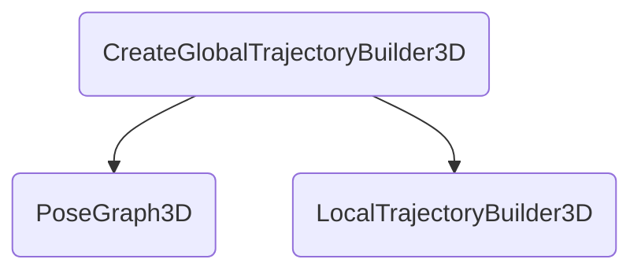

找到涉及的文件

```
find . -name *_3d*
./cartographer/mapping/3d/range_data_inserter_3d.cc
./cartographer/mapping/3d/submap_3d.cc
./cartographer/mapping/3d/submap_3d.h
./cartographer/mapping/3d/range_data_inserter_3d.h
./cartographer/mapping/internal/optimization/optimization_problem_3d.cc
./cartographer/mapping/internal/optimization/cost_functions/rotation_cost_function_3d.h
./cartographer/mapping/internal/optimization/cost_functions/acceleration_cost_function_3d.h
./cartographer/mapping/internal/optimization/cost_functions/landmark_cost_function_3d.h
./cartographer/mapping/internal/optimization/cost_functions/spa_cost_function_3d.h
./cartographer/mapping/internal/optimization/optimization_problem_3d.h
./cartographer/mapping/internal/3d/pose_graph_3d.cc
./cartographer/mapping/internal/3d/local_trajectory_builder_options_3d.cc
./cartographer/mapping/internal/3d/scan_matching/ceres_scan_matcher_3d.h
./cartographer/mapping/internal/3d/scan_matching/precomputation_grid_3d.cc
./cartographer/mapping/internal/3d/scan_matching/ceres_scan_matcher_3d.cc
./cartographer/mapping/internal/3d/scan_matching/translation_delta_cost_functor_3d.h
./cartographer/mapping/internal/3d/scan_matching/fast_correlative_scan_matcher_3d.cc
./cartographer/mapping/internal/3d/scan_matching/intensity_cost_function_3d.h
./cartographer/mapping/internal/3d/scan_matching/precomputation_grid_3d.h
./cartographer/mapping/internal/3d/scan_matching/rotation_delta_cost_functor_3d.h
./cartographer/mapping/internal/3d/scan_matching/occupied_space_cost_function_3d.h
./cartographer/mapping/internal/3d/scan_matching/real_time_correlative_scan_matcher_3d.cc
./cartographer/mapping/internal/3d/scan_matching/fast_correlative_scan_matcher_3d.h
./cartographer/mapping/internal/3d/scan_matching/intensity_cost_function_3d.cc
./cartographer/mapping/internal/3d/scan_matching/real_time_correlative_scan_matcher_3d.h
./cartographer/mapping/internal/3d/local_slam_result_3d.h
./cartographer/mapping/internal/3d/local_trajectory_builder_options_3d.h
./cartographer/mapping/internal/3d/pose_graph_3d.h
./cartographer/mapping/internal/3d/local_slam_result_3d.cc
./cartographer/mapping/internal/3d/local_trajectory_builder_3d.cc
./cartographer/mapping/internal/3d/local_trajectory_builder_3d.h
./cartographer/mapping/internal/constraints/constraint_builder_3d.cc
./cartographer/mapping/internal/constraints/constraint_builder_3d.h
./cartographer/mapping/proto/submaps_options_3d.proto
./cartographer/mapping/proto/local_trajectory_builder_options_3d.proto
./cartographer/mapping/proto/scan_matching/ceres_scan_matcher_options_3d.proto
./cartographer/mapping/proto/scan_matching/fast_correlative_scan_matcher_options_3d.proto
./cartographer/mapping/proto/range_data_inserter_options_3d.proto
./configuration_files/trajectory_builder_3d.lua
```

找到文件夹

```
find . -type d -name 3d
./cartographer/mapping/3d
./cartographer/mapping/internal/3d
```

删除ImuBasedPoseExtrapolator目录

以及相应文件

```
imu_based_pose_extrapolator.h
imu_based_pose_extrapolator.cc
```

删除引用了*_3d.h的字段

cartographer/mapping/trajectory_node.h

```
high_resolution_point_cloud
low_resolution_point_cloud
rotational_scan_matcher_histogram
```

### 删除FixedFramePose和AddLandmarkData

删除FixedFrame、Landmark相关字段

```
SerializeFixedFramePoseData
SerializeLandmarkNodes
kFixedFramePoseData
kLandmarkData
AddFixedFramePoseData
AddLandmarkData
FixedFramePoseData
LandmarkData
landmark_data_
fixed_frame_pose_data_
C_landmarks
C_fixed_frames
fixed_frame_pose_data.h
landmark_data.h
GetLandmarkNodes
landmark_nodes
GetInitialLandmarkPose
AddLandmarkCostFunctions
SetLandmarkPose
GetLandmarkPoses
SensorId::SensorType::LANDMARK
SensorId::SensorType::FIXED_FRAME_POSE
```

删除相关文件

```
rm cartographer/sensor/fixed_frame_pose_data.*
rm cartographer/sensor/landmark_data.*
rm cartographer/mapping/internal/optimization/cost_functions/landmark_cost_function_2d.h
```

### 删除TSDF分支

删除TSDF相关字段

```
find . -name *tsdf*
./cartographer/mapping/internal/2d/tsdf_2d.cc
./cartographer/mapping/internal/2d/scan_matching/interpolated_tsdf_2d.h
./cartographer/mapping/internal/2d/scan_matching/tsdf_match_cost_function_2d.cc
./cartographer/mapping/internal/2d/scan_matching/tsdf_match_cost_function_2d.h
./cartographer/mapping/internal/2d/tsdf_range_data_inserter_2d.h
./cartographer/mapping/internal/2d/tsdf_range_data_inserter_2d.cc
./cartographer/mapping/internal/2d/tsdf_2d.h
./cartographer/mapping/proto/tsdf_2d.proto
./cartographer/mapping/proto/tsdf_range_data_inserter_options_2d.proto
find . -name *tsdf* -delete
```

删除lua里的tsdf

cartographer/configuration_files/trajectory_builder_2d.lua

```
      -- tsdf_range_data_inserter = {
      --   truncation_distance = 0.3,
      --   maximum_weight = 10.,
      --   update_free_space = false,
      --   normal_estimation_options = {
      --     num_normal_samples = 4,
      --     sample_radius = 0.5,
      --   },
      --   project_sdf_distance_to_scan_normal = true,
      --   update_weight_range_exponent = 0,
      --   update_weight_angle_scan_normal_to_ray_kernel_bandwidth = 0.5,
      --   update_weight_distance_cell_to_hit_kernel_bandwidth = 0.5,
      -- },
```

删除含有TSDF的字段

```
TSDF2D
TSDF
TSDF_INSERTER_2D
```

grid_2d.proto

```
//import "cartographer/mapping/proto/tsdf_2d.proto";
```

submap2d.cc

```
//#include "cartographer/mapping/internal/2d/tsdf_range_data_inserter_2d.h"
```

## 优化接口

### 删除pose_extrapolator_interface

```
find . -name *interface.h
./cartographer/sensor/collator_interface.h ok
./cartographer/io/proto_stream_interface.h
./cartographer/mapping/range_data_inserter_interface.h ok
./cartographer/mapping/grid_interface.h ok
./cartographer/mapping/pose_extrapolator_interface.h ok
./cartographer/mapping/map_builder_interface.h
./cartographer/mapping/pose_graph_interface.h
./cartographer/mapping/internal/optimization/optimization_problem_interface.h
./cartographer/mapping/trajectory_builder_interface.h
```

数据结构迁移，把interface的结构体ExtrapolationResult放在public之后

```
  struct ExtrapolationResult {
    // The poses for the requested times at index 0 to N-1.
    std::vector<transform::Rigid3f> previous_poses;
    // The pose for the requested time at index N.
    transform::Rigid3d current_pose;
    Eigen::Vector3d current_velocity;
    Eigen::Quaterniond gravity_from_tracking;
  };
```

独立函数迁移CreatePoseExtrapolatorOptions，把函数从interface迁出到pose_extrapolator

```
ConstantVelocityPoseExtrapolatorOptions
CreatePoseExtrapolatorOptions
CreateWithImuData
```

修改后修改头文件

```
#include "cartographer/mapping/pose_extrapolator_interface.h"
改为
#include "cartographer/mapping/pose_extrapolator.h"
```

在extrapolator.h增加引用

```
#include "cartographer/mapping/proto/pose_extrapolator_options.pb.h"
#include "cartographer/transform/timestamped_transform.h"
```

首先改变原有继承关系

```
class PoseExtrapolator : public PoseExtrapolatorInterface {
改为
class PoseExtrapolator 
```

删除所有的override

最后我们删除文件

```
 rm cartographer/mapping/pose_extrapolator_interface.cc
 rm cartographer/mapping/pose_extrapolator_interface.h
```

### 删除grid_interface和range_data_inserter_interface

删除引用

```
// #include "cartographer/mapping/grid_interface.h"
替换为
#include "cartographer/mapping/2d/grid_2d.h"

// #include "cartographer/mapping/range_data_inserter_interface.h"
替换为
#include "cartographer/mapping/2d/probability_grid_range_data_inserter_2d.h"
```

```
class Grid2D : public GridInterface 
改为
class Grid2D

class ProbabilityGridRangeDataInserter2D : public RangeDataInserterInterface 
改为
class ProbabilityGridRangeDataInserter2D

删除类里的 override
```

把其他地方的

```
RangeDataInserterInterface 替换为 ProbabilityGridRangeDataInserter2D
GridInterface 替换为 Grid2D
```

独立函数迁移从range_data_inserter_interface 到probability_grid_range_data_inserter_2d

```
.h
// proto::RangeDataInserterOptions CreateRangeDataInserterOptions(
//     common::LuaParameterDictionary* const parameter_dictionary);
.cc
// proto::RangeDataInserterOptions CreateRangeDataInserterOptions(
//     common::LuaParameterDictionary* const parameter_dictionary) {
//   proto::RangeDataInserterOptions options;
//   const std::string range_data_inserter_type_string =
//       parameter_dictionary->GetString("range_data_inserter_type");
//   proto::RangeDataInserterOptions_RangeDataInserterType
//       range_data_inserter_type;
//   CHECK(proto::RangeDataInserterOptions_RangeDataInserterType_Parse(
//       range_data_inserter_type_string, &range_data_inserter_type))
//       << "Unknown RangeDataInserterOptions_RangeDataInserterType kind: "
//       << range_data_inserter_type_string;
//   options.set_range_data_inserter_type(range_data_inserter_type);
//   *options.mutable_probability_grid_range_data_inserter_options_2d() =
//       CreateProbabilityGridRangeDataInserterOptions2D(
//           parameter_dictionary
//               ->GetDictionary("probability_grid_range_data_inserter")
//               .get());
//   //   *options.mutable_tsdf_range_data_inserter_options_2d() =
//   //       CreateTSDFRangeDataInserterOptions2D(
//   // parameter_dictionary->GetDictionary("tsdf_range_data_inserter")
//   //               .get());
//   return options;
// }
```

编译通过后删除文件

```
rm cartographer/mapping/grid_interface.h
rm cartographer/mapping/range_data_inserter_interface.h
rm cartographer/mapping/range_data_inserter_interface.cc
```

### 删除collator_interface

有两个派生类trajectory_collator和collator，只保留collator。

```
  // Queue keys are a pair of trajectory ID and sensor identifier.
  OrderedMultiQueue queue_;
  // Map of trajectory ID to all associated QueueKeys.
  absl::flat_hash_map<int, std::vector<QueueKey>> queue_keys_;
  
  absl::flat_hash_map<int, OrderedMultiQueue> trajectory_to_queue_;
  // Map of trajectory ID to all associated QueueKeys.
  absl::flat_hash_map<int, std::vector<QueueKey>> trajectory_to_queue_keys_;
```

先找到相应文件进行屏蔽

```
CollatorInterface
```

修改类

```
class Collator : public CollatorInterface
改为
class Collator
删除override
```

修改引用文件

```
#include "cartographer/sensor/collator_interface.h"
```

在使用文件中修改

```
#include "cartographer/sensor/collator_interface.h"
改为
#include "cartographer/sensor/internal/collator.h"
CollatorInterface改为Collator
```

最后删除文件

```
rm cartographer/sensor/internal/trajectory_collator.*
rm cartographer/sensor/collator_interface.*
```

### 删除proto_stream_interface

```
find . -name *interface.h
./cartographer/io/proto_stream_interface.h
./cartographer/mapping/map_builder_interface.h
./cartographer/mapping/pose_graph_interface.h
./cartographer/mapping/internal/optimization/optimization_problem_interface.h
./cartographer/mapping/trajectory_builder_interface.h
```

首先屏蔽文件

```
./cartographer/io/proto_stream_interface.h
```

修改引用

```
#include "cartographer/io/proto_stream_interface.h" 屏蔽
//#include "cartographer/io/proto_stream_interface.h"
class ProtoStreamWriter : public ProtoStreamWriterInterface 
改为
class ProtoStreamWriter

class ProtoStreamReader : public ProtoStreamReaderInterface 
改为
class ProtoStreamReader
```

```
// #include "cartographer/io/proto_stream_interface.h"
class ForwardingProtoStreamWriter
    : public cartographer::io::ProtoStreamWriterInterface
    改为
class ForwardingProtoStreamWriter
    : public cartographer::io::ProtoStreamWriterInterface
    
class InMemoryProtoStreamReader
    : public cartographer::io::ProtoStreamReaderInterface 
改为
class InMemoryProtoStreamReader
```

使用者cartographer/io/internal/mapping_state_serialization.h

```
// #include "cartographer/io/proto_stream_interface.h"
改为
// #include "cartographer/io/proto_stream.h"
```

全局替换

```
// #include "cartographer/io/proto_stream_interface.h"
#include "cartographer/io/proto_stream.h"
ProtoStreamWriterInterface 改为 ProtoStreamWriter
ProtoStreamReaderInterface 改为 ProtoStreamReader
```

最后删除不需要的文件

```
rm ./cartographer/io/proto_stream_interface.h
```

### 删除optimization_problem_interface

首先屏蔽

```
cartographer/mapping/internal/optimization/optimization_problem_interface.h
```

删除引用

```
// #include
// "cartographer/mapping/internal/optimization/optimization_problem_interface.h"
```

其次删除派生

```
class OptimizationProblem2D
    : public OptimizationProblemInterface<NodeSpec2D, SubmapSpec2D,
                                          transform::Rigid2d>
                                          改为
class OptimizationProblem2D 
  删除类中的override
  迁移 using Constraint = Constraint; 到类中
```

### 删除map_build_interface

```
// #include "cartographer/mapping/map_builder_interface.h"
```

```
  proto::MapBuilderOptions CreateMapBuilderOptions(
    common::LuaParameterDictionary* const parameter_dictionary);
  
  using LocalSlamResultCallback =
      TrajectoryBuilderInterface::LocalSlamResultCallback;

  using SensorId = TrajectoryBuilderInterface::SensorId;
```

删除 override

```
std::unique_ptr<MapBuilderInterface> CreateMapBuilder(
    const proto::MapBuilderOptions& options) {
  return absl::make_unique<MapBuilder>(options);
}

改成
std::unique_ptr<MapBuilder> CreateMapBuilder(
    const proto::MapBuilderOptions& options) {
  return absl::make_unique<MapBuilder>(options);
}
```

删除文件

```
rm cartographer/mapping/map_builder_interface.h
```

### 优化TrajectoryBuilderInterface

优化前

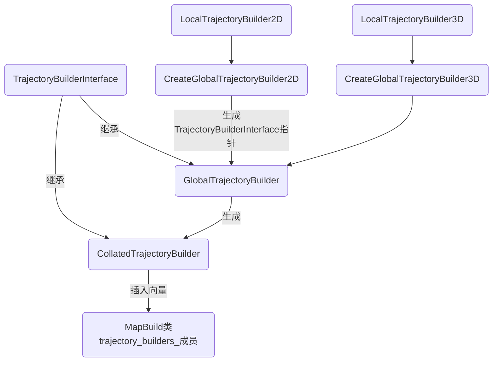

优化后

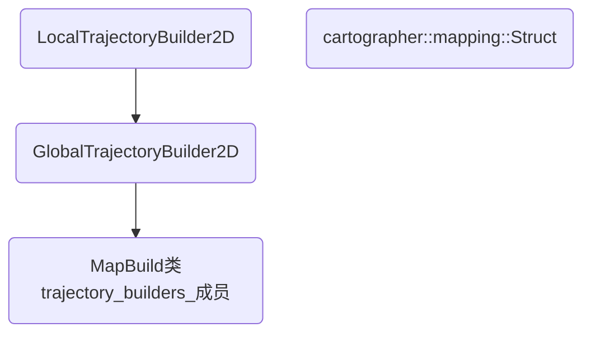

新建global_trajectory_builder_2d*

```
两个模版类改为LocalTrajectoryBuilder2D PoseGraph2D
拷贝global_trajectroy_builder，修改为2d,删除Create
删除继承关系，删除override。理顺.cc和.h的分工。
```

屏蔽TrajectoryBuilderInterface，CollatedTrajectoryBuilder，GlobalTrajectoryBuilder三个类代码

使用时map_build.h

```
  //   using LocalSlamResultCallback =
  //       TrajectoryBuilderInterface::LocalSlamResultCallback;

  //   using SensorId = TrajectoryBuilderInterface::SensorId;
  
    //std::vector<std::unique_ptr<mapping::TrajectoryBuilderInterface>>
      trajectory_builders_;
     改为
     std::vector<std::unique_ptr<mapping::TrajectoryBuilderInterface>>
      trajectory_builders_;
```

修改dispatchable.h

```
// #include "cartographer/mapping/trajectory_builder_interface.h"
#include "cartographer/mapping/internal/2d/global_trajectory_builder_2d.h"
```

修改data.h

```
  #include "cartographer/mapping/internal/2d/global_trajectory_builder_2d.h"
  // virtual void AddToTrajectoryBuilder(
  //     mapping::TrajectoryBuilderInterface *trajectory_builder) = 0;
  virtual void AddToTrajectoryBuilder(
      mapping::GlobalTrajectoryBuilder2D* trajectory_builder) = 0;
```

修改local_slam_result_2d.h

```
  void AddToTrajectoryBuilder(
      TrajectoryBuilderInterface* const trajectory_builder) override;
      //DCHECK(dynamic_cast<PoseGraph2D*>(pose_graph));
   DCHECK(dynamic_cast<PoseGraph2D*>(pose_graph_2d));
   // static_cast<PoseGraph2D*>(pose_graph)
  pose_graph_2d->AddNode(
```

```
    // }
    // DCHECK(dynamic_cast<PoseGraph2D*>(pose_graph_.get()));
    // trajectory_builders_.push_back(absl::make_unique<CollatedTrajectoryBuilder>(
    //     trajectory_options, sensor_collator_.get(), trajectory_id,
    //     expected_sensor_ids,
    //     CreateGlobalTrajectoryBuilder2D(
    //         std::move(local_trajectory_builder), trajectory_id,
    //         static_cast<PoseGraph2D*>(pose_graph_.get()),
    //         local_slam_result_callback, pose_graph_odometry_motion_filter)));
    // }
    改为
```

根据报错信息进一步修改

修改

```
class LocalSlamResult2D : public LocalSlamResultData
改为class LocalSlamResult2D
```

优化后可以删除文件

```
rm gloabal_trajectory_builder
rm trajectory_builder_interface
rm collated_trajectory_builder
```

### 优化PoseGraphInterface

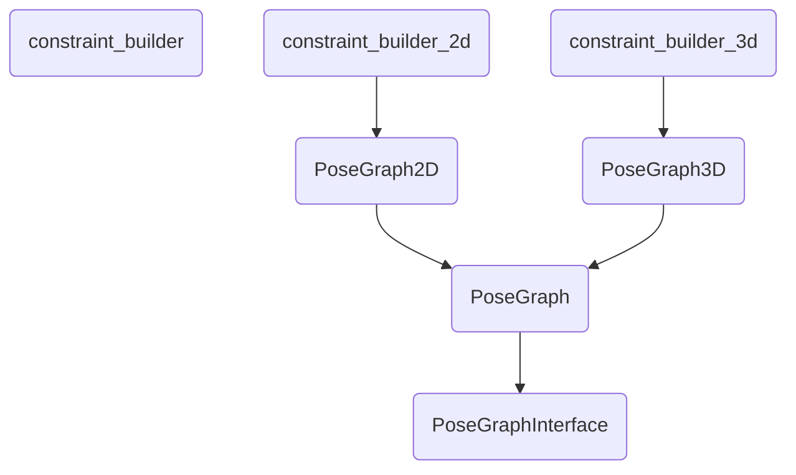

最终优化后得到

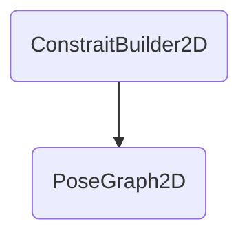


```
constrait_builder只有一个Create函数，把这个函数放入PoseGraph后删除。
然后把constrait_builder,posegraph都屏蔽
```

其中涉及几个优化的结构。首先把pose_graph_interface.h的结构体剪切到pose_graph_data.h

```
  struct Constraint {
    struct Pose {
      transform::Rigid3d zbar_ij;
      double translation_weight;
      double rotation_weight;
    };

    SubmapId submap_id;  // 'i' in the paper.
    NodeId node_id;      // 'j' in the paper.

    // Pose of the node 'j' relative to submap 'i'.
    Pose pose;

    // Differentiates between intra-submap (where node 'j' was inserted into
    // submap 'i') and inter-submap constraints (where node 'j' was not inserted
    // into submap 'i').
    enum Tag { INTRA_SUBMAP, INTER_SUBMAP } tag;
  };

  // struct LandmarkNode {
  //   struct LandmarkObservation {
  //     int trajectory_id;
  //     common::Time time;
  //     transform::Rigid3d landmark_to_tracking_transform;
  //     double translation_weight;
  //     double rotation_weight;
  //   };
  //   std::vector<LandmarkObservation> landmark_observations;
  //   absl::optional<transform::Rigid3d> global_landmark_pose;
  //   bool frozen = false;
  // };

  struct SubmapPose {
    int version;
    transform::Rigid3d pose;
  };

  struct SubmapData {
    std::shared_ptr<const Submap> submap;
    transform::Rigid3d pose;
  };

  struct TrajectoryData {
    double gravity_constant = 9.8;
    std::array<double, 4> imu_calibration{{1., 0., 0., 0.}};
    // absl::optional<transform::Rigid3d> fixed_frame_origin_in_map;
    std::optional<transform::Rigid3d> fixed_frame_origin_in_map;
  };

  enum class TrajectoryState { ACTIVE, FINISHED, FROZEN, DELETED };

  using GlobalSlamOptimizationCallback =
      std::function<void(const std::map<int /* trajectory_id */, SubmapId>&,
                         const std::map<int /* trajectory_id */, NodeId>&)>;
```

在把pose_graph.h的结构体拷贝到pose_graph_data.h

```
  struct InitialTrajectoryPose {
    int to_trajectory_id;
    transform::Rigid3d relative_pose;
    common::Time time;
  };

```

屏蔽所有的PoseGraphInterface::

在optimization_problem_2d.h加入前置声明

```
namespace mapping {
struct Constraint;
struct TrajectoryData;
enum class TrajectoryState;
namespace optimization {
```

在pose_graph_data.h加入前置声明

```
namespace optimization {
struct NodeSpec2D;
struct SubmapSpec2D;
}  // namespace optimization

```

并取消public PoseGraph的继承关系，删除类内的override

```
// #include "cartographer/mapping/pose_graph.h"
// #include "cartographer/mapping/pose_graph_interface.h"
#include "cartographer/mapping/internal/pose_graph_data.h"
#include "cartographer/mapping/internal/2d/pose_graph_2d.h"
```

修改一系列使用PoseGraph接口的函数,WritePbStream

```
WritePbStream(const mapping::PoseGraph2D& pose_graph,)
SerializePoseGraph(const mapping::PoseGraph2D& pose_graph,
```

把pose_graph.h头文件拷贝到pose_graph_2d.h

```
#include "cartographer/mapping/proto/pose_graph.pb.h"
#include "cartographer/mapping/proto/pose_graph_options.pb.h"
#include "cartographer/mapping/proto/serialization.pb.h"
```

```
屏蔽MaybeAddPureLocalizationTrimmer
```

把pose_graph.h的函数拷贝到pose_graph_2d

.h

```
class PoseGraph2D{proto::PoseGraph ToProto(bool include_unfinished_submaps) const{};}
std::vector<Constraint> FromProto(
    const ::google::protobuf::RepeatedPtrField<
        ::cartographer::mapping::proto::PoseGraph::Constraint>&
        constraint_protos);
proto::PoseGraph::Constraint ToProto(const Constraint& constraint);
```

.cc

```
proto::PoseGraph PoseGraph2D::ToProto(bool include_unfinished_submaps) const {
  proto::PoseGraph proto;

  std::map<int, proto::Trajectory* const> trajectory_protos;
  const auto trajectory = [&proto, &trajectory_protos](
                              const int trajectory_id) -> proto::Trajectory* {
    if (trajectory_protos.count(trajectory_id) == 0) {
      auto* const trajectory_proto = proto.add_trajectory();
      trajectory_proto->set_trajectory_id(trajectory_id);
      CHECK(trajectory_protos.emplace(trajectory_id, trajectory_proto).second);
    }
    return trajectory_protos.at(trajectory_id);
  };

  std::set<mapping::SubmapId> unfinished_submaps;
  for (const auto& submap_id_data : GetAllSubmapData()) {
    proto::Trajectory* trajectory_proto =
        trajectory(submap_id_data.id.trajectory_id);
    if (!include_unfinished_submaps &&
        !submap_id_data.data.submap->insertion_finished()) {
      // Collect IDs of all unfinished submaps and skip them.
      unfinished_submaps.insert(submap_id_data.id);
      continue;
    }
    CHECK(submap_id_data.data.submap != nullptr);
    auto* const submap_proto = trajectory_proto->add_submap();
    submap_proto->set_submap_index(submap_id_data.id.submap_index);
    *submap_proto->mutable_pose() =
        transform::ToProto(submap_id_data.data.pose);
  }

  auto constraints_copy = constraints();
  std::set<mapping::NodeId> orphaned_nodes;
  proto.mutable_constraint()->Reserve(constraints_copy.size());
  for (auto it = constraints_copy.begin(); it != constraints_copy.end();) {
    if (!include_unfinished_submaps &&
        unfinished_submaps.count(it->submap_id) > 0) {
      // Skip all those constraints that refer to unfinished submaps and
      // remember the corresponding trajectory nodes as potentially orphaned.
      orphaned_nodes.insert(it->node_id);
      it = constraints_copy.erase(it);
      continue;
    }
    *proto.add_constraint() = cartographer::mapping::ToProto(*it);
    ++it;
  }

  if (!include_unfinished_submaps) {
    // Iterate over all constraints and remove trajectory nodes from
    // 'orphaned_nodes' that are not actually orphaned.
    for (const auto& constraint : constraints_copy) {
      orphaned_nodes.erase(constraint.node_id);
    }
  }

  for (const auto& node_id_data : GetTrajectoryNodes()) {
    proto::Trajectory* trajectory_proto =
        trajectory(node_id_data.id.trajectory_id);
    CHECK(node_id_data.data.constant_data != nullptr);
    auto* const node_proto = trajectory_proto->add_node();
    node_proto->set_node_index(node_id_data.id.node_index);
    node_proto->set_timestamp(
        common::ToUniversal(node_id_data.data.constant_data->time));
    *node_proto->mutable_pose() =
        transform::ToProto(node_id_data.data.global_pose);
  }

  // auto landmarks_copy = GetLandmarkPoses();
  // proto.mutable_landmark_poses()->Reserve(landmarks_copy.size());
  // for (const auto& id_pose : landmarks_copy) {
  //   auto* landmark_proto = proto.add_landmark_poses();
  //   landmark_proto->set_landmark_id(id_pose.first);
  //   *landmark_proto->mutable_global_pose() =
  //   transform::ToProto(id_pose.second);
  // }
  return proto;
}

proto::PoseGraph::Constraint::Tag ToProto(const Constraint::Tag& tag) {
  switch (tag) {
    case Constraint::Tag::INTRA_SUBMAP:
      return proto::PoseGraph::Constraint::INTRA_SUBMAP;
    case Constraint::Tag::INTER_SUBMAP:
      return proto::PoseGraph::Constraint::INTER_SUBMAP;
  }
  LOG(FATAL) << "Unsupported tag.";
}

Constraint::Tag FromProto(const proto::PoseGraph::Constraint::Tag& proto) {
  switch (proto) {
    case proto::PoseGraph::Constraint::INTRA_SUBMAP:
      return Constraint::Tag::INTRA_SUBMAP;
    case proto::PoseGraph::Constraint::INTER_SUBMAP:
      return Constraint::Tag::INTER_SUBMAP;
    case ::google::protobuf::kint32max:
    case ::google::protobuf::kint32min: {
    }
  }
  LOG(FATAL) << "Unsupported tag.";
}

std::vector<Constraint> FromProto(
    const ::google::protobuf::RepeatedPtrField<proto::PoseGraph::Constraint>&
        constraint_protos) {
  std::vector<Constraint> constraints;
  for (const auto& constraint_proto : constraint_protos) {
    const mapping::SubmapId submap_id{
        constraint_proto.submap_id().trajectory_id(),
        constraint_proto.submap_id().submap_index()};
    const mapping::NodeId node_id{constraint_proto.node_id().trajectory_id(),
                                  constraint_proto.node_id().node_index()};
    const Constraint::Pose pose{
        transform::ToRigid3(constraint_proto.relative_pose()),
        constraint_proto.translation_weight(),
        constraint_proto.rotation_weight()};
    const Constraint::Tag tag = FromProto(constraint_proto.tag());
    constraints.push_back(Constraint{submap_id, node_id, pose, tag});
  }
  return constraints;
}

proto::PoseGraph::Constraint ToProto(const Constraint& constraint) {
  proto::PoseGraph::Constraint constraint_proto;
  *constraint_proto.mutable_relative_pose() =
      transform::ToProto(constraint.pose.zbar_ij);
  constraint_proto.set_translation_weight(constraint.pose.translation_weight);
  constraint_proto.set_rotation_weight(constraint.pose.rotation_weight);
  constraint_proto.mutable_submap_id()->set_trajectory_id(
      constraint.submap_id.trajectory_id);
  constraint_proto.mutable_submap_id()->set_submap_index(
      constraint.submap_id.submap_index);
  constraint_proto.mutable_node_id()->set_trajectory_id(
      constraint.node_id.trajectory_id);
  constraint_proto.mutable_node_id()->set_node_index(
      constraint.node_id.node_index);
  constraint_proto.set_tag(mapping::ToProto(constraint.tag));
  return constraint_proto;
}
```

在通过编译查漏补缺，编译通过后删除pose_graph.h,pose_graph.cc,pose_graph_interface.h

## 优化配置参数


参数传递方向

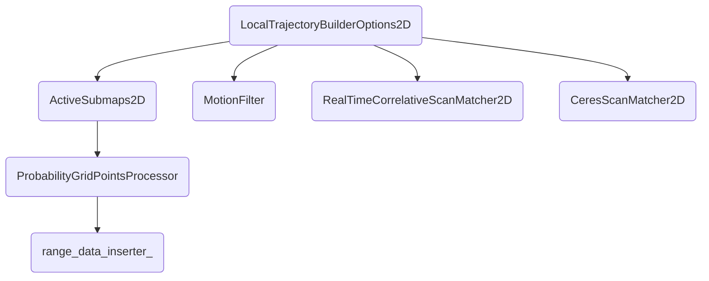

```
#ifndef CARTOGRAPHER_COMMON_CONFIG_H_
#define CARTOGRAPHER_COMMON_CONFIG_H_
#include "math.h"

namespace cartographer {

constexpr size_t kBackgroundThreadsCount = 4;  // num_background_threads
constexpr bool kCollateByTrajectory = false;   // collate_by_trajectory

constexpr bool kUseImuData = true;
constexpr double kLidarMinRange = 0.2;
constexpr double kLidarMaxRange = 50.0;
constexpr double kMinHeight = -0.8;
constexpr double kMaxHeight = 2.0;
constexpr double kMissingDataRayDistance = 5.0;
constexpr size_t kAccumulatedRangeCount = 1;
constexpr double kVoxelFilterSize = 0.025;

constexpr double kAdaptiveVoxelFilterMaxLength = 0.5;
constexpr size_t kAdaptiveVoxelFilterCount = 200;
constexpr double kAdaptiveVoxelFilterMaxRange = 50.;

constexpr double kLoopClosureAdaptiveVoxelFilterMaxLength = 0.9;
constexpr size_t kLoopClosureAdaptiveVoxelFilterMaxCount = 200;
constexpr double kLoopClosureAdaptiveVoxelFilterMaxRange = 50.;

constexpr bool kUseOnlineCSM = false;
constexpr double kRealTimeCSMLinearSearchWindow = 0.1;
constexpr double kRealTimeCSMAngularSearchWindow = common::DegToRad(20.);
constexpr double kRealTimeCSMTranslationDeltaCostWeight =
    1e-1;  // translation_delta_cost_weight
constexpr double kRealTimeCSMRotationDeltaCostWeight =
    1e-1;  // options_.rotation_delta_cost_weight()

constexpr double kCSMOccupiedSapceWeight = 1.;  // occupied_space_weight
constexpr double kCSMTranslationWeight = 10.;
constexpr double kCSMRotationWeight = 40.;
constexpr bool kCSMUseNonmonotonicSteps = false;
constexpr double kCSMMaxIterationsCount = 20;    // max_num_iterations
constexpr size_t kCSMCeresThreadsCount = 1;      // num_threads
constexpr double kMotionFilterMaxDuration = 5.;  // max_time_seconds
constexpr double kMotionFilterTranslation = 0.2;
constexpr double kMotionFilterRotaiton = common::DegToRad(1.);

constexpr double kImuGravityTimeConstant = 10.;  // imu_gravity_time_constant
constexpr bool kPoseExtrapolatorUseImuBase = false;
constexpr bool kPoseExtrapolatorDuration = 0.5;  // pose_queue_duration

constexpr size_t kSubmapsNodeCount = 50;  // num_range_data
constexpr double kResolution = 0.10;      // resolution
constexpr bool kSubmapsInsertFreeSpace = true;  // insert_free_space
constexpr double kSubmapsHitPorbility = 0.55;
constexpr double kSubmapsMissPorbility = 0.49;

constexpr size_t kOptimizeEveryNNodes = 90;
constexpr double kSamplingRatio = 0.3;
constexpr double kMaxConstrantDistance = 15;
constexpr double kLocalMatchMinScore = 0.55;  // 注意重复
constexpr double kGlobalMatchMinScore = 0.6;
constexpr double kLoopClosureTranslationWeight = 1.1e4;
constexpr double kLoopClosureRotationWeight = 1.1e4;
constexpr bool kLogMatches = false;
constexpr double kFastCSMLinearSearchWindow = 7.;
constexpr double kFastCSMAngularSearchWindow = common::DegToRad(30.);
constexpr size_t kBranchAndBoundDepth = 7;
constexpr double kFastCSMOccupiedSapceWeight = 20.;
constexpr double kFastCSMTranslationWeight = 10.;
constexpr double kFastCSMRotationWeight = 1.;
constexpr double kFastCSMUseNonmonotonicSteps = true;
constexpr double kFastCSMCeresMaxIterationsCount = 10;
constexpr double kFastCSMCeresThreadsCount = 1;

// optimization
constexpr double kHuberScale = 1e1;  // huber_scale
constexpr double kLocalSlmPoseTranslationWeight = 1e5;
// local_slam_pose_translation_weight
constexpr double kLocalSlamPoseRotationWeight = 1e5;
// local_slam_pose_rotation_weight
constexpr double kOdometryTranslationWeight = 1e5;
// odometry_translation_weight
constexpr double kOdometryRotationWeight = 1e5;  // odometry_rotation_weight
constexpr bool kLogSolverSummary = false;        // log_solver_summary
// constexpr bool kUseOnlineImuExtrinsicsIn3d = true;
// use_online_imu_extrinsics_in_3d
// constexpr bool kFixZIn3D = false;  // fix_z_in_3d
constexpr double kOptimizationUseNonmonotonicSteps = true;
// use_nonmonotonic_steps
constexpr double kOptimizationMaxIterationsCount = 10;  // max_num_iterations
constexpr double kOptimizationThreadsCount = 7;         // num_threads
constexpr double kMaxFinalIterationsCount = 50;  // max_num_final_iterations
constexpr double kGlobalSamplingRatio = 0.003;   // global_sampling_ratio
constexpr bool kLogResidualHistograms = false;   // log_residual_histograms
constexpr double kGlobalConstraintSearchInterval = 10;
// global_constraint_search_after_n_seconds

}  // namespace cartographer
#endif
```


### ProbabilityGridRangeDataInserter2D参数优化

.h修改

```
#include "cartographer/common/config.h"
// #include
// "cartographer/mapping/proto/probability_grid_range_data_inserter_options_2d.pb.h"
// #include "cartographer/mapping/range_data_inserter_interface.h"
// #include "cartographer/mapping/2d/probability_grid_range_data_inserter_2d.h"
// proto::ProbabilityGridRangeDataInserterOptions2D
// CreateProbabilityGridRangeDataInserterOptions2D(
//     common::LuaParameterDictionary* parameter_dictionary);
// proto::RangeDataInserterOptions CreateRangeDataInserterOptions(
//     common::LuaParameterDictionary* const parameter_dictionary);
  //   explicit ProbabilityGridRangeDataInserter2D(
  //       const proto::ProbabilityGridRangeDataInserterOptions2D& options);
  explicit ProbabilityGridRangeDataInserter2D();
  //   const proto::ProbabilityGridRangeDataInserterOptions2D options_;
```

.cc

```
// proto::ProbabilityGridRangeDataInserterOptions2D
// CreateProbabilityGridRangeDataInserterOptions2D(
//     common::LuaParameterDictionary* parameter_dictionary) {
//   proto::ProbabilityGridRangeDataInserterOptions2D options;
//   options.set_hit_probability(
//       parameter_dictionary->GetDouble("hit_probability"));
//   options.set_miss_probability(
//       parameter_dictionary->GetDouble("miss_probability"));
//   options.set_insert_free_space(
//       parameter_dictionary->HasKey("insert_free_space")
//           ? parameter_dictionary->GetBool("insert_free_space")
//           : true);
//   CHECK_GT(options.hit_probability(), 0.5);
//   CHECK_LT(options.miss_probability(), 0.5);
//   return options;
// }

// proto::RangeDataInserterOptions CreateRangeDataInserterOptions(
//     common::LuaParameterDictionary* const parameter_dictionary) {
//   proto::RangeDataInserterOptions options;
//   const std::string range_data_inserter_type_string =
//       parameter_dictionary->GetString("range_data_inserter_type");
//   proto::RangeDataInserterOptions_RangeDataInserterType
//       range_data_inserter_type;
//   CHECK(proto::RangeDataInserterOptions_RangeDataInserterType_Parse(
//       range_data_inserter_type_string, &range_data_inserter_type))
//       << "Unknown RangeDataInserterOptions_RangeDataInserterType kind: "
//       << range_data_inserter_type_string;
//   options.set_range_data_inserter_type(range_data_inserter_type);
//   *options.mutable_probability_grid_range_data_inserter_options_2d() =
//       CreateProbabilityGridRangeDataInserterOptions2D(
//           parameter_dictionary
//               ->GetDictionary("probability_grid_range_data_inserter")
//               .get());
//   //   *options.mutable_tsdf_range_data_inserter_options_2d() =
//   //       CreateTSDFRangeDataInserterOptions2D(
//   // parameter_dictionary->GetDictionary("tsdf_range_data_inserter")
//   //               .get());
//   return options;
// }

// ProbabilityGridRangeDataInserter2D::ProbabilityGridRangeDataInserter2D(
//     const proto::ProbabilityGridRangeDataInserterOptions2D& options)
//     : options_(options),
//       hit_table_(ComputeLookupTableToApplyCorrespondenceCostOdds(
//           Odds(options.hit_probability()))),
//       miss_table_(ComputeLookupTableToApplyCorrespondenceCostOdds(
//           Odds(options.miss_probability()))) {}

ProbabilityGridRangeDataInserter2D::ProbabilityGridRangeDataInserter2D()
    : hit_table_(ComputeLookupTableToApplyCorrespondenceCostOdds(
          Odds(kSubmapsHitPorbility))),
      miss_table_(ComputeLookupTableToApplyCorrespondenceCostOdds(
          Odds(kSubmapsMissPorbility))) {}    
          
          
options_.insert_free_space() -- kSubmapsInsertFreeSpace
options.hit_probability() -- kSubmapsHitProbability
options.miss_probability() -- kSubmapMissProbability


```

### ProbabilityGridPointsProcessor参数优化

.h

```
ProbabilityGridPointsProcessor(
      double resolution,
      //const mapping::proto::ProbabilityGridRangeDataInserterOptions2D&
      //    probability_grid_range_data_inserter_options,
      const DrawTrajectories& draw_trajectories, const OutputType& output_type,
      std::unique_ptr<FileWriter> file_writer,
      const std::vector<mapping::proto::Trajectory>& trajectories,
      PointsProcessor* next);
```

.cc

```
// const mapping::proto::ProbabilityGridRangeDataInserterOptions2D&
//     probability_grid_range_data_inserter_options,
 // range_data_inserter_(probability_grid_range_data_inserter_options),

// std::unique_ptr<ProbabilityGridPointsProcessor>
// ProbabilityGridPointsProcessor::FromDictionary(
//     const std::vector<mapping::proto::Trajectory>& trajectories,
//     const FileWriterFactory& file_writer_factory,
//     common::LuaParameterDictionary* const dictionary,
//     PointsProcessor* const next) {
//   const auto draw_trajectories = (!dictionary->HasKey("draw_trajectories") ||
//                                   dictionary->GetBool("draw_trajectories"))
//                                      ? DrawTrajectories::kYes
//                                      : DrawTrajectories::kNo;
//   const auto output_type =
//       dictionary->HasKey("output_type")
//           ? OutputTypeFromString(dictionary->GetString("output_type"))
//           : OutputType::kPng;
//   return absl::make_unique<ProbabilityGridPointsProcessor>(
//       dictionary->GetDouble("resolution"),
//       mapping::CreateProbabilityGridRangeDataInserterOptions2D(
//           dictionary->GetDictionary("range_data_inserter").get()),
//       draw_trajectories, output_type,
//       file_writer_factory(dictionary->GetString("filename") +
//                           FileExtensionFromOutputType(output_type)),
//       trajectories, next);
// }

// ProbabilityGridPointsProcessor::OutputType OutputTypeFromString(
//     const std::string& output_type) {
//   if (output_type == "png") {
//     return ProbabilityGridPointsProcessor::OutputType::kPng;
//   } else if (output_type == "pb") {
//     return ProbabilityGridPointsProcessor::OutputType::kPb;
//   } else {
//     LOG(FATAL) << "OutputType " << output_type << " does not exist!";
//   }
// }
```

### ActiveSubmaps2D参数优化

submap_2d.h修改

```
#include "cartographer/common/config.h"
//#include "cartographer/mapping/proto/submaps_options_2d.pb.h"
// proto::SubmapsOptions2D CreateSubmapsOptions2D(
//     common::LuaParameterDictionary* parameter_dictionary);
//   explicit ActiveSubmaps2D(const proto::SubmapsOptions2D& options);
  explicit ActiveSubmaps2D();
//const proto::SubmapsOptions2D options_;
```

submap_2d.cc修改

```
// proto::SubmapsOptions2D CreateSubmapsOptions2D(
//     common::LuaParameterDictionary* const parameter_dictionary) {
//   proto::SubmapsOptions2D options;
//   options.set_num_range_data(
//       parameter_dictionary->GetNonNegativeInt("num_range_data"));
//   *options.mutable_grid_options_2d() = CreateGridOptions2D(
//       parameter_dictionary->GetDictionary("grid_options_2d").get());
//   *options.mutable_range_data_inserter_options() =
//       CreateRangeDataInserterOptions(
//           parameter_dictionary->GetDictionary("range_data_inserter").get());

//   bool valid_range_data_inserter_grid_combination = false;
//   const proto::GridOptions2D_GridType& grid_type =
//       options.grid_options_2d().grid_type();
//   const proto::RangeDataInserterOptions_RangeDataInserterType&
//       range_data_inserter_type =
//           options.range_data_inserter_options().range_data_inserter_type();
//   if (grid_type == proto::GridOptions2D::PROBABILITY_GRID &&
//       range_data_inserter_type ==
//           proto::RangeDataInserterOptions::PROBABILITY_GRID_INSERTER_2D) {
//     valid_range_data_inserter_grid_combination = true;
//   }
//   // if (grid_type == proto::GridOptions2D::TSDF &&
//   //     range_data_inserter_type ==
//   //         proto::RangeDataInserterOptions::TSDF_INSERTER_2D) {
//   //   valid_range_data_inserter_grid_combination = true;
//   // }
//   CHECK(valid_range_data_inserter_grid_combination)
//       << "Invalid combination grid_type " << grid_type
//       << " with range_data_inserter_type " << range_data_inserter_type;
//   CHECK_GT(options.num_range_data(), 0);
//   return options;
// }

// std::unique_ptr<ProbabilityGridRangeDataInserter2D>
// ActiveSubmaps2D::CreateRangeDataInserter() {
//   switch (options_.range_data_inserter_options().range_data_inserter_type())
//   {
//     case proto::RangeDataInserterOptions::PROBABILITY_GRID_INSERTER_2D:
//       return absl::make_unique<ProbabilityGridRangeDataInserter2D>(
//           options_.range_data_inserter_options()
//               .probability_grid_range_data_inserter_options_2d());
//     // case proto::RangeDataInserterOptions::TSDF_INSERTER_2D:
//     //   return absl::make_unique<TSDFRangeDataInserter2D>(
//     //       options_.range_data_inserter_options()
//     //           .tsdf_range_data_inserter_options_2d());
//     default:
//       LOG(FATAL) << "Unknown RangeDataInserterType.";
//   }
// }
std::unique_ptr<ProbabilityGridRangeDataInserter2D>
ActiveSubmaps2D::CreateRangeDataInserter() {
  return absl::make_unique<ProbabilityGridRangeDataInserter2D>();
}

// std::unique_ptr<Grid2D> ActiveSubmaps2D::CreateGrid(
//     const Eigen::Vector2f& origin) {
//   constexpr int kInitialSubmapSize = 100;
//   float resolution = kResolution;
//   switch (options_.grid_options_2d().grid_type()) {
//     case proto::GridOptions2D::PROBABILITY_GRID:
//       return absl::make_unique<ProbabilityGrid>(
//           MapLimits(resolution,
//                     origin.cast<double>() + 0.5 * kInitialSubmapSize *
//                                                 resolution *
//                                                 Eigen::Vector2d::Ones(),
//                     CellLimits(kInitialSubmapSize, kInitialSubmapSize)),
//           &conversion_tables_);
//     // case proto::GridOptions2D::TSDF:
//     //   return absl::make_unique<TSDF2D>(
//     //       MapLimits(resolution,
//     //                 origin.cast<double>() + 0.5 * kInitialSubmapSize *
//     //                                             resolution *
//     //                                             Eigen::Vector2d::Ones(),
//     //                 CellLimits(kInitialSubmapSize, kInitialSubmapSize)),
//     //       options_.range_data_inserter_options()
//     //           .tsdf_range_data_inserter_options_2d()
//     //           .truncation_distance(),
//     //       options_.range_data_inserter_options()
//     //           .tsdf_range_data_inserter_options_2d()
//     //           .maximum_weight(),
//     //       &conversion_tables_);
//     default:
//       LOG(FATAL) << "Unknown GridType.";
//   }
// }

std::unique_ptr<Grid2D> ActiveSubmaps2D::CreateGrid(
    const Eigen::Vector2f& origin) {
  constexpr int kInitialSubmapSize = 100;
  return absl::make_unique<ProbabilityGrid>(
      MapLimits(kResolution,
                origin.cast<double>() + 0.5 * kInitialSubmapSize * kResolution *
                                            Eigen::Vector2d::Ones(),
                CellLimits(kInitialSubmapSize, kInitialSubmapSize)),
      &conversion_tables_);
}

```

```
options_.num_range_data() 改为kSubmapNodes
options_.grid_options_2d().resolution() -- kResolution
options_.grid_options_2d().resolution() -- kResolution
```

```
// ActiveSubmaps2D::ActiveSubmaps2D(const proto::SubmapsOptions2D& options)
//     : options_(options), range_data_inserter_(CreateRangeDataInserter()) {}

ActiveSubmaps2D::ActiveSubmaps2D()
    : range_data_inserter_(CreateRangeDataInserter()) {}
```

### MotionFilter参数优化

.h

```
// //#include "cartographer/common/lua_parameter_dictionary.h"
#include "cartographer/common/config.h"
// #include "cartographer/mapping/proto/motion_filter_options.pb.h"
// proto::MotionFilterOptions CreateMotionFilterOptions(
//     common::LuaParameterDictionary* parameter_dictionary);
//explicit MotionFilter(const proto::MotionFilterOptions& options);
explicit MotionFilter();
/ const proto::MotionFilterOptions options_;
```

.cc

```
// proto::MotionFilterOptions CreateMotionFilterOptions(
//     common::LuaParameterDictionary* const parameter_dictionary) {
//   proto::MotionFilterOptions options;
//   options.set_max_time_seconds(
//       parameter_dictionary->GetDouble("max_time_seconds"));
//   options.set_max_distance_meters(
//       parameter_dictionary->GetDouble("max_distance_meters"));
//   options.set_max_angle_radians(
//       parameter_dictionary->GetDouble("max_angle_radians"));
//   return options;
// }
MotionFilter::MotionFilter()  {}
```

```
options_.max_time_seconds()--kMotionFilterMaxDuration
options_.max_distance_meters()--  kMotionFilterTranslation
options_.max_angle_radians()--kMotionFilterRotaiton
```

### RealTimeCorrelativeScanMatcher2D参数优化

.h

```
#include "cartographer/common/config.h"
// #include "cartographer/mapping/proto/scan_matching/real_time_correlative_scan_matcher_options.pb.h"
  //   explicit RealTimeCorrelativeScanMatcher2D(
  //       const proto::RealTimeCorrelativeScanMatcherOptions& options);
  explicit RealTimeCorrelativeScanMatcher2D();
```

.cc

```
// RealTimeCorrelativeScanMatcher2D::RealTimeCorrelativeScanMatcher2D(
//     const proto::RealTimeCorrelativeScanMatcherOptions& options)
//     : options_(options) {}
```

替换

```
options_.linear_search_window()--kRealTimeCSMLinearSearchWindow
options_.angular_search_window()--
options_.translation_delta_cost_weight()--kRealTimeCSMTranslationDeltaCostWeight
options_.rotation_delta_cost_weight()--kRealTimeCSMRotationDeltaCostWeight
```

### OptimizationProblem2D参数优化

删除CreatePoseGraphOptions

.h修改

```
#include "cartographer/common/config.h"
```

在config.h里加入

```
constexpr double kHuberScale = 1e1;
constexpr double kOdometryTranslationWeight = 1e5; //
constexpr double kOdometryRotationWeight = 1e5;
```

```
  
  // explicit OptimizationProblem2D(
  //     const optimization::proto::OptimizationProblemOptions& options);
  改为explicit OptimizationProblem2D();
  
初始化不传入option,删除options_变量
//#include "cartographer/mapping/proto/pose_graph/optimization_problem_options.pb.h"
```

```
options_.global_constraint_search_after_n_seconds()
```

### CeresScanMatcher2D参数优化

.h修改

```
// #include
// "cartographer/mapping/proto/scan_matching/ceres_scan_matcher_options_2d.pb.h"
#include "cartographer/common/config.h"
// proto::CeresScanMatcherOptions2D CreateCeresScanMatcherOptions2D(
//     common::LuaParameterDictionary* parameter_dictionary);
  // explicit CeresScanMatcher2D(const proto::CeresScanMatcherOptions2D&
  // options);
  explicit CeresScanMatcher2D();
    // const proto::CeresScanMatcherOptions2D options_;
  // ceres::Solver::Options ceres_solver_options_;
```

.cc修改

```
// proto::CeresScanMatcherOptions2D CreateCeresScanMatcherOptions2D(
//     common::LuaParameterDictionary* const parameter_dictionary) {
//   proto::CeresScanMatcherOptions2D options;
//   options.set_occupied_space_weight(
//       parameter_dictionary->GetDouble("occupied_space_weight"));
//   options.set_translation_weight(
//       parameter_dictionary->GetDouble("translation_weight"));
//   options.set_rotation_weight(
//       parameter_dictionary->GetDouble("rotation_weight"));
//   *options.mutable_ceres_solver_options() =
//       common::CreateCeresSolverOptionsProto(
//           parameter_dictionary->GetDictionary("ceres_solver_options").get());
//   return options;
// }
```

### LocalTrajectoryBuilder2D参数优化

.h

```
 #include "cartographer/common/config.h"
 // #include
// "cartographer/mapping/proto/local_trajectory_builder_options_2d.pb.h"
  //   explicit LocalTrajectoryBuilder2D(
  //       const proto::LocalTrajectoryBuilderOptions2D& options,
  //       const std::vector<std::string>& expected_range_sensor_ids);
  explicit LocalTrajectoryBuilder2D(
      const std::vector<std::string>& expected_range_sensor_ids);
```

.cc

```
// LocalTrajectoryBuilder2D::LocalTrajectoryBuilder2D(
//     const proto::LocalTrajectoryBuilderOptions2D& options,
//     const std::vector<std::string>& expected_range_sensor_ids)
//     :  // options_(options),
//       active_submaps_(options.submaps_options()),
//       motion_filter_(options_.motion_filter_options()),
//       real_time_correlative_scan_matcher_(
//           options_.real_time_correlative_scan_matcher_options()),
//       ceres_scan_matcher_(options_.ceres_scan_matcher_options()),
//       range_data_collator_(expected_range_sensor_ids) {}

LocalTrajectoryBuilder2D::LocalTrajectoryBuilder2D(
    const std::vector<std::string>& expected_range_sensor_ids)
    : range_data_collator_(expected_range_sensor_ids) {}
```

### VoxelFilter

```
options.max_length() -- kAdaptiveVoxelFilterMaxLength
```

### MapBuilder

```
  // absl::optional<MotionFilter> pose_graph_odometry_motion_filter;
  // if (trajectory_options.has_pose_graph_odometry_motion_filter()) {
  //   LOG(INFO) << "Using a motion filter for adding odometry to the pose
  //   graph."; pose_graph_odometry_motion_filter.emplace(
  //       MotionFilter(trajectory_options.pose_graph_odometry_motion_filter()));
  // }
  
// std::shared_ptr<LocalTrajectoryBuilder2D> local_trajectory_builder_2d =
  //     std::make_shared<LocalTrajectoryBuilder2D>(
  //         trajectory_options.trajectory_builder_2d_options(),
  //         SelectRangeSensorIds(expected_sensor_ids));
  std::shared_ptr<LocalTrajectoryBuilder2D> local_trajectory_builder_2d =
      std::make_shared<LocalTrajectoryBuilder2D>(
          SelectRangeSensorIds(expected_sensor_ids));
          
          
          // MapBuilder::MapBuilder(const proto::MapBuilderOptions& options)
//     : options_(options), thread_pool_(options.num_background_threads()) {
//   // CHECK(options.use_trajectory_builder_2d() ^
//   //       options.use_trajectory_builder_3d());
//   if (options.use_trajectory_builder_2d()) {
//     pose_graph_2d_ = absl::make_unique<PoseGraph2D>(
//         options_.pose_graph_options(),
//         absl::make_unique<optimization::OptimizationProblem2D>(
//             options_.pose_graph_options().optimization_problem_options()),
//         &thread_pool_);
//   }
//   // if (options.use_trajectory_builder_3d()) {
//   //   pose_graph_ = absl::make_unique<PoseGraph3D>(
//   //       options_.pose_graph_options(),
//   //       absl::make_unique<optimization::OptimizationProblem3D>(
//   //           options_.pose_graph_options().optimization_problem_options()),
//   //       &thread_pool_);
//   // }
//   // if (options.collate_by_trajectory()) {
//   //   sensor_collator_ = absl::make_unique<sensor::TrajectoryCollator>();
//   // } else {
//   sensor_collator_ = absl::make_unique<sensor::Collator>();
//   // }
// }

MapBuilder::MapBuilder() : thread_pool_(kBackgroundThreadsCount) {
  pose_graph_2d_ = absl::make_unique<PoseGraph2D>(
      absl::make_unique<optimization::OptimizationProblem2D>(), &thread_pool_);
  sensor_collator_ = absl::make_unique<sensor::Collator>();
}
```

### PoseExtrapolator参数优化

.h

```
// #include "cartographer/mapping/proto/pose_extrapolator_options.pb.h"
#include "cartographer/common/config.h"

// proto::PoseExtrapolatorOptions CreatePoseExtrapolatorOptions(
//     common::LuaParameterDictionary* const parameter_dictionary);

std::unique_ptr<PoseExtrapolator> PoseExtrapolator::CreateWithImuData(
    // const proto::PoseExtrapolatorOptions& options,
    const std::vector<sensor::ImuData>& imu_data,
    const std::vector<transform::TimestampedTransform>& initial_poses) 
    
    
```

.cc

```
std::unique_ptr<PoseExtrapolator> PoseExtrapolator::CreateWithImuData(
    // const proto::PoseExtrapolatorOptions& options,
    const std::vector<sensor::ImuData>& imu_data,
    const std::vector<transform::TimestampedTransform>& initial_poses) 
    
    options.constant_velocity().pose_queue_duration() 改为 kPoseExtrapolatorDuration         
    options.constant_velocity().imu_gravity_time_constant() 改为 kImuGravityTimeConstant
```

### FastCorrelativeScanMatcher2D参数优化

.h

```
#include "cartographer/common/config.h"
// #include
// "cartographer/mapping/proto/scan_matching/fast_correlative_scan_matcher_options_2d.pb.h"
proto::FastCorrelativeScanMatcherOptions2D
CreateFastCorrelativeScanMatcherOptions2D(
    common::LuaParameterDictionary* parameter_dictionary);
PrecomputationGridStack2D(const Grid2D& grid);
  //FastCorrelativeScanMatcher2D(
  //    const Grid2D& grid,
  //    const proto::FastCorrelativeScanMatcherOptions2D& options);
      FastCorrelativeScanMatcher2D(const Grid2D& grid);
        // const proto::FastCorrelativeScanMatcherOptions2D options_;
```

.cc

```
options.branch_and_bound_depth() k
options_.linear_search_window() kFastCSMLinearSearchWindow
options_.angular_search_window() kFastCSMAngularSearchWindow
```


### ConstraintBuilder2D参数优化

.h

```
// #include "cartographer/mapping/proto/pose_graph/constraint_builder_options.pb.h"
#include "cartographer/common/config.h"

//   const constraints::proto::ConstraintBuilderOptions options_;
```

.cc

```
options_.max_constraint_distance() -- kMaxConstrantDistance
options_.sampling_ratio() -- kSamplingRatio
options_.global_localization_min_score() -- kGlobalMatchMinScore
options_.min_score() kLocalMatchMinScore
                                    options_.loop_closure_translation_weight(), kLoopClosureTranslationWeight
                                    options_.loop_closure_rotation_weight() kLoopClosureRotationWeight
                                   options_.log_matches() -- 
```

```
  scan_matcher_task->SetWorkItem(
      [&submap_scan_matcher, &scan_matcher_options]() {
        submap_scan_matcher.fast_correlative_scan_matcher =
            absl::make_unique<scan_matching::FastCorrelativeScanMatcher2D>(
                *submap_scan_matcher.grid, scan_matcher_options);
      });
      改为
    scan_matcher_task->SetWorkItem(
      [&submap_scan_matcher]() {
        submap_scan_matcher.fast_correlative_scan_matcher =
            absl::make_unique<scan_matching::FastCorrelativeScanMatcher2D>(
                *submap_scan_matcher.grid, scan_matcher_options);
      });    
      
      
        scan_matcher_task->SetWorkItem(
      [&submap_scan_matcher]() {
        submap_scan_matcher.fast_correlative_scan_matcher =
            absl::make_unique<scan_matching::FastCorrelativeScanMatcher2D>(
                *submap_scan_matcher.grid, scan_matcher_options);
      });
      
      改为 
        scan_matcher_task->SetWorkItem([&submap_scan_matcher]() {
    submap_scan_matcher.fast_correlative_scan_matcher =
        absl::make_unique<scan_matching::FastCorrelativeScanMatcher2D>(
            *submap_scan_matcher.grid);
  });
      
```


### posegraph2d参数优化

```
options_.matcher_translation_weight() --kCSMTranslationWeight
options_.matcher_rotation_weight() -- kCMSRotationWeight
options_.optimize_every_n_nodes()--kOptimizeEveryNNodes
```

### Grid2d参数优化

.h

```
// #include "cartographer/mapping/proto/submaps_options_2d.pb.h"
#include "cartographer/common/config.h"
// proto::GridOptions2D CreateGridOptions2D(
//     common::LuaParameterDictionary* const parameter_dictionary);
```

.cc

```
// proto::GridOptions2D CreateGridOptions2D(
//     common::LuaParameterDictionary* const parameter_dictionary) {
//   proto::GridOptions2D options;
//   const std::string grid_type_string =
//       parameter_dictionary->GetString("grid_type");
//   proto::GridOptions2D_GridType grid_type;
//   CHECK(proto::GridOptions2D_GridType_Parse(grid_type_string, &grid_type))
//       << "Unknown GridOptions2D_GridType kind: " << grid_type_string;
//   options.set_grid_type(grid_type);
//   options.set_resolution(parameter_dictionary->GetDouble("resolution"));
//   return options;
// }
```

### 删除GridType

由于我们删除了TSDF，栅格里只有一种格式，不需要关心GridType

grid_2d.h

```
//enum class GridType { PROBABILITY_GRID };
  // virtual GridType GetGridType() const = 0;
```

grid_2d.cc

```
// GridType ProbabilityGrid::GetGridType() const {
//   return GridType::PROBABILITY_GRID;
// }
```

probability_grid.h

```
// GridType GetGridType() const override;
```

probability_grid.cc

```
// GridType ProbabilityGrid::GetGridType() const {
//   return GridType::PROBABILITY_GRID;
// }
```

ceres_scan_matcher_2d.cc

```
  //   CHECK_GT(kCSMOccupiedSapceWeight, 0.);==================
  //   switch (grid.GetGridType()) {
  //     case GridType::PROBABILITY_GRID:
  //       problem.AddResidualBlock(
  //           CreateOccupiedSpaceCostFunction2D(
  //               kCSMOccupiedSapceWeight /
  //                   std::sqrt(static_cast<double>(point_cloud.size())),
  //               point_cloud, grid),
  //           nullptr /* loss function */, ceres_pose_estimate);
  //       break;
  //       // case GridType::TSDF:
  //       //   problem.AddResidualBlock(
  //       //       CreateTSDFMatchCostFunction2D(
  //       //           options_.occupied_space_weight() /
  //       //               std::sqrt(static_cast<double>(point_cloud.size())),
  //       //           point_cloud, static_cast<const TSDF2D&>(grid)),
  //       //       nullptr /* loss function */, ceres_pose_estimate);
  //       //   break;
  //   }
  problem.AddResidualBlock(
      CreateOccupiedSpaceCostFunction2D(
          kCSMOccupiedSapceWeight /
              std::sqrt(static_cast<double>(point_cloud.size())),
          point_cloud, grid),
      nullptr /* loss function */, ceres_pose_estimate);
```

real_time_correlative_scan_matcher.cc

```
    // switch (grid.GetGridType()) {
    //   case GridType::PROBABILITY_GRID:
    //     candidate.score = ComputeCandidateScore(
    //         static_cast<const ProbabilityGrid&>(grid),
    //         discrete_scans[candidate.scan_index], candidate.x_index_offset,
    //         candidate.y_index_offset);
    //     break;
    //     // case GridType::TSDF:
    //     //   candidate.score = ComputeCandidateScore(
    //     //       static_cast<const TSDF2D&>(grid),
    //     //       discrete_scans[candidate.scan_index],
    //     candidate.x_index_offset,
    //     //       candidate.y_index_offset);
    //     //   break;
    // }
        candidate.score = ComputeCandidateScore(
        static_cast<const ProbabilityGrid&>(grid),
        discrete_scans[candidate.scan_index], candidate.x_index_offset,
        candidate.y_index_offset);
```

### PoseGraph参数优化

.h修改

```
// #include "cartographer/mapping/proto/submaps_options_2d.pb.h"
#include "cartographer/maaping/internal/2d/config.h"

// proto::GridOptions2D CreateGridOptions2D(
//     common::LuaParameterDictionary* const parameter_dictionary);
```

.cc修改

```
// proto::GridOptions2D CreateGridOptions2D(
//     common::LuaParameterDictionary* const parameter_dictionary) {
//   proto::GridOptions2D options;
//   const std::string grid_type_string =
//       parameter_dictionary->GetString("grid_type");
//   proto::GridOptions2D_GridType grid_type;
//   CHECK(proto::GridOptions2D_GridType_Parse(grid_type_string, &grid_type))
//       << "Unknown GridOptions2D_GridType kind: " << grid_type_string;
//   options.set_grid_type(grid_type);
//   options.set_resolution(parameter_dictionary->GetDouble("resolution"));
//   return options;
// }
```

### 剥离lua依赖

屏蔽 lua_parameter_dictionary.h lua_parameter_directonary.cc

屏蔽 normal_estimation_2d.h normal_estimation_2d.cc

全局屏蔽 删除FromDictionary

```
//#include "cartographer/common/lua_parameter_dictionary.h"
```

在CMakeLists.txt删除lua

```
//find_package(LuaGoogle REQUIRED)
# set(CARTOGRAPHER_CONFIGURATION_FILES_DIRECTORY ${CMAKE_INSTALL_PREFIX}/share/cartographer/configuration_files
#   CACHE PATH ".lua configuration files directory")
# target_include_directories(${PROJECT_NAME} SYSTEM PUBLIC
#   "${LUA_INCLUDE_DIR}")
# target_link_libraries(${PROJECT_NAME} PUBLIC ${LUA_LIBRARIES})
```

删除配置文件文件夹

```
rm -rf configuration_files
```

删除配置的proto相关文件

```
find . -name *_options_2d.proto -delete
find . -name *_options.proto -delete
```

在cartographer/mapping/proto/trajectory.proto添加

```
message SensorId {
  enum SensorType {
    RANGE = 0;
    IMU = 1;
    ODOMETRY = 2;
    //FIXED_FRAME_POSE = 3;
    //LANDMARK = 4;
    LOCAL_SLAM_RESULT = 5;
  }

  SensorType type = 1;
  string id = 2;
}
```


## 优化ABSL

cartographer在absl库调用了几个函数

```
absl::optional
absl::MutexLock locker(&mutex_)
absl::flat_hash_map
absl::Condition
absl::FromChrono
absl::make_unique
absl::Substitute
GUARDED_BY
EXCLUSIVE_LOCKS_REQUIRED
```

### 优化histogram

```
删除 score_histogram_
```

删除 histogram 类的.h 和 .cc

### 优化DebugString

```
  //#include "absl/strings/substitute.h"
  std::string DebugString() const {
    std::ostringstream out;
    out << std::fixed << std::setprecision(2) << "t:[" << translation().x()
        << "," << translation().y() << "],r:[" << rotation << "]";
    return out.str();
    // return absl::Substitute("{ t: [$0, $1], r: [$2] }", translation().x(),
    //                         translation().y(), rotation().angle());
  }
  
  std::string DebugString() const {
    std::ostringstream out;
    out << std::fixed << std::setprecision(2) << "t:[" << translation().x()
        << "," << translation().y() << "," << translation().z() << "],r:["
        << rotation().w() << "," << rotation().x() << "," << rotation().y()
        << "," << rotation().z() << "]";
    return out.str();
    // return absl::Substitute("{ t: [$0, $1, $2], q: [$3, $4, $5, $6] }",
    //                         translation().x(), translation().y(),
    //                         translation().z(), rotation().w(),
    //                         rotation().x(), rotation().y(), rotation().z());
  }
```

cartographer/io/xray_points_processor.cc

```
//file_writer_factory_(absl::StrCat(output_filename_, i, ".png"))
file_writer_factory_(output_filename_ + std::to_string(i) + ".png")
```

### 优化flat_hash_map

用std::unordered_map替换absl::flat_hast_map

在CMakeLists.txt

```
# absl::flat_hash_map
```

```
#include "absl/container/flat_hash_map.h"
替换为// #include "absl/container/flat_hash_map.h"
```

### 优化optional

```
用std::optional替换absl::optional
```

### 优化flat_hash_set

```
用std::set替换absl::flat_hash_set
```

### 优化make_unique

```
用std::make_unique替换absl::make_unique
```

```
//#include "absl/memory/memory.h"
修改为
#include <memory>
```

### 优化mutex

这五个要一起优化，而且耦合性很高，暂时未找到std库未有对应函数。

```
absl::MutexLock locker(&mutex_)
absl::Condition
absl::FromChrono
GUARDED_BY
EXCLUSIVE_LOCKS_REQUIRED
LOCKS_EXCLUDED
```

修改

blocking_queue.h

```
void Push(T t) {
    // const auto predicate = [this]()  {
    //   return QueueNotFullCondition();
    // };
    // absl::MutexLock lock(&mutex_);
    // mutex_.Await(absl::Condition(&predicate));
    // deque_.push_back(std::move(t));

    std::unique_lock<std::mutex> lock(mutex_);
    cv.wait(lock, [&] { return QueueNotFullCondition(); });
    deque_.push_back(std::move(t));
  }

  bool PushWithTimeout(T t, const common::Duration timeout) {
    std::unique_lock<std::mutex> lock(mutex_);
    if (!cv.wait_for(lock, timeout, [&] { return QueueNotFullCondition(); })) {
      return false;
    } else {
      deque_.push_back(std::move(t));
      return true;
    }

    // const auto predicate = [this]()  {
    //   return QueueNotFullCondition();
    // };
    // absl::MutexLock lock(&mutex_);
    // if (!mutex_.AwaitWithTimeout(absl::Condition(&predicate),
    //                              absl::FromChrono(timeout))) {
    //   return false;
    // }
    // deque_.push_back(std::move(t));
    // return true;
  }

  // Pops the next value from the queue. Blocks until a value is available.
  T Pop() {
    // const auto predicate = [this]()  {
    //   return !QueueEmptyCondition();
    // };
    // absl::MutexLock lock(&mutex_);
    // mutex_.Await(absl::Condition(&predicate));

    // T t = std::move(deque_.front());
    // deque_.pop_front();
    // return t;
    std::unique_lock<std::mutex> lock(mutex_);
    cv.wait(lock, [&] { return !QueueEmptyCondition(); });
    T t = std::move(deque_.front());
    deque_.pop_front();
    return t;
  }

  // Like Pop, but can timeout. Returns nullptr in this case.
  T PopWithTimeout(const common::Duration timeout) {
    // const auto predicate = [this]()  {
    //   return !QueueEmptyCondition();
    // };
    // absl::MutexLock lock(&mutex_);
    // if (!mutex_.AwaitWithTimeout(absl::Condition(&predicate),
    //                              absl::FromChrono(timeout))) {
    //   return nullptr;
    // }
    // T t = std::move(deque_.front());
    // deque_.pop_front();
    // return t;

    std::unique_lock<std::mutex> lock(mutex_);
    if (!cv.wait_for(lock, timeout, [&] { return QueueEmptyCondition(); })) {
      return nullptr;
    } else {
      T t = std::move(deque_.front());
      deque_.pop_front();
      return t;
    }
  }

  // Like Peek, but can timeout. Returns nullptr in this case.
  template <typename R>
  R* PeekWithTimeout(const common::Duration timeout) {
    // const auto predicate = [this]()  {
    //   return !QueueEmptyCondition();
    // };
    // absl::MutexLock lock(&mutex_);
    // if (!mutex_.AwaitWithTimeout(absl::Condition(&predicate),
    //                              absl::FromChrono(timeout))) {
    //   return nullptr;
    // }
    // return deque_.front().get();

    std::unique_lock<std::mutex> lock(mutex_);
    if (!cv.wait_for(lock, timeout, [&] { return !QueueEmptyCondition(); })) {
      return nullptr;
    } else {
      return deque_.front().get();
    }
  }

  // Returns the next value in the queue or nullptr if the queue is empty.
  // Maintains ownership. This assumes a member function get() that returns
  // a pointer to the given type R.
  template <typename R>
  const R* Peek() {
    // absl::MutexLock lock(&mutex_);
    // if (deque_.empty()) {
    //   return nullptr;
    // }
    // return deque_.front().get();
    std::unique_lock<std::mutex> lock(mutex_);
    if (deque_.empty()) {
      return nullptr;
    }
    return deque_.front().get();
  }

  // Returns the number of items currently in the queue.
  size_t Size() {
    // absl::MutexLock lock(&mutex_);
    // return deque_.size();
    std::unique_lock<std::mutex> lock(mutex_);
    return deque_.size();
  }

  // Blocks until the queue is empty.
  void WaitUntilEmpty() {
    // const auto predicate = [this]()  {
    //   return QueueEmptyCondition();
    // };
    // absl::MutexLock lock(&mutex_);
    // mutex_.Await(absl::Condition(&predicate));
    std::unique_lock<std::mutex> lock(mutex_);
    cv.wait(lock, [&] { return QueueEmptyCondition(); });
  }

 private:
    std::condition_variable cv;
  // Returns true iff the queue is empty.
  bool QueueEmptyCondition() { return deque_.empty(); }

  // Returns true iff the queue is not full.
  bool QueueNotFullCondition() {
    return queue_size_ == kInfiniteQueueSize || deque_.size() < queue_size_;
  }
  std::mutex mutex_;
  // absl::Mutex mutex_;
  const size_t queue_size_;
  std::deque<T> deque_;
```

修改thread_pool.h和task.h

修改include

```
#include <mutex>
// #include "absl/synchronization/mutex.h"
std::mutex mutex_;
```

删除所有的

```
LOCKS_EXCLUDED(mutex_) 
GUARDED_BY(mutex_)
EXCLUSIVE_LOCKS_REQUIRED(mutex_)
```

在cc里替换

```
//absl::MutexLock locker(&mutex_)
std::unique_lock<std::mutex> lock(mutex_);
```

修改PoseGraph2D里的Await

.h修改include

```
#include <mutex>
// #include "absl/synchronization/mutex.h"
```

pose_graph_2d.h删除宏

```
LOCKS_EXCLUDED(mutex_) 
GUARDED_BY(mutex_)
EXCLUSIVE_LOCKS_REQUIRED(mutex_)
LOCKS_EXCLUDED(work_queue_mutex_)
GUARDED_BY(work_queue_mutex_)
EXCLUSIVE_LOCKS_REQUIRED(parent_->mutex_)
```

.cc删除宏

```
LOCKS_EXCLUDED(mutex_) 
```

修改

```
//absl::MutexLock locker(&mutex_)
std::unique_lock<std::mutex> lock(mutex_)
//absl::MutexLock locker(&work_queue_mutex_);
std::unique_lock<std::mutex> lock(work_queue_mutex_)
```

把

```
    const auto predicate = [this]() { return work_queue_ == nullptr; };
    // absl::MutexLock locker(&work_queue_mutex_);
    // while (!work_queue_mutex_.AwaitWithTimeout(
    //     absl::Condition(&predicate),
    //     absl::FromChrono(common::FromSeconds(1.)))) {
    //   report_progress();
    // }
    std::unique_lock<std::mutex> lock(work_queue_mutex_);
    while (!cv_.wait_for(lock, common::FromSeconds(1), predicate)) {
      report_progress();
    }
 
  {
    // const auto predicate = [this]() { return work_queue_ == nullptr; };
    // absl::MutexLock locker(&work_queue_mutex_);
    // while (!work_queue_mutex_.AwaitWithTimeout(
    //     absl::Condition(&predicate),
    //     absl::FromChrono(common::FromSeconds(1.)))) {
    //   report_progress();
    // }
    std::unique_lock<std::mutex> lock(work_queue_mutex_);
    while (!cv_.wait_for(lock, common::FromSeconds(1), [this]() { return work_queue_ == nullptr; })) {
      report_progress();
    }
  }
```

删除在connected_components.h connected_components.cc里的mutex

```
// #include "absl/synchronization/mutex.h"
#include <mutex>
//absl::Mutex lock_;
std::mutex_ lock_;
//absl::MutexLock locker(&lock_);
std::unique_lock<std::mutex> lock(mutex_);
```

删除所有的

```
EXCLUSIVE_LOCKS_REQUIRED(lock_)
GUARDED_BY(lock_)
LOCKS_EXCLUDED(lock_)
```

最后处理constraint_builder_2d.h

```
// #include "absl/synchronization/mutex.h"
#include <mutex>
//absl::Mutex mutex_;
std::mutex lock_;
```

constraint_builder_2d.cc

```
//absl::MutexLock locker(&mutex_)
std::unique_lock<std::mutex> lock(mutex_)
```

```
删除LOCKS_EXCLUDED(lock_)
EXCLUSIVE_LOCKS_REQUIRED
```

### 删除absl依赖

```
# find_package(absl REQUIRED)
# target_link_libraries(${PROJECT_NAME} PUBLIC ${PROTOBUF_LIBRARY} 
#   absl::algorithm
#   absl::base
#   absl::debugging
#   # absl::flat_hash_map
#   absl::memory
#   absl::meta
#   absl::numeric
#   absl::str_format
#   absl::strings
#   absl::synchronization
#   absl::time
#   absl::utility 
# )
```

### 删除文件

```
rm cartographer/common/configuration_file_resolver.cc
rm cartographer/common/configuration_file_resolver.h
rm cartographer/common/histogram.cc
rm cartographer/common/histogram.h
rm cartographer/common/lua_parameter_dictionary.cc
rm cartographer/common/lua_parameter_dictionary.h
rm cartographer/common/lua.h
rm cartographer/io/internal/pbstream_migrate.cc
rm cartographer/io/internal/pbstream_migrate.h
rm cartographer/io/hybrid_grid_points_processor.cc
rm cartographer/io/hybrid_grid_points_processor.h
rm cartographer/io/min_max_range_filtering_points_processor.h
rm cartographer/io/min_max_range_filtering_points_processor.cc
rm cartographer/io/points_processor_pipeline_builder.cc
rm cartographer/io/points_processor_pipeline_builder.h
rm cartographer/io/serialization_format_migration.cc
rm cartographer/io/serialization_format_migration.h
rm cartographer/io/vertical_range_filtering_points_processor.h
rm cartographer/io/vertical_range_filtering_points_processor.cc
rm cartographer/mapping/internal/2d/normal_estimation_2d.cc
rm cartographer/mapping/internal/2d/normal_estimation_2d.h
rm cartographer/mapping/internal/2d/tsd_value_converter.cc
rm cartographer/mapping/internal/2d/tsd_value_converter.h
rm cartographer/mapping/internal/constraints/constraint_builder.cc
rm cartographer/mapping/internal/constraints/constraint_builder.h
rm cartographer/mapping/internal/optimization/optimization_problem_options.cc
rm cartographer/mapping/internal/optimization/optimization_problem_options.h
rm cartographer/mapping/internal/scan_matching/real_time_correlative_scan_matcher.cc
rm cartographer/mapping/internal/scan_matching/real_time_correlative_scan_matcher.h
rm cartographer/mapping/internal/collated_trajectory_builder.*
rm cartographer/mapping/internal/global_trajectory_builder.cc
rm cartographer/mapping/pose_graph_interface.*
rm cartographer/mapping/pose_graph.*
rm cartographer/mapping/trajectory_builder_interface.*
```

# Slam原理

## 应用改造

安装killall

```
apt-get install -y psmisc
```

在cartographer目录下修改test_node.cc

```
#include <glog/logging.h>
#include <gtest/gtest.h>
#include <stdio.h>
#include <stdlib.h>
#include <time.h>

int main(int argc, char* argv[]) {
  google::InitGoogleLogging(argv[0]);
  testing::InitGoogleTest(&argc, argv);
  return RUN_ALL_TESTS();
}
```

新增slam_node.cc

```
#include <glog/logging.h>
#include <gtest/gtest.h>
#include <stdio.h>
#include <stdlib.h>
#include <time.h>
int main(int argc, char* argv[]) {
  google::InitGoogleLogging(argv[0]);
  //   testing::InitGoogleTest(&argc, argv);
  return 0;
  //   return RUN_ALL_TESTS();
}
```

修改CMakeLists.txt

1、新增对main.cc,test.cc结尾文件的特殊处理

```
file(GLOB_RECURSE TEST_MAIN "cartographer/test_node.cc")
file(GLOB_RECURSE SLAM_MAIN "cartographer/slam_node.cc")
file(GLOB_RECURSE TEST_HDRS "cartographer/*_test.h")
file(GLOB_RECURSE TEST_SRCS "cartographer/*_test.cc")
list(REMOVE_ITEM ALL_LIBRARY_SRCS ${TEST_MAIN} ${SLAM_MAIN} ${TEST_SRCS} )

if(${BUILD_TEST})
  add_executable(test_node ${TEST_MAIN} ${ALL_LIBRARY_SRCS} ${TEST_HDRS} ${TEST_SRCS})
  target_link_libraries(test_node ${EIGEN3_LIBRARIES} ${CERES_LIBRARIES} ${PROTOBUF_LIBRARY}
    ${Boost_LIBRARIES} ${CAIRO_LIBRARIES} pthread gtest glog gflags)
endif()

if(${BUILD_SLAM})
  add_executable(slam_node ${SLAM_MAIN} ${ALL_LIBRARY_SRCS})
  target_link_libraries(slam_node ${EIGEN3_LIBRARIES} ${CERES_LIBRARIES} ${PROTOBUF_LIBRARY}
    ${Boost_LIBRARIES} ${CAIRO_LIBRARIES} pthread glog gflags)
endif()
```

2、不再生成静态链接库，而是生成应用

```
include_directories(${CMAKE_CURRENT_SOURCE_DIR} ${OpenCV_INCLUDE_DIRS} ${GTest_INCLUDE_DIRS} ${Glog_INCLUDE_DIRS} 
${catkin_INCLUDE_DIRS} ${EIGEN3_INCLUDE_DIR} ${CERES_INCLUDE_DIRS} ${PROTOBUF_INCLUDE_DIR})

if(${BUILD_TEST})
  add_executable(test_node ${TEST_MAIN} ${ALL_LIBRARY_SRCS} ${TEST_HDRS} ${TEST_SRCS})
  target_link_libraries(test_node ${EIGEN3_LIBRARIES} ${CERES_LIBRARIES} ${PROTOBUF_LIBRARY}
    ${Boost_LIBRARIES} ${CAIRO_LIBRARIES} pthread gtest glog gflags)
endif()


if(${BUILD_SLAM})
  add_executable(slam_node ${SLAM_MAIN} ${ALL_LIBRARY_SRCS})
  target_link_libraries(slam_node ${EIGEN3_LIBRARIES} ${CERES_LIBRARIES} ${PROTOBUF_LIBRARY}
    ${Boost_LIBRARIES} ${CAIRO_LIBRARIES} pthread glog gflags)
endif()
```

最终改成

```
cmake_minimum_required(VERSION 3.2)
project(cartographer)
set(CMAKE_CXX_STANDARD 17)
include("${PROJECT_SOURCE_DIR}/cmake/functions.cmake")
google_initialize_cartographer_project()
find_package(Boost REQUIRED COMPONENTS iostreams)
find_package(Ceres REQUIRED COMPONENTS SuiteSparse)
find_package(Eigen3 REQUIRED)
find_package(Protobuf 3.0.0 REQUIRED)
include(FindPkgConfig)
find_library(CAIRO_LIBRARIES cairo)
install(FILES package.xml DESTINATION share/cartographer)
install(DIRECTORY cmake DESTINATION share/cartographer)
file(GLOB_RECURSE ALL_LIBRARY_HDRS "cartographer/*.h")
file(GLOB_RECURSE ALL_LIBRARY_SRCS "cartographer/*.cc")
file(GLOB_RECURSE TEST_MAIN "cartographer/test_node.cc")
file(GLOB_RECURSE SLAM_MAIN "cartographer/slam_node.cc")
file(GLOB_RECURSE TEST_HDRS "cartographer/*_test.h")
file(GLOB_RECURSE TEST_SRCS "cartographer/*_test.cc")
list(REMOVE_ITEM ALL_LIBRARY_SRCS ${TEST_MAIN} ${SLAM_MAIN} ${TEST_SRCS} )
set(INSTALL_SOURCE_HDRS ${ALL_LIBRARY_HDRS})
file(GLOB_RECURSE INTERNAL_HDRS "cartographer/*/internal/*.h")
list(REMOVE_ITEM INSTALL_SOURCE_HDRS ${INTERNAL_HDRS})
file(GLOB_RECURSE ALL_PROTOS "cartographer/*.proto")
set(ALL_PROTO_SRCS)
set(ALL_PROTO_HDRS)
foreach(ABS_FIL ${ALL_PROTOS})
  file(RELATIVE_PATH REL_FIL ${PROJECT_SOURCE_DIR} ${ABS_FIL})
  get_filename_component(DIR ${REL_FIL} DIRECTORY)
  get_filename_component(FIL_WE ${REL_FIL} NAME_WE)
  list(APPEND ALL_PROTO_SRCS "${PROJECT_BINARY_DIR}/${DIR}/${FIL_WE}.pb.cc")
  list(APPEND ALL_PROTO_HDRS "${PROJECT_BINARY_DIR}/${DIR}/${FIL_WE}.pb.h")
  add_custom_command(
    OUTPUT "${PROJECT_BINARY_DIR}/${DIR}/${FIL_WE}.pb.cc"
           "${PROJECT_BINARY_DIR}/${DIR}/${FIL_WE}.pb.h"
    COMMAND  ${PROTOBUF_PROTOC_EXECUTABLE}
    ARGS --cpp_out  ${PROJECT_BINARY_DIR} -I
      ${PROJECT_SOURCE_DIR} ${ABS_FIL}
    DEPENDS ${ABS_FIL}
    COMMENT "Running C++ protocol buffer compiler on ${ABS_FIL}"
    VERBATIM
  )
endforeach()
set_source_files_properties(${ALL_PROTO_SRCS} ${ALL_PROTO_HDRS} PROPERTIES GENERATED TRUE)
list(APPEND ALL_LIBRARY_HDRS ${ALL_PROTO_HDRS})
list(APPEND ALL_LIBRARY_SRCS ${ALL_PROTO_SRCS})
set(INSTALL_GENERATED_HDRS ${ALL_PROTO_HDRS})
include_directories(${CMAKE_CURRENT_SOURCE_DIR} ${OpenCV_INCLUDE_DIRS} ${GTest_INCLUDE_DIRS} ${Glog_INCLUDE_DIRS} 
${catkin_INCLUDE_DIRS} ${EIGEN3_INCLUDE_DIR} ${CERES_INCLUDE_DIRS} ${PROTOBUF_INCLUDE_DIR})

if(${BUILD_TEST})
  add_executable(test_node ${TEST_MAIN} ${ALL_LIBRARY_SRCS} ${TEST_HDRS} ${TEST_SRCS})
  target_link_libraries(test_node ${EIGEN3_LIBRARIES} ${CERES_LIBRARIES} ${PROTOBUF_LIBRARY}
    ${Boost_LIBRARIES} ${CAIRO_LIBRARIES} pthread gtest glog gflags)
endif()

if(${BUILD_SLAM})
  add_executable(slam_node ${SLAM_MAIN} ${ALL_LIBRARY_SRCS})
  target_link_libraries(slam_node ${EIGEN3_LIBRARIES} ${CERES_LIBRARIES} ${PROTOBUF_LIBRARY}
    ${Boost_LIBRARIES} ${CAIRO_LIBRARIES} pthread glog gflags)
endif()

foreach(HDR ${INSTALL_SOURCE_HDRS})
  file(RELATIVE_PATH REL_FIL ${PROJECT_SOURCE_DIR} ${HDR})
  get_filename_component(DIR ${REL_FIL} DIRECTORY)
  install(
    FILES ${HDR}
    DESTINATION include/${DIR}
  )
endforeach()

foreach(HDR ${INSTALL_GENERATED_HDRS})
  file(RELATIVE_PATH REL_FIL ${PROJECT_BINARY_DIR} ${HDR})
  get_filename_component(DIR ${REL_FIL} DIRECTORY)
  install(
    FILES ${HDR}
    DESTINATION include/${DIR}
  )
endforeach()
```

在scripts目录下新建build_slam.sh和build_test.sh

build_slam.sh

```
docker start slam
docker exec slam service ssh start

reset
pushd ~/gamma/cartographer/
git add .
git commit -m "modify cartographer"
git push origin master -f
popd

ssh root@172.17.0.2 'cd /root/gamma/cartographer/ &&git reset --hard origin/master && git pull origin master && sync'
ssh root@172.17.0.2 'cd /root/gamma/cartographer/build && cmake -DBUILD_SLAM=true .. && make -j16 install'
```

build_test.sh

```
docker start slam
docker exec slam service ssh start

reset
pushd ~/gamma/cartographer/
git add .
git commit -m "modify cartographer"
git push origin master -f
popd

ssh root@172.17.0.2 'cd /root/gamma/cartographer/ &&git reset --hard origin/master && git pull origin master && sync'
ssh root@172.17.0.2 'cd /root/gamma/cartographer/build && cmake -DBUILD_TEST=true .. && make -j16 install'
```

## catkin改造

我们要把现有的设备改造成catkin_make编译，并且集成ros的相关内容。

在docker下，/root/gamma/目录新建src

```
mkdir -p /root/gamma/src
cd /root/gamma/src
catkin_ini_workspace
cd /root/gamma
catkin_make
```

这个时候会提示cartographer满足catkin_make的编译，让我们用catkin_make_isolated编译

```
-- ~~~~~~~~~~~~~~~~~~~~~~~~~~~~~~~~~~~~~~~~~~~~~~~~~
-- ~~  traversing 1 packages in topological order:
-- ~~  - cartographer (plain cmake)
-- ~~~~~~~~~~~~~~~~~~~~~~~~~~~~~~~~~~~~~~~~~~~~~~~~~
CMake Error at /opt/ros/noetic/share/catkin/cmake/catkin_workspace.cmake:100 (message):
  This workspace contains non-catkin packages in it, and catkin cannot build
  a non-homogeneous workspace without isolation.  Try the
  'catkin_make_isolated' command instead.
Call Stack (most recent call first):
  CMakeLists.txt:69 (catkin_workspace)


-- Configuring incomplete, errors occurred!
See also "/root/gamma/build/CMakeFiles/CMakeOutput.log".
See also "/root/gamma/build/CMakeFiles/CMakeError.log".
```

这个时候退出docker，修改scripts/build_slam.sh，原来的docker的目录是/root/gamma/cartographer/改成/root/gamma/src/cartographer/，这样保证catkin_make的目录调用一致。

```
docker start slam
docker exec slam service ssh start

reset
pushd ~/gamma/cartographer/
git add .
git commit -m "modify cartographer"
git push origin master -f
popd

ssh root@172.17.0.2 'cd /root/gamma/src/cartographer/ &&git reset --hard origin/master && git pull origin master && sync'
ssh root@172.17.0.2 'source /opt/ros/noetic/setup.bash && cd /root/gamma/ && catkin_make -DBUILD_SLAM=true -j16'
```

这个时候提示报错

```
Invoking "cmake" failed
```

这个时候修改package.xml

```
    <!-- <depend>libabsl-dev</depend> -->
      <!-- <depend>lua5.2-dev</depend> -->
  <!-- <export>
    <build_type>cmake</build_type>
  </export> -->
```

修改后再编译，就可以编译成功

新建一个launch文件夹,新建slam.launch

```
<launch>
 <node name="slam_node" output="screen" pkg="cartographer" type="slam_node" required="true"/>
</launch>
```

新建test.launch

```
<launch>
 <node name="test_node" output="screen" pkg="cartographer" type="test_node" required="true"/>
</launch>
```

在scrips下修改 build_slam.sh脚本

```
docker start slam
docker exec slam service ssh start

reset
pushd ~/gamma/cartographer/
git add .
git commit -m "modify cartographer"
git push origin master -f
popd

ssh root@172.17.0.2 'killall roslaunch && killall slam_node && killall test_node'
ssh root@172.17.0.2 'cd /root/gamma/src/cartographer/ &&git reset --hard origin/master && git pull origin master && sync'
ssh root@172.17.0.2 'source /opt/ros/noetic/setup.bash && cd /root/gamma/ && catkin_make -DBUILD_SLAM=true -DBUILD_TEST=false -j16'
ssh root@172.17.0.2 'source /root/gamma/devel/setup.bash && roslaunch cartographer slam.launch'
```

修改build_test.sh脚本

```
docker start slam
docker exec slam service ssh start

reset
pushd ~/gamma/cartographer/
git add .
git commit -m "modify cartographer"
git push origin master -f
popd

ssh root@172.17.0.2 'killall roslaunch && killall slam_node && killall test_node'
ssh root@172.17.0.2 'cd /root/gamma/src/cartographer/ &&git reset --hard origin/master && git pull origin master && sync'
ssh root@172.17.0.2 'source /opt/ros/noetic/setup.bash && cd /root/gamma/ && catkin_make -DBUILD_SLAM=false -DBUILD_TEST=true -j16'
ssh root@172.17.0.2 'source /root/gamma/devel/setup.bash && roslaunch cartographer test.launch'
```

分别进行测试，通过即可。

改造完slam_node就是一个ros节点。可以正常使用。

## 服务消息改造

整体业务框架

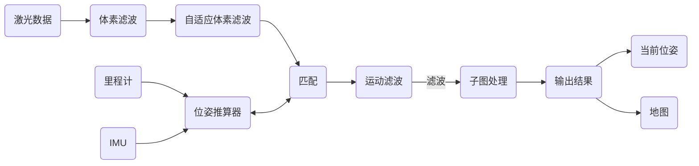

输入是LIO，激光，IMU，里程计三个数据，输出是当前位姿(tf)和地图。

ros接口集中在业务管理、输入、输出三个方面。


ros接口流程

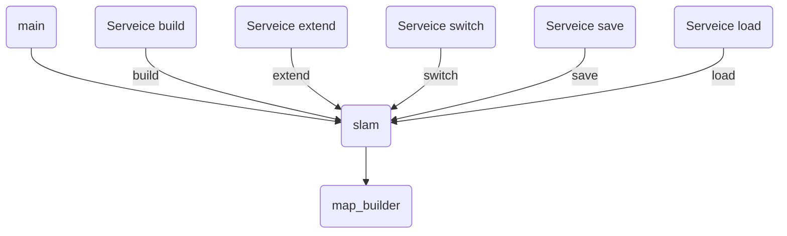

最后我们得到几个业务接口

1、建图，初次建图，不需要重定位，需要首帧对齐，新建轨迹为0的地图。可以取消，可以保存。保存后立刻切换为该地图。服务需要一个命令名称build，一个地图名称。地图通过消息/map发布，每5秒发布一次。机器的位姿

2、扩建，二次建图，需要重定位，需要重定位，新建轨迹>0的地图。可以取消，可以保存。保存后立刻切换为该地图。服务需要一个命令名称extend，一个地图名称。地图通过消息/map发布，每5秒发布一次。

3、切图，对保存后的地图文件进行切换，读取一个地图，需要重定位。新建的轨迹>0。可以再次切图，此时地图不会更新。可以保存，根据参数配置确定保存子图的数量，保存会检测是否有人工建图和人工扩建的轨迹，这部分会继续保留，但是自动切图的轨迹会替换成我们最新的轨迹。

4、保存，建图、扩建地图时保存地图，保存地图需要最终优化和保存地图两个步骤。切图后的保存功能设计初衷为让机器可以始终保持地图更新，又需要保证轨迹不会逐步增加。

5、重定位，扩建、切图均需要重定位，在全局地图里找到最合适的匹配，并且设置轨迹的相对位姿，如果定位成功则继续进行工作，如果定位失败则以默认初始位姿开始进行相应工作，后续重定位交给约束间的自动重定位。

6、导入，单纯导入一张地图并打印地图的所有信息。

涉及消息：

msg/posture.msg

```
float x
float y
float yaw
```

srv/Command.srv

```
string command
int32 filename
Posture pose
---
string message
```

在package.xml里加入两个依赖

```
  <build_depend>message_generation</build_depend>
  <exec_depend>message_runtime</exec_depend>
```

在CMakeLists.txt

里修改

```
find_package(catkin REQUIRED COMPONENTS roscpp message_generation)
add_message_files(
  DIRECTORY msg
  FILES
    Posture.msg
)

add_service_files(
  DIRECTORY srv
  FILES
    Command.srv
)

catkin_package(
  CATKIN_DEPENDS    
    message_runtime
)
```

新建一个slam类，来接收处理命令。

## 读取地图

写第一个接口函数，通过load一张已经建好的pbstream地图，逐步打印地图的信息。

在cartographer下新建一个ros目录，在目录里新建一个slam类，这个slam类作为沟通main和map_builder的接口，成员变量为map_builder的智能指针。

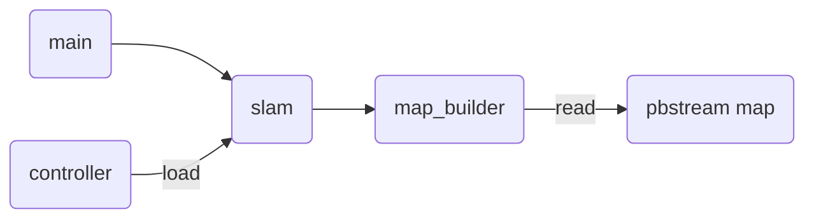

重写一个Slam。初始化需要能够接收消息。

在scripts接口新建一个

```
rosservice call /command "
  command: load
  filename: 1
  pose:
    x: 0.0
    y: 0.0
    yaw: 0.0
"
```


## 地图信息展示

 	一个pbstream地图，使用proto压缩过的各种信息的集合。包含配置信息，位姿信息，地图信息，约束信息等。最终是通过子图的位姿，拼接成一个大地图。

### 地图信息构成

大地图由多个带位姿的子图组成。

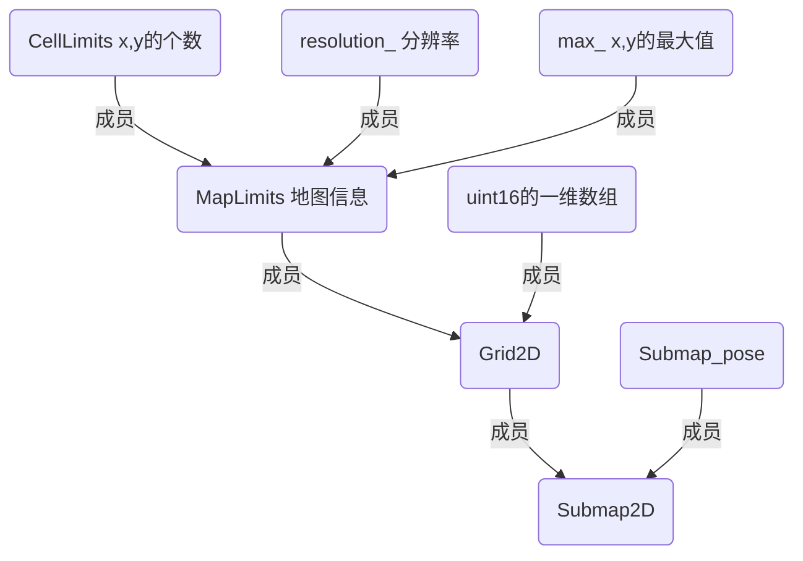

```
Submap2D的成员
  std::unique_ptr<Grid2D> grid_;//一张栅格地图
  ValueConversionTables* conversion_tables_;//一个转换表
继承于Submap的成员
  const transform::Rigid3d local_pose_;//地图的位姿，相对于map的位姿。  
```

```
Grid2D的成员
  MapLimits limits_;//地图的零点，宽高，分辨率信息。
  std::vector<uint16> correspondence_cost_cells_;//真正的地图数据
  const std::vector<float>* value_to_correspondence_cost_table_;//代价地图对应表
```

```
MapLimits的成员
  double resolution_;//分辨率
  Eigen::Vector2d max_;//x,y的最大值
  CellLimits cell_limits_;//离散化后x的个数，y的个数
```

```
CellLimits栅格的限制
  int num_x_cells = 0;
  int num_y_cells = 0;
```

### 子图信息展示

在map_builder加一个函数

```
.h
MapById<SubmapId, ::cartographer::mapping::SubmapData> GetAllSubmapData();
.cc
MapById<SubmapId, ::cartographer::mapping::SubmapData>
MapBuilder::GetAllSubmapData() {
  return pose_graph_2d_->GetAllSubmapData();
}
```

原来的地图发布查询子图流程，最终得到填写内容的std::map<SubmapId, SubmapSlice> submap_slices_。

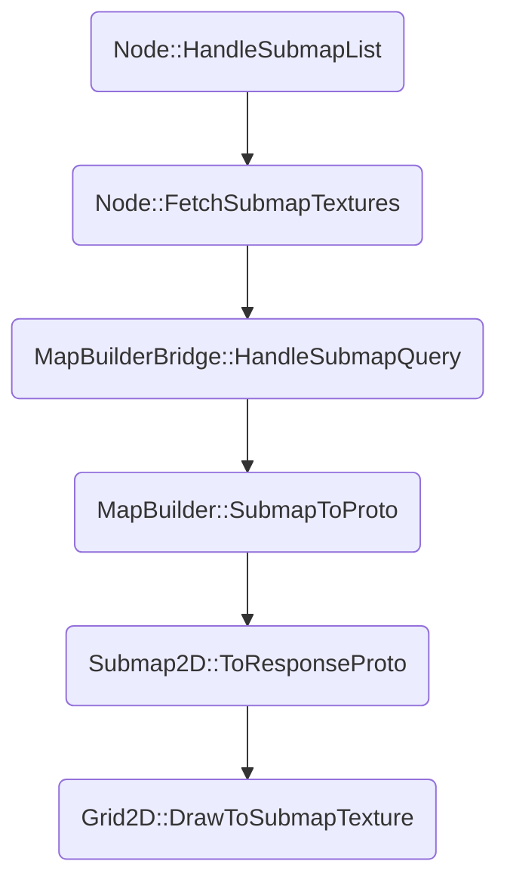

```
bool ProbabilityGrid::DrawToSubmapTexture(
    proto::SubmapQuery::Response::SubmapTexture* const texture,
    transform::Rigid3d local_pose) const {
  Eigen::Array2i offset;
  CellLimits cell_limits;
  ComputeCroppedLimits(&offset, &cell_limits);
  std::string cells;
  for (const Eigen::Array2i& xy_index : XYIndexRangeIterator(cell_limits)) {
    if (!IsKnown(xy_index + offset)) {
      cells.push_back(0 /* unknown log odds value */);
      cells.push_back(0 /* alpha */);
      continue;
    }
    const int delta =
        128 - ProbabilityToLogOddsInteger(GetProbability(xy_index + offset));
    const uint8 alpha = delta > 0 ? 0 : -delta;
    const uint8 value = delta > 0 ? delta : 0;
    cells.push_back(value);
    cells.push_back((value || alpha) ? alpha : 1);
  }

  common::FastGzipString(cells, texture->mutable_cells());
  texture->set_width(cell_limits.num_x_cells);
  texture->set_height(cell_limits.num_y_cells);
  const double resolution = limits().resolution();
  texture->set_resolution(resolution);
  const double max_x = limits().max().x() - resolution * offset.y();
  const double max_y = limits().max().y() - resolution * offset.x();
  *texture->mutable_slice_pose() = transform::ToProto(
      local_pose.inverse() *
      transform::Rigid3d::Translation(Eigen::Vector3d(max_x, max_y, 0.)));

  return true;
}
```

原cartographer ros的地图发布流程

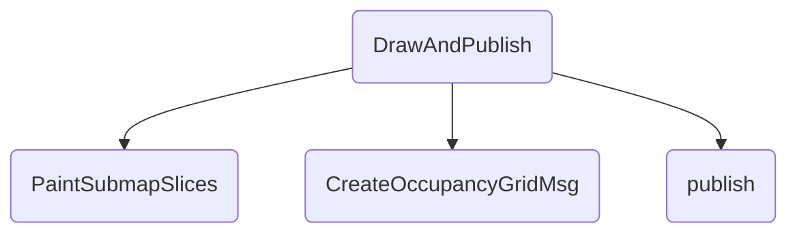

```
PaintSubmapSlicesResult PaintSubmapSlices(
    const std::map<::cartographer::mapping::SubmapId, SubmapSlice>& submaps,
    const double resolution) {
  Eigen::AlignedBox2f bounding_box;
  {
    auto surface = MakeUniqueCairoSurfacePtr(
        cairo_image_surface_create(kCairoFormat, 1, 1));
    auto cr = MakeUniqueCairoPtr(cairo_create(surface.get()));
    const auto update_bounding_box = [&bounding_box, &cr](double x, double y) {
      cairo_user_to_device(cr.get(), &x, &y);
      bounding_box.extend(Eigen::Vector2f(x, y));
    };

    CairoPaintSubmapSlices(
        1. / resolution, submaps, cr.get(),
        [&update_bounding_box](const SubmapSlice& submap_slice) {
          update_bounding_box(0, 0);
          update_bounding_box(submap_slice.width, 0);
          update_bounding_box(0, submap_slice.height);
          update_bounding_box(submap_slice.width, submap_slice.height);
        });
  }

  const int kPaddingPixel = 5;
  const Eigen::Array2i size(
      std::ceil(bounding_box.sizes().x()) + 2 * kPaddingPixel,
      std::ceil(bounding_box.sizes().y()) + 2 * kPaddingPixel);
  const Eigen::Array2f origin(-bounding_box.min().x() + kPaddingPixel,
                              -bounding_box.min().y() + kPaddingPixel);

  auto surface = MakeUniqueCairoSurfacePtr(
      cairo_image_surface_create(kCairoFormat, size.x(), size.y()));
  {
    auto cr = MakeUniqueCairoPtr(cairo_create(surface.get()));
    cairo_set_source_rgba(cr.get(), 0.5, 0.0, 0.0, 1.);
    cairo_paint(cr.get());
    cairo_translate(cr.get(), origin.x(), origin.y());
    CairoPaintSubmapSlices(1. / resolution, submaps, cr.get(),
                           [&cr](const SubmapSlice& submap_slice) {
                             cairo_set_source_surface(
                                 cr.get(), submap_slice.surface.get(), 0., 0.);
                             cairo_paint(cr.get());
                           });
    cairo_surface_flush(surface.get());
  }
  return PaintSubmapSlicesResult(std::move(surface), origin);
}
```

```
std::unique_ptr<nav_msgs::OccupancyGrid> CreateOccupancyGridMsg(
    const cartographer::io::PaintSubmapSlicesResult& painted_slices,
    const double resolution, const std::string& frame_id,
    const ros::Time& time) {
  auto occupancy_grid = absl::make_unique<nav_msgs::OccupancyGrid>();
  const int width = cairo_image_surface_get_width(painted_slices.surface.get());
  const int height =
      cairo_image_surface_get_height(painted_slices.surface.get());
  occupancy_grid->header.stamp = time;
  occupancy_grid->header.frame_id = frame_id;
  occupancy_grid->info.map_load_time = time;
  occupancy_grid->info.resolution = resolution;
  occupancy_grid->info.width = width;
  occupancy_grid->info.height = height;
  occupancy_grid->info.origin.position.x =
      -painted_slices.origin.x() * resolution;
  occupancy_grid->info.origin.position.y =
      (-height + painted_slices.origin.y()) * resolution;
  occupancy_grid->info.origin.position.z = 0.;
  occupancy_grid->info.origin.orientation.w = 1.;
  occupancy_grid->info.origin.orientation.x = 0.;
  occupancy_grid->info.origin.orientation.y = 0.;
  occupancy_grid->info.origin.orientation.z = 0.;
  const uint32_t* pixel_data = reinterpret_cast<uint32_t*>(
      cairo_image_surface_get_data(painted_slices.surface.get()));
  occupancy_grid->data.reserve(width * height);
  for (int y = height - 1; y >= 0; --y) {
    for (int x = 0; x < width; ++x) {
      const uint32_t packed = pixel_data[y * width + x];
      const unsigned char color = packed >> 16;
      const unsigned char observed = packed >> 8;
      const int value =
          observed == 0
              ? -1
              : ::cartographer::common::RoundToInt((1. - color / 255.) * 100.);
      CHECK_LE(-1, value);
      CHECK_GE(100, value);
      occupancy_grid->data.push_back(value);
    }
  }
  return occupancy_grid;
}
```

DrawToSubmapTexture时

```
    const int delta =
        128 - ProbabilityToLogOddsInteger(GetProbability(xy_index + offset));
    const uint8 alpha = delta > 0 ? 0 : -delta;
    const uint8 value = delta > 0 ? delta : 0;
    cells.push_back(value);
    cells.push_back((value || alpha) ? alpha : 1);
```

GetProbability输出的是0.1到0.9的占据概率值。

ProbabilityToLogOddsInteger转化成1-255的值

```
inline uint8 ProbabilityToLogOddsInteger(const float probability) {
  const int value = common::RoundToInt((Logit(probability) - kMinLogOdds) *
                                       254.f / (kMaxLogOdds - kMinLogOdds)) + 1;
  return value;
}
```

大概的意思是通过对数函数可以启到一个平滑的作用，0代表未知，已知概率0.1到0.9映射到1~255。又通过DrawToSubmapTexture的函数处理。一个字节装value，一个字节装alpha。通过1-颠倒概率，越小代表占据概率越大。

PaintSubmapSlices对我们来说是没有源码的黑盒。只知道加了一圈5像素的padding，原点因此改变。

CreateOccupancyGridMsg生成Grid的时候，一个cell已经变成32位。高位16~31位代表颜色，低位8~15位代表观测，0-7位不知道干啥。如果8-15位等于0则代表未知。

```
  for (int y = height - 1; y >= 0; --y) {
    for (int x = 0; x < width; ++x) {
      const uint32_t packed = pixel_data[y * width + x];
      const unsigned char color = packed >> 16;
      const unsigned char observed = packed >> 8;
      const int value =
          observed == 0
              ? -1
              : ::cartographer::common::RoundToInt((1. - color / 255.) * 100.);
      CHECK_LE(-1, value);
      CHECK_GE(100, value);
      occupancy_grid->data.push_back(value);
    }
  }
```

这里又有一个1-颠倒概率，代表越大概率越大。

我们对系统进行修改，不进行颠来倒去。仅输出0，10-90的概率栅格。

DrawToSubmapTexture

```
    const int delta = 100 * GetProbability(xy_index + offset);
    const uint8 alpha = delta > 0 ? 0 : -delta;
    const uint8 value = delta > 0 ? delta : 0;
    cells.push_back(value);
    cells.push_back((value || alpha) ? alpha : 1);
```

PublishSubmaps

```
      geometry_msgs::Pose pose = to_geometry_pose(submap_id_pose.data.pose);
    mapping::proto::SubmapQuery::Response proto;
    std::string error =
        map_builder_ptr_->SubmapToProto(submap_id_pose.id, &proto);
    if (proto.textures().size() > 1) {
      LOG(ERROR) << "Proto textures size is (" << proto.textures().size()
                 << "),continue.";
      continue;
    }
    if (proto.textures().empty()) {
      LOG(ERROR) << "Proto textures is empty,continue.";
      continue;
    }
    for (auto&& texture : proto.textures()) {
      nav_msgs::OccupancyGrid grid;
      grid.header.stamp = ros::Time::now();
      grid.header.frame_id = "map";
      grid.info.resolution = texture.resolution();
      grid.info.width = texture.width();
      grid.info.height = texture.height();
      grid.info.origin.position.x = 0.;
      grid.info.origin.position.y = 0.;
      grid.info.origin.position.z = 0.;
      grid.info.origin.orientation.w = 1.;
      grid.info.origin.orientation.x = 0.;
      grid.info.origin.orientation.y = 0.;
      grid.info.origin.orientation.z = 0.;
      std::string cells;
      ::cartographer::common::FastGunzipString(texture.cells(), &cells);
      const int num_pixels = texture.width() * texture.height();
      CHECK_EQ(cells.size(), 2 * num_pixels);
      LOG(ERROR) << "Cells size:(" << cells.size() << "),num_pixels:("
                 << num_pixels << ").";

      for (int i = 0; i < texture.height(); ++i) {
        for (int j = 0; j < texture.width(); ++j) {
          int intensity = cells[(i * texture.width() + j) * 2];
          // uint8_t value = ::cartographer::common::RoundToInt(
          //     (1. - intensity / 255.) * 100.);
          if (intensity > 0)
            grid.data.push_back(intensity);
          else
            grid.data.push_back(-1);
          // int alpha = cells[(i * texture.width() + j) * 2];
          // grid.data.push_back(255 - cells[(i * texture.width() + j) *
          // 2]); pixels.intensity.push_back(cells[(i * width + j) *
          // 2]); pixels.alpha.push_back(cells[(i * width + j) * 2 +
          // 1]);
        }
      }
      submaps_publisher_.publish(grid);
      sleep(1);
    }    
```

我们新建一个成员ros::Publisher submaps_publisher_;

PublishSubmaps每秒打印一个子图信息

```
void Slam::PublishSubmaps(){
  for (auto&& submap_data : map_builder_ptr_->GetAllSubmapData()) {
    const mapping::Grid2D& grid =
        *std::static_pointer_cast<const mapping::Submap2D>(
             submap_data.data.submap)
             ->grid();
    LOG(ERROR) << "Submap id:(" << submap_data.id << "),relocation:("
               << grid.limits().resolution() << "),max:("
               << grid.limits().max().x() << "," << grid.limits().max().y()
               << "),count:(" << grid.limits().cell_limits().num_x_cells << ","
               << grid.limits().cell_limits().num_y_cells << ")";
    sleep(1);
  }
}
```

### 位姿信息


### 约束信息


6.1 案例分析：建图过程中产生脚印


概率栅格地图概率模型
$$
odd(s|z) = \frac{p(z|s=1)}{p(z|s=0)}odd(s)\\
Hit:odds_z=\frac{p(z=1|s=1)}{p(z=1|s=0)}\\
Miss:odds_z=\frac{p(z=0|s=1)}{p(z=0|s=0)}\\
M_{new}(x)=clamp(odds^{-1}(odds(M_{old}(x)*odds(p_{hist}))))
$$

​	对于一个点，要么有障碍物，要么没有障碍物，我们用$p(s=0)$标识为空，用$p(s=1)$标识为占。二者和$p(s=0)+p(s=1)=1$。一个点的状态用二者比例标识$Odd(s) = \frac{p(s=0)}{p(s=1)}$。假设当前状态为$Odd(s)$当有一个新的测量值出现$z\sim(0,1)$，则更新为：
$$
Odd(s)=\frac{p(s=0|z)}{p(s=1|z)}
$$
表示在z发生情况下s的状态。

根据贝叶斯公式：
$$
p(s=1|z)=\frac{p(z|s=1)p(s=1)}{p(z)}\\
p(s=0|z)=\frac{p(z|s=0)p(s=0)}{p(z)}
$$
带入公示后得到
$$
Odd(s|z)_{k} = \frac{p(s=1|z)}{p(s=0|z)}\\=\frac{p(z|s=1)p(s=1)/p(z)}{p(z|s=0)p(s=0)/p(z)}\\
=\frac{p(z|s=1)}{p(z|s=0)}*Odd(s)_{k-1}
$$
​	默认的一类错误概率（拒真错误）hit_probability参数 0.55，二类错误概率（存伪概率）miss_probability0.49。粉丝的参数为0.75和0.45。hit  0.7  miss 0.49

|           | 观测值为1        | 观测值为0         |
| --------- | ---------------- | ----------------- |
| 预测值为1 | $p(z=1|s=1)=0.7$ | $p(z=0|s=1)=0.51$ |
| 预测值为0 | $p(z=1|s=0)=0.3$ | $p(z=0|s=0)=0.49$ |

​		根据公式（4），计算得到转移矩阵：
$$
C(z|s)=\begin{cases} \frac{p(z=1|s=1)}{p(z=1|s=0)}=0.7/0.3=2.33,z=1 \\ \frac{p(z=0|s=1)}{p(z=0|s=0)} =0.49/0.51=0.96,z=0 \end{cases}
$$
​		由于clamp的存在将odds的初值限定在了0.1到0.9之间。可以理解为在状态发生变化前的初值。

| 观测值 | 当前odd(s)值                                                 | 归一化到[0,100] |
| ------ | ------------------------------------------------------------ | --------------- |
| -      | -                                                            | -1              |
| 0      | $Odds(z|s)_{k0}=0.1$                                         | 10              |
| 1      | $Odds(z|s)_{k1}=Odd(s)_{k0}*C(z|s)=0.1*2.33$                 | 23              |
| 1      | $Odds(z|s)_{k2}=Odd(s)_{k0}*C(z|s)=0.1*2.33^2$               | 54              |
| 1      | $Odds(z|s)_{k3}=min(Odd(s)_{k0}*C(z|s))=min(0.1*2.33^3,0.9)$ | 90              |

​		当发现障碍物，最少需要7个抽样才能到达最大值。由于我们的设置了35、53的阈值，连续两个就会超过阈值。我们再来看障碍物离开的情况。

| 观测值 | 当前odd(s)值                                         | 四舍五入后归一化 |
| ------ | ---------------------------------------------------- | ---------------- |
| 1      | $Odd(z|s)_{k0}=0.9$                                  | 90               |
| 0      | $Odd(z|s)_{k1}=Odd(z|s)_{k0}*C(z)=0.9*0.96$          | 86               |
| ...    | ...                                                  | ...              |
| 0      | $Odd(z|s)_{k13}=Odds(z|s)_{k12}=0.9*0.96^{12}=0.529$ | 53               |
| 0      | $Odd(z|s)_{14}=0.9*0.96^{13}=0.508$                  | 51               |
| ...    | ...                                                  | ...              |
| 0      | $Odd(z|s)_{21}=0.9*0.96^{21}=0.358$                  | 35               |
| 0      | $Odd(z|s)_{22}=0.9*0.96^{22}=0.344$                  | 34               |
| 0      | $max(0.1,0.9*0.96^N)$                                | 10               |

​		可以看出需要22次miss才会更新掉障碍物。

```

```

如果配置参数是0.75和0.45按表计算

2次看见栅格概率就会从10到90。

11次看不见，栅格的概率就会从90到10。

motion filter 

constexpr double kMotionFilterMaxDuration = 5.;  // max_time_seconds

constexpr double kMotionFilterTranslation = 0.2;

constexpr double kMotionFilterRotaiton = common::DegToRad(10);

比如说我们的激光是10hz.每一帧都会插图，我在一个地方呆上0.2秒，这个地方的脚步的栅格就是90。

如果我离开这个地方1.1秒以上，这个地方的栅格就是10.

我们的地图 int8,-127~128,            -1，[10,90]。

最后一帧，应该有脚印，其他位置的脚印应该被消除。

--------

3次看见 到90，11次看不见到10。0.5米每秒运行。激光用多少米的，不希望插图太快。1秒一次，0.2到0.5之间。旋转阈值设置在20度。调个头，9次。6次，因为角速度太快了。


## 信号输出

## 运动滤波

## 位姿推算

## rcsm匹配

## csm匹配

## fcsm匹配

## 激光处理

## 插图处理

## 后端优化

# ROS1接口cartographer_ros

## 业务逻辑梳理

###  建图模式

### 扩建模式

### 定位模式

### 保存行为

#### 重定位行为

#### 全局匹配重定位

#### 指定位姿重定位

#### 指定范围重定位

### 配置修改

#### .建图模式参数

#### 定位模式参数

###  输入接口

#### 激光接口

#### 里程计接口

#### imu接口

### 输出接口

#### tf的转换关系

#### tf的输出

####  map的输出

## 性能优化

### 性能分析

### 找到关键点

### 频繁插图

### 频繁Rcsm

### 频繁找约束

### 频繁后优

# 难题疑点

## 长走廊问题

## 玻璃环境

## 地图纠正

##  环境变动

##  严重打滑

##  危险区域

#  附录

## 软件使用

###  apt-get

```
命令：
update - 重新获取软件包列表 
upgrade - 进行更新 
install - 安装新的软件包 
remove - 移除软件包 
autoremove - 自动移除全部不使用的软件包 
purge - 移除软件包和配置文件 
source - 下载源码档案 
build-dep - 为源码包配置编译依赖 
dist-upgrade - 发行版升级
dselect-upgrade - 依照 dselect 的选择更新 
clean - 清除下载的归档文件 
autoclean - 清除旧的的已下载的归档文件 
check - 检验是否有损坏的依赖 
选项：
-h 本帮助文件。 
-q 输出到日志 - 无进展指示 
-qq 不输出信息，错误除外 
-d 仅下载 - 不安装或解压归档文件 
-s 不实际安装。模拟执行命令
-y 假定对所有的询问选是，不提示 
-f 尝试修正系统依赖损坏处 
-m 如果归档无法定位，尝试继续
-u 同时显示更新软件包的列表 
-b 获取源码包后编译 -V 显示详细的版本号
-c=? 阅读此配置文件
-o=? 设置自定的配置选项，如 -o dir::cache=/tmp
常用实例：
apt-cache search packagename 搜索包
apt-cache show packagename 获取包的相关信息，如说明、大小、版本等
apt-get install packagename 安装包
apt-get install packagename --reinstall 重新安装包
apt-get -f install 修复安装”-f = –fix-missing”
apt-get remove packagename 删除包
apt-get remove packagename --purge 删除包，包括删除配置文件等
apt-get update 更新源
apt-get upgrade 更新已安装的包
apt-get dist-upgrade 升级系统
apt-get dselect-upgrade 使用 dselect 升级
apt-cache depends packagename 了解使用依赖
apt-cache rdepends packagename 是查看该包被哪些包依赖
apt-get build-dep packagename 安装相关的编译环境
apt-get source packagename 下载该包的源代码
apt-get clean 清理无用的包
apt-get autoclean 清理无用的包
apt-get check 检查是否有损坏的依赖
```

### docker run

```
-i	以交互模式运行容器，通常与 -t 同时使用
-t	启动容器后，为容器分配一个命令行，通常与 -i 同时使用
-v	目录映射，容器目录挂载到宿主机目录，格式： <host目录>:<容器目录>
-d	守护进程，后台运行该容器
-p	指定端口映射，格式：主机(宿主)端口:容器端口
-P	随机端口映射，容器内部端口随机映射到主机的端口（49153起始 49153到65535）
-u	以什么用户身份创建容器
–name “nginx-lb”	容器名字
-m, --memory bytes	设置容器使用内存最大值
-h, --hostname string	指定容器的 host name
–dns 8.8.8.8	指定容器 dns 服务器
-e username=“ritchie”	设置环境变量
–restart Docker	重启后，容器是否自动重启
–privileged	容器内是否使用真正的 root 权限
```

### docker 显示

```
-v /tmp/.X11-unix:/tmp/.X11-unix
-e DISPLAY=:0
docker run -itd --name 容器名 -h 容器主机名 --privileged \
           -v /tmp/.X11-unix:/tmp/.X11-unix  \
           -e DISPLAY=:0 镜像名或id /bin/bash
           --net=none
```

