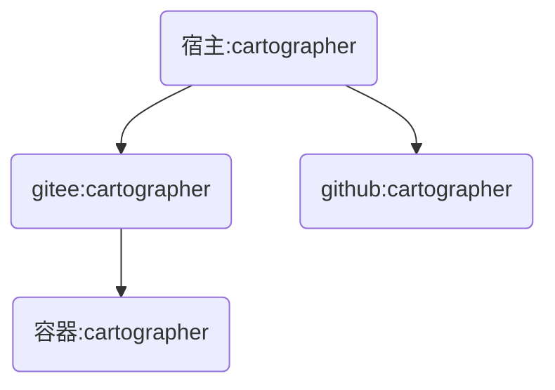
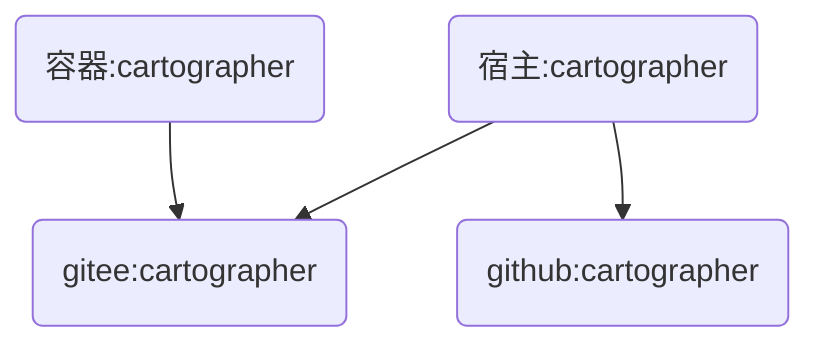
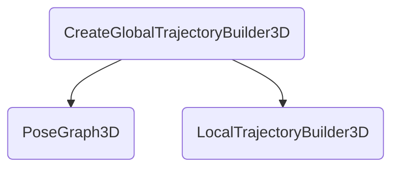

cartographer系统集成

# 背景介绍

## 项目背景

    本人是图像处理专业的研究生，具有多年的slam的工作经验，所在的项目组家扫出货量超过10000台，商扫出货量超过100台。在复杂场景，SLAM系统长时间高强度的稳定运行，表现出较好的鲁棒性。
    
    随着激光性能的提升和成本的降低，cartographer在室内2D环境，成为室内机器人的主流slam软件。但是其在工程上具有很高的集成难度，不易上手，也不易修改。为此，我们做一个理论的教学视频，使初学者可以快速学习slam原理；同时大幅删节冗余部分，去除不必要的依赖库，减少编译难度；并且优化性能，在非常低端的设备上实现较为复杂功能。
    
    最后一章也将对行业痛点，几个难题进行收录和探讨，部分已经解决的问题将公布源代码。我们也将建立讨论小组共同研究进步。
    
    本教学视频，所有课件和源代码会同步到github和gitee上。
    
    码云的下载地址为：https://gitee.com/slam-xiay/cartographer.git
    
    GitHub的下载地址为：https://github.com/slam-xiay/cartographer.git

# 平台搭建

## 平台目标

    目标硬件平台是rk3326,rk3399或rk3588，目标的软件平台为ubuntu20.04。为了方便今后的交叉编译，使用docker作为虚拟机，使用ubuntu 20.04作为系统，使用linux/arm64/v8平台。进行数据保存与码云服务器进行同步。每次工作均保存成一个commit进行上传。



## docker安装

在宿主ubuntu20.04安装docker

```
sudo apt-get update 
sudo apt-get install docker-ce docker-ce-cli containerd.io docker-buildx-plugin docker-compose-plugin
service docker restart
```

使用命令查看docker的状态

```
xiay@xiay:~$ docker ps -a
CONTAINER ID   IMAGE          COMMAND       CREATED        STATUS                  PORTS                                           NAMES
4c6e47dc5943   ubuntu:20.04   "/bin/bash"   19 hours ago   Up 5 hours              0.0.0.0:11311->11311/tcp, :::11311->11311/tcp   slam
693a00d93625   f78909c2b360   "/bin/bash"   2 months ago   Exited (0) 4 days ago                                                   ubuntu20
xiay@xiay:~$ docker images -a
REPOSITORY                   TAG       IMAGE ID       CREATED         SIZE
arm64v8/ubuntu               20.04     3048ba078595   6 weeks ago     65.7MB
ubuntu                       20.04     3048ba078595   6 weeks ago     65.7MB
dockcross/linux-arm64        latest    b926af811944   3 months ago    2.08GB
ubuntu                       <none>    fde9c12d7d3f   3 months ago    65.7MB
<none>                       <none>    f78909c2b360   3 months ago    72.8MB
bestwu/wechat                latest    0f0d1eee0079   7 months ago    2.87GB
ubuntu                       22.04     c6b84b685f35   7 months ago    77.8MB
ubuntu                       latest    c6b84b685f35   7 months ago    77.8MB
ubuntu                       <none>    6df894023726   8 months ago    72.8MB
multiarch/qemu-user-static   latest    3539aaa87393   14 months ago   305MB
```

## 容器配置

选择20.04的镜像，arm64v8的平台，平台需要自带gitlab。

```
docker run --rm --privileged multiarch/qemu-user-static --reset -p yes
```

```
docker run \
 -itd  \
 --restart always \
 --privileged=true \
 --name slam \
 --platform linux/arm64/v8 \
 ubuntu:20.04
```

通过attach命令进入容器。

```
$ sudo docker attach slam
$ sudo docker exec -it slam /bin/bash
```

查看服务器架构，确认是arm架构

```
root@78052cf4cba4:/# uname -m
aarch64
```

## 基础包安装

```
apt-get update
apt-get install sudo ssh vim wget g++ cmake git
wget http://fishros.com/install -O fishros && . fishros
```

选择换源并安装ros1

```
RUN Choose Task:[请输入括号内的数字]
---众多工具，等君来用---
ROS相关:
  [1]:一键安装(推荐):ROS(支持ROS/ROS2,树莓派Jetson)
  [3]:一键安装:rosdep(小鱼的rosdepc,又快又好用)
  [4]:一键配置:ROS环境(快速更新ROS环境设置,自动生成环境选择)
  [9]:一键安装:Cartographer(18 20测试通过,16未测. updateTime 20240125)
  [11]:一键安装:ROS Docker版(支持所有版本ROS/ROS2)
  [16]:一键安装：系统自带ROS (！！警告！！仅供特殊情况下使用)
常用软件:
  [2]:一键安装:github桌面版(小鱼常用的github客户端)
  [6]:一键安装:NodeJS环境
  [7]:一键安装:VsCode开发工具
  [8]:一键安装:Docker
  [10]:一键安装:微信(可以在Linux上使用的微信)
  [12]:一键安装:PlateformIO MicroROS开发环境(支持Fishbot)
  [14]:一键安装:科学上网代理工具
  [15]:一键安装：QQ for Linux
配置工具:
  [5]:一键配置:系统源(更换系统源,支持全版本Ubuntu系统)
  [13]:一键配置:python国内源
[0]:quit
请输入[]内的数字以选择:1

RUN Choose Task:[请输入括号内的数字]
新手或首次安装一定要一定要一定要换源并清理三方源，换源!!!系统默认国外源容易失败!!
[1]:更换系统源再继续安装
[2]:不更换继续安装
[0]:quit
请输入[]内的数字以选择:1

RUN Choose Task:[请输入括号内的数字]
请选择换源方式,如果不知道选什么请选2
[1]:仅更换系统源
[2]:更换系统源并清理第三方源
[0]:quit
请输入[]内的数字以选择:2

RUN Choose Task:[请输入括号内的数字]
请选择你要安装的ROS版本名称(请注意ROS1和ROS2区别):
[1]:noetic(ROS1)
[2]:foxy(ROS2)
[3]:galactic(ROS2)
[4]:rolling(ROS2)
[0]:quit
请输入[]内的数字以选择:1

RUN Choose Task:[请输入括号内的数字]
请选择安装的具体版本(如果不知道怎么选,请选1桌面版):
[1]:noetic(ROS1)桌面版
[2]:noetic(ROS1)基础版(小)
[0]:quit
请输入[]内的数字以选择:2

Please select the geographic area in which you live. Subsequent configuration questions will narrow this down by presenting a list of cities, representing the time zones in which they are located.
6. Asia 
Geographic area: 6

Please select the city or region corresponding to your time zone.
70. Shanghai 
Time zone: 70
```

使用roscore命令判断是否装好ros

```
root@44cf1a96d70f:/# roscore
.. logging to /root/.ros/log/3d872440-f0cd-11ee-bbc2-8df8ab58e450/roslaunch-44cf1a96d70f-21762.log
Checking log directory for disk usage. This may take a while.
Press Ctrl-C to interrupt
Done checking log file disk usage. Usage is <1GB.

started roslaunch server http://44cf1a96d70f:40561/
ros_comm version 1.16.0
```

修改宿主的~/.bashrc

```
export ROS_MASTER_URI=http://172.17.0.2:11311
```

然后激活环境变量

```
source ~/.bashrc
```

用rostopic查看

```
(base) xiay@xiay:~$ rostopic list
/rosout
/rosout_agg
```

可以看到东西说明，环境配置成功。

## 安装cartographer

官网链接

https://google-cartographer.readthedocs.io/en/latest/

```
cd ~
apt-get install git
git clone https://github.com/cartographer-project/cartographer.git
```

生成公钥，在码云和github空间设置公钥

```
root@8792bb9a3467:~/cartographer# ssh-keygen           
Generating public/private rsa key pair.
Enter file in which to save the key (/root/.ssh/id_rsa): 
Created directory '/root/.ssh'.
Enter passphrase (empty for no passphrase): 
Enter same passphrase again: 
Your identification has been saved in /root/.ssh/id_rsa
Your public key has been saved in /root/.ssh/id_rsa.pub
The key fingerprint is:
SHA256:21UbEjBTxYUpAnKbWTRHt0Wl/VEiCJVfbT88ROtw2PY root@8792bb9a3467
The key's randomart image is:
+---[RSA 3072]----+
|      . +=O**o=BB|
|       o =+=.+BB=|
|        +  o.=BBo|
|            .o=*=|
|        S   . ..E|
|         o .     |
|        . .      |
|                 |
|                 |
+----[SHA256]-----+
root@8792bb9a3467:~/cartographer# cat ~/.ssh/id_rsa.pub 
ssh-rsa AAAAB3NzaC1yc2EAAAADAQABAAABgQDJ6IAaW2TlQBpehHeJY5TGglYK+DKRZ05FLqYFQyxQ9K9MZQV0+h6gSIrrb0Fkq8vtLw5eN8vGTanCGUY5VhutHSV/hsvYCkpD+ZV71v38yH5lokQivwPEmtS4ST+4a+TgWWCNPrIJGwOlzZbOcW7Lh0NcyERgcr53OLK8i32wdDHbBJ7fpGCsxnfsD1bfw8exrxV0TqbkNK2nB5tLC0l3h2QdmwBNCBIR63iIDuhxzHwSwS7WnW8pgYebIOIGiJTgFjSo3ijVXkiVUCRQK9uOl5zWferxGCj6LxYiS/prAWM5DAxyW19fC6yy3HKsGILpWAcnsrALVgGMh6j6iFhvH4KJy9kyy7iDxVDAuSXEWmCgIuzlYp85JPryMUDcoGEcu29qoUXy1nSw9ucIcgQ6+6plpTN/Vmr/kl6FKJpEOPeUev8UUHrzXsObpcwPm6rgFtHM+98E5NWNJGg2j68Gl69vmJCNW/5BtMCt935N+DWDRoseH5TEqpWmKEElB10= root@8792bb9a3467
```

把打印的内容复制填入github的ssh公钥。


把打印的内容复制填入gitee的ssh公钥


通过git remote 命令修改两个源的位置

```
git remote set-url origin git@gitee.com:slam-xiay/cartographer.git
git remote set-url github git@github.com:slam-xiay/cartographer.git
git remote add github git@github.com:slam-xiay/cartographer.git
```

通过remote -v查看两个源的位置

```
root@8792bb9a3467:~/cartographer# git remote -v
github	git@github.com:slam-xiay/cartographer.git (fetch)
github	git@github.com:slam-xiay/cartographer.git (push)
origin	git@gitee.com:slam-xiay/cartographer.git (fetch)
origin	git@gitee.com:slam-xiay/cartographer.git (push)
```

修改权限后上传

```
root@44cf1a96d70f:~/cartographer# git push -f origin master
root@44cf1a96d70f:~/cartographer# git push -f github master
```

## 配置ssh

目的是宿主通过ssh登录docker容器不需要密码

安装配置ssh

```
sudo apt-get install ssh openssh-server openssh-client
sed -i "s/#PubkeyAuthentication/PubkeyAuthentication/g" /etc/ssh/sshd_config
sed -i "s/#uthorizedKeysFile/uthorizedKeysFile/g" /etc/ssh/sshd_config
mkdir -p /root/.ssh/
ssh-keygen
service ssh restart
```

在宿主生成公钥

```
ssh-keygen
```

在宿主打印公钥

```
cat ~/.ssh/id_rsa.pub
```

复制宿主的公钥到容器的/root/.ssh/authorized_keys

通过ssh免秘钥登录主机

```
ssh root@172.17.0.2
```

## 编译脚本



工作下载和使用就略过了，我们在宿主主机下载一个备份

```
cd ~
mkdir -p gamma
cd gamma 
git clone https://gitee.com/slam-xiay/cartographer.git
cd cartographer
```

新建一个build.sh

```
touch build.sh
chmod +x ./build.sh 
```

编辑build.sh内容

业务流程如下

```
确保docker开启，ssh开启。
上传宿主的cartographer内容到gitee服务器。
登录容器的cartographer，下载gitee服务器的cartographer。
编译容器的cartographer。
```

由于我们还没有先对cartographer进行编译和精简，后续未完成的流程等ros接口那个章节再补充。

```
docker start slam
docker exec slam service ssh start

reset
pushd ~/gamma/cartographer/
git add .
git commit -m "modify cartographer"
git push origin master -f
popd

ssh root@172.17.0.2 'cd /root/gamma/cartographer/ &&git reset --hard origin/master && git pull origin master && sync'
ssh root@172.17.0.2 'rm /root/gamma/cartographer/build/libcartographer.a && sync'
ssh root@172.17.0.2 'cd /root/gamma/cartographer/build && cmake .. && make -j16 install'
```

这个编译完是这个效果则表示编译成功

```
~/gamma/cartographer ~/gamma/cartographer
On branch master
Your branch is up to date with 'origin/master'.

nothing to commit, working tree clean
Everything up-to-date
~/gamma/cartographer
HEAD is now at cea9da4 modify cartographer
From https://gitee.com/slam-xiay/cartographer
 * branch            master     -> FETCH_HEAD
Already up to date.
/usr/bin/rm: cannot remove '/root/gamma/cartographer/build/libcartographer.a': No such file or directory
-- The CXX compiler identification is GNU 9.4.0
-- Check for working CXX compiler: /usr/bin/c++
-- Check for working CXX compiler: /usr/bin/c++ -- works
-- Detecting CXX compiler ABI info
-- Detecting CXX compiler ABI info - done
-- Detecting CXX compile features
-- Detecting CXX compile features - done
-- Build type: Release
Files /root/gamma/cartographer/build/AllFiles.cmake and - differ
CMake Warning at /usr/src/googletest/googlemock/CMakeLists.txt:43 (project):
  VERSION keyword not followed by a value or was followed by a value that
  expanded to nothing.


CMake Warning at /usr/src/googletest/googletest/CMakeLists.txt:54 (project):
  VERSION keyword not followed by a value or was followed by a value that
  expanded to nothing.


-- Found PythonInterp: /usr/bin/python3.8 (found version "3.8.10") 
-- Looking for pthread.h
-- Looking for pthread.h - found
-- Performing Test CMAKE_HAVE_LIBC_PTHREAD
-- Performing Test CMAKE_HAVE_LIBC_PTHREAD - Failed
-- Looking for pthread_create in pthreads
-- Looking for pthread_create in pthreads - not found
-- Looking for pthread_create in pthread
-- Looking for pthread_create in pthread - found
-- Found Threads: TRUE  
-- Found GMock: gmock_main;-lpthread  
CMake Error at CMakeLists.txt:32 (find_package):
  By not providing "Findabsl.cmake" in CMAKE_MODULE_PATH this project has
  asked CMake to find a package configuration file provided by "absl", but
  CMake did not find one.

  Could not find a package configuration file provided by "absl" with any of
  the following names:

    abslConfig.cmake
    absl-config.cmake

  Add the installation prefix of "absl" to CMAKE_PREFIX_PATH or set
  "absl_DIR" to a directory containing one of the above files.  If "absl"
  provides a separate development package or SDK, be sure it has been
  installed.


-- Configuring incomplete, errors occurred!
See also "/root/gamma/cartographer/build/CMakeFiles/CMakeOutput.log".
See also "/root/gamma/cartographer/build/CMakeFiles/CMakeError.log".
```

纯净的cartographer是没有gtest、gmock、absl库。

我们在.gitignore补充一些文件，让我们本地的vscode配置不影响库文件

```
build
bazel-*
.vscode
.bazelci
settings.json
```

做好这些以后，用vscode打开cartographer，并保存。


以此点红框位置打开终端，并调用build.sh则表示我们同步成功。

根据个人习惯决定是否打开保存修改格式。这不是我们的重点，关注的人多的话，关于自动调整格式我们专门做一集。

# 编译优化

## 安装依赖

```
apt-get install sudo ssh vim wget g++ cmake git google-mock python3-sphinx libboost-iostreams-dev libcairo2-dev libceres-dev libgflags-dev libgoogle-glog-dev liblua5.2-dev googletest libeigen3-dev  -y
```

### 安装package依赖

安装package.xml里声明的依赖。

```
  <build_depend>git</build_depend>
  <build_depend>google-mock</build_depend>
  <build_depend>gtest</build_depend>
  <build_depend>python3-sphinx</build_depend>
  <depend>libboost-iostreams-dev</depend>
  <depend>eigen</depend>
  <depend>libabsl-dev</depend>
  <depend>libcairo2-dev</depend>
  <depend>libceres-dev</depend>
  <depend>libgflags-dev</depend>
  <depend>libgoogle-glog-dev</depend>
  <depend>liblua5.2-dev</depend>
  <depend>protobuf-dev</depend>
```

使用apt-get安装可以找到的依赖

```
apt-get install google-mock python3-sphinx libboost-iostreams-dev libcairo2-dev libceres-dev libgflags-dev libgoogle-glog-dev 
```

其他几个是报错的，我单独安装

```
Note, selecting 'liblua5.2-dev' for regex 'lua5.2-dev'
E: Unable to locate package protobuf-dev
E: Unable to locate package gtest
E: Unable to locate package eigen
E: Unable to locate package libabsl-dev
```

我们使用变通的方式进行安装

```
apt-get install liblua5.2-dev googletest libeigen3-dev 
```

### absl安装

只有abseil不能安装，我们使用手动安装

```
 cd ~/gamma/
 git clone git@gitee.com:slam-xiay/abseil-cpp.git
 cd abseil-cpp
 git checkout 215105818dfde3174fe799600bb0f3cae233d0bf
 mkdir build
 cd build
 cmake \
  -DCMAKE_CXX_STANDARD=17 \
  -DCMAKE_INSTALL_PREFIX=usr \
  -DCMAKE_BUILD_TYPE=Release \
  ..
 make -j16 install
```

### Protobuf安装

```
cd ~/gamma/
git clone git@github.com:protocolbuffers/protobuf.git
git checkout tags/v3.4.1
mkdir build
cd build
cmake \
  -DCMAKE_CXX_STANDARD=17 \
  -DCMAKE_INSTALL_PREFIX=usr \
  -DCMAKE_POSITION_INDEPENDENT_CODE=ON \
  -DCMAKE_BUILD_TYPE=Release \
  -Dprotobuf_BUILD_TESTS=OFF \
  ../cmake
make -j16 install
```

## 模块优化

```
abseil 215105818dfde3174fe799600bb0f3cae233d0bf
protobuf v3.4.1
```

安装完abseil 和protobuf，我们先不管报错，开始优化模块，优化完模块这些问题也将一并解决。

### 删除WIN32分支

修改cartographer下的cmakelist.txt

```
# if(WIN32)
#   list(APPEND BOOST_COMPONENTS zlib)
#   set(Boost_USE_STATIC_LIBS FALSE)
# endif()

# if(WIN32)
#   # On Windows, Protobuf is incorrectly found by the bundled CMake module, so prefer native CMake config.
#   set(protobuf_MODULE_COMPATIBLE TRUE CACHE INTERNAL "")
#   find_package(Protobuf 3.0.0 CONFIG)
# else()
  find_package(Protobuf 3.0.0 REQUIRED)
# endif()

# if (NOT WIN32)
  PKG_SEARCH_MODULE(CAIRO REQUIRED cairo>=1.12.16)
# else()
#   find_library(CAIRO_LIBRARIES cairo)
# endif()

# if (WIN32)
#   find_package(glog REQUIRED)
#   set(GLOG_LIBRARY glog::glog)
# else()
  set(GLOG_LIBRARY glog)
# endif()

#if(WIN32)
#   # Needed to fix conflict with MSVC's error macro.
#   target_compile_definitions(${PROJECT_NAME} PUBLIC -DGLOG_NO_ABBREVIATED_SEVERITIES)
# endif()

# if (NOT WIN32)
  target_link_libraries(${PROJECT_NAME} PUBLIC pthread)
# endif()

# if (WIN32)
#   target_compile_definitions(${TEST_LIB} PUBLIC -DGTEST_LINKED_AS_SHARED_LIBRARY)
# endif()
```

### 删除MSVC分支

在CMakeList.txt里删除

```
# if(MSVC)
#   # Needed for VS 2017 5.8
#   target_compile_definitions(${PROJECT_NAME} PUBLIC -D_ENABLE_EXTENDED_ALIGNED_STORAGE -D_USE_MATH_DEFINES)
# endif()
```

### 删除GRPC分支

在CMakeList.txt里删除

```
# option(BUILD_GRPC "build Cartographer gRPC support" false)
# set(CARTOGRAPHER_HAS_GRPC ${BUILD_GRPC})
# if (${BUILD_GRPC})
#   find_package(async_grpc REQUIRED)
# endif()

# if(${BUILD_GRPC})
#   set(ALL_GRPC_SERVICE_SRCS)
#   set(ALL_GRPC_SERVICE_HDRS)
#   foreach(ABS_FIL ${ALL_GRPC_SERVICES})
#     file(RELATIVE_PATH REL_FIL ${PROJECT_SOURCE_DIR} ${ABS_FIL})
#     get_filename_component(DIR ${REL_FIL} DIRECTORY)
#     get_filename_component(FIL_WE ${REL_FIL} NAME_WE)

#     list(APPEND ALL_GRPC_SERVICE_SRCS "${PROJECT_BINARY_DIR}/${DIR}/${FIL_WE}.pb.cc")
#     list(APPEND ALL_GRPC_SERVICE_HDRS "${PROJECT_BINARY_DIR}/${DIR}/${FIL_WE}.pb.h")

#     add_custom_command(
#       OUTPUT "${PROJECT_BINARY_DIR}/${DIR}/${FIL_WE}.pb.cc"
#              "${PROJECT_BINARY_DIR}/${DIR}/${FIL_WE}.pb.h"
#       COMMAND  ${PROTOBUF_PROTOC_EXECUTABLE}
#       ARGS --cpp_out  ${PROJECT_BINARY_DIR}
#         -I ${PROJECT_SOURCE_DIR}
#         ${ABS_FIL}
#       DEPENDS ${ABS_FIL}
#       COMMENT "Running C++ protocol buffer compiler on ${ABS_FIL}"
#       VERBATIM
#     )
#   endforeach()
#   set_source_files_properties(${ALL_GRPC_SERVICE_SRCS} ${ALL_GRPC_SERVICE_HDRS} PROPERTIES GENERATED TRUE)
#   list(APPEND ALL_LIBRARY_HDRS ${ALL_GRPC_SERVICE_HDRS})
#   list(APPEND ALL_LIBRARY_SRCS ${ALL_GRPC_SERVICE_SRCS})
# endif()


# if(${BUILD_GRPC})
#   google_binary(cartographer_grpc_server
#     SRCS
#       cartographer/cloud/map_builder_server_main.cc
#   )
#   target_link_libraries(cartographer_grpc_server PUBLIC grpc++)
#   target_link_libraries(cartographer_grpc_server PUBLIC async_grpc)
#   if(${BUILD_PROMETHEUS})
#     target_link_libraries(cartographer_grpc_server PUBLIC ${ZLIB_LIBRARIES})
#     target_link_libraries(cartographer_grpc_server PUBLIC prometheus-cpp-core)
#     target_link_libraries(cartographer_grpc_server PUBLIC prometheus-cpp-pull)
#   endif()
# endif()

# if(${BUILD_GRPC})
#   target_link_libraries(${PROJECT_NAME} PUBLIC grpc++)
#   target_link_libraries(${PROJECT_NAME} PUBLIC async_grpc)
# endif()

# if(${BUILD_GRPC})
#   target_link_libraries("${TEST_TARGET_NAME}" PUBLIC grpc++)
#   target_link_libraries("${TEST_TARGET_NAME}" PUBLIC async_grpc)
# endif()
```

同时，文中提到ALL_GRPC_FILES在file(GLOB_RECURSE ALL_GRPC_FILES "cartographer/cloud/*")

也就是说cartographer/cloud文件夹中的文件，我们一起删除。

```
rm cartographer/cloud -rf
```

然后在CMakeList里删除相关的文件

```
# file(GLOB_RECURSE ALL_GRPC_FILES "cartographer/cloud/*")
# list(REMOVE_ITEM ALL_GRPC_FILES ${ALL_PROMETHEUS_FILES})
# if (NOT ${BUILD_GRPC})
#   list(REMOVE_ITEM ALL_LIBRARY_HDRS ${ALL_GRPC_FILES})
#   list(REMOVE_ITEM ALL_LIBRARY_SRCS ${ALL_GRPC_FILES})
#   list(REMOVE_ITEM TEST_LIBRARY_HDRS ${ALL_GRPC_FILES})
#   list(REMOVE_ITEM TEST_LIBRARY_SRCS ${ALL_GRPC_FILES})
#   list(REMOVE_ITEM ALL_TESTS ${ALL_GRPC_FILES})
#   list(REMOVE_ITEM ALL_EXECUTABLES ${ALL_GRPC_FILES})
# endif()

# if (NOT ${BUILD_GRPC})
#   list(REMOVE_ITEM ALL_PROTOS ${ALL_GRPC_FILES})
# endif()
```

在cartographer-config.cmake.in里删除

```
#set(CARTOGRAPHER_HAS_GRPC @CARTOGRAPHER_HAS_GRPC@)
#if(CARTOGRAPHER_HAS_GRPC)
#   find_package(async_grpc ${QUIET_OR_REQUIRED_OPTION})
#endif()
#if (WIN32)
#    find_package(glog REQUIRED)
#endif()
```

删除lua文件

```
rm cartographer/configuration_files/map_builder_server.lua
```

### 删除PROMETHEUS分支

在CMakeLists.txt里删除

```
#option(BUILD_PROMETHEUS "build Prometheus monitoring support" false)
#if(${BUILD_PROMETHEUS})
#   find_package( ZLIB REQUIRED )
# endif()

# if (NOT ${BUILD_PROMETHEUS})
#   list(REMOVE_ITEM ALL_LIBRARY_HDRS ${ALL_PROMETHEUS_FILES})
#   list(REMOVE_ITEM ALL_LIBRARY_SRCS ${ALL_PROMETHEUS_FILES})
#   list(REMOVE_ITEM TEST_LIBRARY_HDRS ${ALL_PROMETHEUS_FILES})
#   list(REMOVE_ITEM TEST_LIBRARY_SRCS ${ALL_PROMETHEUS_FILES})
#   list(REMOVE_ITEM ALL_TESTS ${ALL_PROMETHEUS_FILES})
#   list(REMOVE_ITEM ALL_EXECUTABLES ${ALL_PROMETHEUS_FILES})
# endif()

# if(${BUILD_PROMETHEUS})
#   target_link_libraries(${PROJECT_NAME} PUBLIC ${ZLIB_LIBRARIES})
#   target_link_libraries(${PROJECT_NAME} PUBLIC prometheus-cpp-core)
#   target_link_libraries(${PROJECT_NAME} PUBLIC prometheus-cpp-pull)
#   target_compile_definitions(${PROJECT_NAME} PUBLIC USE_PROMETHEUS=1)
# endif()

# if(${BUILD_PROMETHEUS})
#   target_link_libraries("${TEST_TARGET_NAME}" PUBLIC ${ZLIB_LIBRARIES})
#   target_link_libraries("${TEST_TARGET_NAME}" PUBLIC prometheus-cpp-core)
#   target_link_libraries("${TEST_TARGET_NAME}" PUBLIC prometheus-cpp-pull)
# endif()
```

同时涉及一个变量的文件 ALL_PROMETHEUS_FILES，在cartographer/cloud/metrics/prometheus/*

由于上文已经删除了所有cloud下的文件所以我们不再重复删除。

### 删除Sphinx分支

```
# # Only build the documentation if we can find Sphinx.
# find_package(Sphinx)
# if(SPHINX_FOUND)
#   add_subdirectory("docs")
# endif()
```

删除docs文件夹

```
rm -rf cartographer/docs
```

### 删除文件

```
rm .github -rf
rm .bazelci -rf
rm scripts -rf
rm .bazelrc
rm .dockerignore
rm AUTHORS
rm azure-pipelines.yml
rm BUILD.bazel
rm CHANGELOG.rst
rm CONTRIBUTING.md
rm Dockerfile.*
rm README.rst
rm RELEASING.rst
rm WORKSPACE
rm bazel -rf
rm docs -rf
rm cartographer/BUILD.bazel
```

### 删除TEST_LIBRARY

```
find . -name fake_*
./cartographer/io/fake_file_writer.cc
./cartographer/io/fake_file_writer_test.cc
./cartographer/io/fake_file_writer.h
./cartographer/mapping/internal/testing/fake_trimmable.h
```

```
find . -name *test_helpers* 
./cartographer/sensor/internal/test_helpers.h
./cartographer/io/internal/testing/test_helpers.h
./cartographer/io/internal/testing/test_helpers.cc
./cartographer/common/internal/testing/lua_parameter_dictionary_test_helpers.h
./cartographer/mapping/internal/testing/test_helpers.h
./cartographer/mapping/internal/testing/test_helpers.cc
./cartographer/transform/rigid_transform_test_helpers.h
```

```
find . -name mock_*
./cartographer/mapping/internal/testing/mock_pose_graph.h
./cartographer/mapping/internal/testing/mock_trajectory_builder.h
./cartographer/mapping/internal/testing/mock_map_builder.h
```

```
find . -name *_test.*
./cartographer/sensor/map_by_time_test.cc
./cartographer/sensor/point_cloud_test.cc
./cartographer/sensor/compressed_point_cloud_test.cc
./cartographer/sensor/landmark_data_test.cc
./cartographer/sensor/internal/voxel_filter_test.cc
./cartographer/sensor/internal/trajectory_collator_test.cc
./cartographer/sensor/internal/collator_test.cc
./cartographer/sensor/internal/ordered_multi_queue_test.cc
./cartographer/sensor/range_data_test.cc
./cartographer/io/probability_grid_points_processor_test.cc
./cartographer/io/points_processor_pipeline_builder_test.cc
./cartographer/io/proto_stream_test.cc
./cartographer/io/proto_stream_deserializer_test.cc
./cartographer/io/
./cartographer/io/internal/in_memory_proto_stream_test.cc
./cartographer/common/fixed_ratio_sampler_test.cc
./cartographer/common/math_test.cc
./cartographer/common/thread_pool_test.cc
./cartographer/common/internal/blocking_queue_test.cc
./cartographer/common/internal/rate_timer_test.cc
./cartographer/common/task_test.cc
./cartographer/common/configuration_files_test.cc
./cartographer/common/lua_parameter_dictionary_test.cc
./cartographer/mapping/pose_extrapolator_test.cc
./cartographer/mapping/pose_graph_test.cc
./cartographer/mapping/id_test.cc
./cartographer/mapping/submaps_test.cc
./cartographer/mapping/pose_graph_trimmer_test.cc
./cartographer/mapping/2d/probability_grid_test.cc
./cartographer/mapping/2d/range_data_inserter_2d_test.cc
./cartographer/mapping/2d/xy_index_test.cc
./cartographer/mapping/2d/submap_2d_test.cc
./cartographer/mapping/2d/map_limits_test.cc
./cartographer/mapping/probability_values_test.cc
./cartographer/mapping/3d/submap_3d_test.cc
./cartographer/mapping/3d/hybrid_grid_test.cc
./cartographer/mapping/3d/range_data_inserter_3d_test.cc
./cartographer/mapping/map_builder_test.cc
./cartographer/mapping/imu_tracker_test.cc
./cartographer/mapping/internal/optimization/cost_functions/spa_cost_function_2d_test.cc
./cartographer/mapping/internal/optimization/cost_functions/landmark_cost_function_2d_test.cc
./cartographer/mapping/internal/optimization/cost_functions/landmark_cost_function_3d_test.cc
./cartographer/mapping/internal/optimization/optimization_problem_3d_test.cc
./cartographer/mapping/internal/trajectory_connectivity_state_test.cc
./cartographer/mapping/internal/2d/overlapping_submaps_trimmer_2d_test.cc
./cartographer/mapping/internal/2d/tsdf_2d_test.cc
./cartographer/mapping/internal/2d/ray_to_pixel_mask_test.cc
./cartographer/mapping/internal/2d/scan_matching/ceres_scan_matcher_2d_test.cc
./cartographer/mapping/internal/2d/scan_matching/occupied_space_cost_function_2d_test.cc
./cartographer/mapping/internal/2d/scan_matching/interpolated_tsdf_2d_test.cc
./cartographer/mapping/internal/2d/scan_matching/tsdf_match_cost_function_2d_test.cc
./cartographer/mapping/internal/2d/scan_matching/correlative_scan_matcher_test.cc
./cartographer/mapping/internal/2d/scan_matching/fast_correlative_scan_matcher_2d_test.cc
./cartographer/mapping/internal/2d/scan_matching/real_time_correlative_scan_matcher_2d_test.cc
./cartographer/mapping/internal/2d/pose_graph_2d_test.cc
./cartographer/mapping/internal/2d/tsdf_range_data_inserter_2d_test.cc
./cartographer/mapping/internal/2d/tsd_value_converter_test.cc
./cartographer/mapping/internal/2d/normal_estimation_2d_test.cc
./cartographer/mapping/internal/3d/scan_matching/real_time_correlative_scan_matcher_3d_test.cc
./cartographer/mapping/internal/3d/scan_matching/interpolated_grid_test.cc
./cartographer/mapping/internal/3d/scan_matching/precomputation_grid_3d_test.cc
./cartographer/mapping/internal/3d/scan_matching/fast_correlative_scan_matcher_3d_test.cc
./cartographer/mapping/internal/3d/scan_matching/ceres_scan_matcher_3d_test.cc
./cartographer/mapping/internal/3d/scan_matching/rotation_delta_cost_functor_3d_test.cc
./cartographer/mapping/internal/3d/scan_matching/intensity_cost_function_3d_test.cc
./cartographer/mapping/internal/3d/scan_matching/rotational_scan_matcher_test.cc
./cartographer/mapping/internal/3d/pose_graph_3d_test.cc
./cartographer/mapping/internal/3d/local_trajectory_builder_3d_test.cc
./cartographer/mapping/internal/connected_components_test.cc
./cartographer/mapping/internal/range_data_collator_test.cc
./cartographer/mapping/internal/constraints/constraint_builder_2d_test.cc
./cartographer/mapping/internal/constraints/constraint_builder_3d_test.cc
./cartographer/mapping/internal/motion_filter_test.cc
./cartographer/mapping/trajectory_node_test.cc
./cartographer/mapping/value_conversion_tables_test.cc
./cartographer/transform/transform_test.cc
./cartographer/transform/transform_interpolation_buffer_test.cc
./cartographer/transform/timestamped_transform_test.cc
./cartographer/transform/rigid_transform_test.cc
```

```
find . -name fake_* -delete
find . -name *test_helpers*  -delete
find . -name mock_* -delete
find . -name *_test.* -delete
```

修改CMakeLists.txt

```
# google_enable_testing()
#file(GLOB_RECURSE TEST_LIBRARY_HDRS "cartographer/fake_*.h" "cartographer/*test_helpers*.h" "cartographer/mock_*.h")
#file(GLOB_RECURSE TEST_LIBRARY_SRCS "cartographer/fake_*.cc" "cartographer/*test_helpers*.cc" "cartographer/mock_*.cc")
# file(GLOB_RECURSE ALL_TESTS "cartographer/*_test.cc")
  # list(REMOVE_ITEM TEST_LIBRARY_HDRS ${ALL_DOTFILES})
  # list(REMOVE_ITEM TEST_LIBRARY_SRCS ${ALL_DOTFILES})
  # list(REMOVE_ITEM ALL_TESTS ${ALL_DOTFILES})
# list(REMOVE_ITEM ALL_LIBRARY_SRCS ${ALL_TESTS})
# list(REMOVE_ITEM ALL_LIBRARY_HDRS ${TEST_LIBRARY_HDRS})
# list(REMOVE_ITEM ALL_LIBRARY_SRCS ${TEST_LIBRARY_SRCS})
# set(TEST_LIB
#   cartographer_test_library
# )
# add_library(${TEST_LIB} ${TEST_LIBRARY_HDRS} ${TEST_LIBRARY_SRCS})
# target_include_directories(${TEST_LIB} SYSTEM PRIVATE
#   "${GMOCK_INCLUDE_DIRS}")
# target_link_libraries(${TEST_LIB} PUBLIC ${GMOCK_LIBRARY})
# target_link_libraries(${TEST_LIB} PUBLIC ${PROJECT_NAME})
# set_target_properties(${TEST_LIB} PROPERTIES
#   COMPILE_FLAGS ${TARGET_COMPILE_FLAGS})

# foreach(ABS_FIL ${ALL_TESTS})
#   file(RELATIVE_PATH REL_FIL ${PROJECT_SOURCE_DIR} ${ABS_FIL})
#   get_filename_component(DIR ${REL_FIL} DIRECTORY)
#   get_filename_component(FIL_WE ${REL_FIL} NAME_WE)
#   # Replace slashes as required for CMP0037.
#   string(REPLACE "/" "." TEST_TARGET_NAME "${DIR}/${FIL_WE}")
#   google_test("${TEST_TARGET_NAME}" ${ABS_FIL})
#   # if(${BUILD_GRPC})
#   #   target_link_libraries("${TEST_TARGET_NAME}" PUBLIC grpc++)
#   #   target_link_libraries("${TEST_TARGET_NAME}" PUBLIC async_grpc)
#   # endif()
#   # if(${BUILD_PROMETHEUS})
#   #   target_link_libraries("${TEST_TARGET_NAME}" PUBLIC ${ZLIB_LIBRARIES})
#   #   target_link_libraries("${TEST_TARGET_NAME}" PUBLIC prometheus-cpp-core)
#   #   target_link_libraries("${TEST_TARGET_NAME}" PUBLIC prometheus-cpp-pull)
#   # endif()
#   target_link_libraries("${TEST_TARGET_NAME}" PUBLIC ${TEST_LIB})
# endforeach()
```

### 删除main文件

删除包含main的文件

```
# google_binary(cartographer_autogenerate_ground_truth
#   SRCS
#     cartographer/ground_truth/autogenerate_ground_truth_main.cc
# )

# google_binary(cartographer_compute_relations_metrics
#   SRCS
#     cartographer/ground_truth/compute_relations_metrics_main.cc
# )

# google_binary(cartographer_pbstream
#   SRCS
#   cartographer/io/pbstream_main.cc
# )

# google_binary(cartographer_print_configuration
#   SRCS
#   cartographer/common/print_configuration_main.cc
# )
```

删除相应文件

```
rm cartographer/common/print_configuration_main.cc 
rm cartographer/io/pbstream_main.cc
rm cartographer/ground_truth -rf
```

CMakeLists.txt删除

```
#file(GLOB_RECURSE ALL_EXECUTABLES "cartographer/*_main.cc")
# list(REMOVE_ITEM ALL_EXECUTABLES ${ALL_DOTFILES})
# list(REMOVE_ITEM ALL_LIBRARY_SRCS ${ALL_EXECUTABLES})
# file(GLOB_RECURSE ALL_GRPC_SERVICES "cartographer/*_service.proto")
# list(REMOVE_ITEM ALL_PROTOS ALL_GRPC_SERVICES)
# file(GLOB_RECURSE ALL_DOTFILES ".*/*")
# if (ALL_DOTFILES)
#   list(REMOVE_ITEM ALL_LIBRARY_HDRS ${ALL_DOTFILES})
#   list(REMOVE_ITEM ALL_LIBRARY_SRCS ${ALL_DOTFILES})
#   # list(REMOVE_ITEM TEST_LIBRARY_HDRS ${ALL_DOTFILES})
#   # list(REMOVE_ITEM TEST_LIBRARY_SRCS ${ALL_DOTFILES})
#   # list(REMOVE_ITEM ALL_TESTS ${ALL_DOTFILES})
#   # list(REMOVE_ITEM ALL_EXECUTABLES ${ALL_DOTFILES})
# endif()
```

### 删除testing文件夹

```
rm cartographer/common/internal/testing
rm cartographer/mapping/internal/testing
```

## 代码优化

### 删除metrics

替换所有的

```
#include "cartographer/metrics/family_factory.h"
//#include "cartographer/metrics/family_factory.h"
```

删除所有包含以下函数以及声明

```
RegisterMetrics
GlobalTrajectoryBuilderRegisterMetrics
GetOrCreateSensorMetric
```

删除包含变量的语句

```
collator_metrics_family_
metrics_map_
```

删除所有的包含以下字段的语句

```
kLocalSlamLatencyMetric
kLocalSlamVoxelFilterFraction
kLocalSlamScanMatcherFraction
kLocalSlamInsertIntoSubmapFraction
kLocalSlamRealTimeRatio
kLocalSlamCpuRealTimeRatio
kRealTimeCorrelativeScanMatcherScoreMetric
kCeresScanMatcherCostMetric
kScanMatcherResidualDistanceMetric
kScanMatcherResidualAngleMetric

kConstraintsSearchedMetric
kConstraintsFoundMetric
kGlobalConstraintsSearchedMetric
kGlobalConstraintsFoundMetric
kQueueLengthMetric
kConstraintScoresMetric
kConstraintRotationalScoresMetric
kConstraintLowResolutionScoresMetric
kGlobalConstraintScoresMetric
kGlobalConstraintRotationalScoresMetric
kGlobalConstraintLowResolutionScoresMetric
kNumSubmapScanMatchersMetric

kWorkQueueDelayMetric
kWorkQueueSizeMetric
kConstraintsSameTrajectoryMetric
kConstraintsDifferentTrajectoryMetric
kActiveSubmapsMetric
kFrozenSubmapsMetric
kDeletedSubmapsMetric
```

删除所有包含以下字段的语句

```
->Observe(
->Increment();
->Set(
->Add()
```

删除文件夹

```
rm cartographer/metrics -rf
```

最后根据编译的内容进行微调

### 删除3D

找到入口use_trajectory_builder_3d

找到相关变量，并删除有关内容

```
use_trajectory_builder_3d
```

找到相关函数并删除

```
CreateGlobalTrajectoryBuilder3D
```



找到涉及的文件

```
find . -name *_3d*
./cartographer/mapping/3d/range_data_inserter_3d.cc
./cartographer/mapping/3d/submap_3d.cc
./cartographer/mapping/3d/submap_3d.h
./cartographer/mapping/3d/range_data_inserter_3d.h
./cartographer/mapping/internal/optimization/optimization_problem_3d.cc
./cartographer/mapping/internal/optimization/cost_functions/rotation_cost_function_3d.h
./cartographer/mapping/internal/optimization/cost_functions/acceleration_cost_function_3d.h
./cartographer/mapping/internal/optimization/cost_functions/landmark_cost_function_3d.h
./cartographer/mapping/internal/optimization/cost_functions/spa_cost_function_3d.h
./cartographer/mapping/internal/optimization/optimization_problem_3d.h
./cartographer/mapping/internal/3d/pose_graph_3d.cc
./cartographer/mapping/internal/3d/local_trajectory_builder_options_3d.cc
./cartographer/mapping/internal/3d/scan_matching/ceres_scan_matcher_3d.h
./cartographer/mapping/internal/3d/scan_matching/precomputation_grid_3d.cc
./cartographer/mapping/internal/3d/scan_matching/ceres_scan_matcher_3d.cc
./cartographer/mapping/internal/3d/scan_matching/translation_delta_cost_functor_3d.h
./cartographer/mapping/internal/3d/scan_matching/fast_correlative_scan_matcher_3d.cc
./cartographer/mapping/internal/3d/scan_matching/intensity_cost_function_3d.h
./cartographer/mapping/internal/3d/scan_matching/precomputation_grid_3d.h
./cartographer/mapping/internal/3d/scan_matching/rotation_delta_cost_functor_3d.h
./cartographer/mapping/internal/3d/scan_matching/occupied_space_cost_function_3d.h
./cartographer/mapping/internal/3d/scan_matching/real_time_correlative_scan_matcher_3d.cc
./cartographer/mapping/internal/3d/scan_matching/fast_correlative_scan_matcher_3d.h
./cartographer/mapping/internal/3d/scan_matching/intensity_cost_function_3d.cc
./cartographer/mapping/internal/3d/scan_matching/real_time_correlative_scan_matcher_3d.h
./cartographer/mapping/internal/3d/local_slam_result_3d.h
./cartographer/mapping/internal/3d/local_trajectory_builder_options_3d.h
./cartographer/mapping/internal/3d/pose_graph_3d.h
./cartographer/mapping/internal/3d/local_slam_result_3d.cc
./cartographer/mapping/internal/3d/local_trajectory_builder_3d.cc
./cartographer/mapping/internal/3d/local_trajectory_builder_3d.h
./cartographer/mapping/internal/constraints/constraint_builder_3d.cc
./cartographer/mapping/internal/constraints/constraint_builder_3d.h
./cartographer/mapping/proto/submaps_options_3d.proto
./cartographer/mapping/proto/local_trajectory_builder_options_3d.proto
./cartographer/mapping/proto/scan_matching/ceres_scan_matcher_options_3d.proto
./cartographer/mapping/proto/scan_matching/fast_correlative_scan_matcher_options_3d.proto
./cartographer/mapping/proto/range_data_inserter_options_3d.proto
./configuration_files/trajectory_builder_3d.lua
```

找到文件夹

```
find . -type d -name 3d
./cartographer/mapping/3d
./cartographer/mapping/internal/3d
```

删除ImuBasedPoseExtrapolator目录

以及相应文件

```
imu_based_pose_extrapolator.h
imu_based_pose_extrapolator.cc
```

删除引用了*_3d.h的字段

### 删除FixedFramePose和AddLandmarkData

删除FixedFrame、Landmark相关字段

```
SerializeFixedFramePoseData
SerializeLandmarkNodes
kFixedFramePoseData
kLandmarkData
AddFixedFramePoseData
AddLandmarkData
FixedFramePoseData
LandmarkData
landmark_data_
fixed_frame_pose_data_
C_landmarks
C_fixed_frames
fixed_frame_pose_data.h
landmark_data.h
GetLandmarkNodes
landmark_nodes
GetInitialLandmarkPose
AddLandmarkCostFunctions
SetLandmarkPose
GetLandmarkPoses
SensorId::SensorType::LANDMARK
SensorId::SensorType::FIXED_FRAME_POSE
```

删除相关文件

```
rm cartographer/sensor/fixed_frame_pose_data.*
rm cartographer/sensor/landmark_data.*
rm cartographer/mapping/internal/optimization/cost_functions/landmark_cost_function_2d.h
```

### 删除TSDF分支

删除TSDF相关字段

```
find . -name *tsdf*
./cartographer/mapping/internal/2d/tsdf_2d.cc
./cartographer/mapping/internal/2d/scan_matching/interpolated_tsdf_2d.h
./cartographer/mapping/internal/2d/scan_matching/tsdf_match_cost_function_2d.cc
./cartographer/mapping/internal/2d/scan_matching/tsdf_match_cost_function_2d.h
./cartographer/mapping/internal/2d/tsdf_range_data_inserter_2d.h
./cartographer/mapping/internal/2d/tsdf_range_data_inserter_2d.cc
./cartographer/mapping/internal/2d/tsdf_2d.h
./cartographer/mapping/proto/tsdf_2d.proto
./cartographer/mapping/proto/tsdf_range_data_inserter_options_2d.proto
find . -name *tsdf* -delete
```

删除lua里的tsdf

cartographer/configuration_files/trajectory_builder_2d.lua

```
      -- tsdf_range_data_inserter = {
      --   truncation_distance = 0.3,
      --   maximum_weight = 10.,
      --   update_free_space = false,
      --   normal_estimation_options = {
      --     num_normal_samples = 4,
      --     sample_radius = 0.5,
      --   },
      --   project_sdf_distance_to_scan_normal = true,
      --   update_weight_range_exponent = 0,
      --   update_weight_angle_scan_normal_to_ray_kernel_bandwidth = 0.5,
      --   update_weight_distance_cell_to_hit_kernel_bandwidth = 0.5,
      -- },
```

删除含有TSDF的字段

```
TSDF2D
TSDF
TSDF_INSERTER_2D
```

grid_2d.proto

```
//import "cartographer/mapping/proto/tsdf_2d.proto";
```

submap2d.cc

```
//#include "cartographer/mapping/internal/2d/tsdf_range_data_inserter_2d.h"
```

### 删除pose_extrapolator_interface

```
find . -name *interface.h
./cartographer/sensor/collator_interface.h ok
./cartographer/io/proto_stream_interface.h
./cartographer/mapping/range_data_inserter_interface.h ok
./cartographer/mapping/grid_interface.h ok
./cartographer/mapping/pose_extrapolator_interface.h ok
./cartographer/mapping/map_builder_interface.h
./cartographer/mapping/pose_graph_interface.h
./cartographer/mapping/internal/optimization/optimization_problem_interface.h
./cartographer/mapping/trajectory_builder_interface.h
```

数据结构迁移，把interface的结构体ExtrapolationResult放在public之后

```
  struct ExtrapolationResult {
    // The poses for the requested times at index 0 to N-1.
    std::vector<transform::Rigid3f> previous_poses;
    // The pose for the requested time at index N.
    transform::Rigid3d current_pose;
    Eigen::Vector3d current_velocity;
    Eigen::Quaterniond gravity_from_tracking;
  };
```

独立函数迁移CreatePoseExtrapolatorOptions，把函数从interface迁出到pose_extrapolator

```
ConstantVelocityPoseExtrapolatorOptions
CreatePoseExtrapolatorOptions
CreateWithImuData
```

修改后修改头文件

```
#include "cartographer/mapping/pose_extrapolator_interface.h"
改为
#include "cartographer/mapping/pose_extrapolator.h"
```

在extrapolator.h增加引用

```
#include "cartographer/mapping/proto/pose_extrapolator_options.pb.h"
#include "cartographer/transform/timestamped_transform.h"
```

首先改变原有继承关系

```
class PoseExtrapolator : public PoseExtrapolatorInterface {
改为
class PoseExtrapolator 
```

删除所有的override

最后我们删除文件

```
 rm cartographer/mapping/pose_extrapolator_interface.cc
 rm cartographer/mapping/pose_extrapolator_interface.h
```

### 删除grid_interface和range_data_inserter_interface

删除引用

```
// #include "cartographer/mapping/grid_interface.h"
替换为
#include "cartographer/mapping/2d/grid_2d.h"

// #include "cartographer/mapping/range_data_inserter_interface.h"
替换为
#include "cartographer/mapping/2d/probability_grid_range_data_inserter_2d.h"
```

```
class Grid2D : public GridInterface 
改为
class Grid2D

class ProbabilityGridRangeDataInserter2D : public RangeDataInserterInterface 
改为
class ProbabilityGridRangeDataInserter2D

删除类里的 override
```

把其他地方的

```
RangeDataInserterInterface 替换为 ProbabilityGridRangeDataInserter2D
GridInterface 替换为 Grid2D
```

独立函数迁移从range_data_inserter_interface 到probability_grid_range_data_inserter_2d

```
.h
// proto::RangeDataInserterOptions CreateRangeDataInserterOptions(
//     common::LuaParameterDictionary* const parameter_dictionary);
.cc
// proto::RangeDataInserterOptions CreateRangeDataInserterOptions(
//     common::LuaParameterDictionary* const parameter_dictionary) {
//   proto::RangeDataInserterOptions options;
//   const std::string range_data_inserter_type_string =
//       parameter_dictionary->GetString("range_data_inserter_type");
//   proto::RangeDataInserterOptions_RangeDataInserterType
//       range_data_inserter_type;
//   CHECK(proto::RangeDataInserterOptions_RangeDataInserterType_Parse(
//       range_data_inserter_type_string, &range_data_inserter_type))
//       << "Unknown RangeDataInserterOptions_RangeDataInserterType kind: "
//       << range_data_inserter_type_string;
//   options.set_range_data_inserter_type(range_data_inserter_type);
//   *options.mutable_probability_grid_range_data_inserter_options_2d() =
//       CreateProbabilityGridRangeDataInserterOptions2D(
//           parameter_dictionary
//               ->GetDictionary("probability_grid_range_data_inserter")
//               .get());
//   //   *options.mutable_tsdf_range_data_inserter_options_2d() =
//   //       CreateTSDFRangeDataInserterOptions2D(
//   // parameter_dictionary->GetDictionary("tsdf_range_data_inserter")
//   //               .get());
//   return options;
// }
```

编译通过后删除文件

```
rm cartographer/mapping/grid_interface.h
rm cartographer/mapping/range_data_inserter_interface.h
rm cartographer/mapping/range_data_inserter_interface.cc
```

### 删除collator_interface

有两个派生类trajectory_collator和collator，只保留collator。

```
  // Queue keys are a pair of trajectory ID and sensor identifier.
  OrderedMultiQueue queue_;
  // Map of trajectory ID to all associated QueueKeys.
  absl::flat_hash_map<int, std::vector<QueueKey>> queue_keys_;
  
  absl::flat_hash_map<int, OrderedMultiQueue> trajectory_to_queue_;
  // Map of trajectory ID to all associated QueueKeys.
  absl::flat_hash_map<int, std::vector<QueueKey>> trajectory_to_queue_keys_;
```

先找到相应文件进行屏蔽

```
CollatorInterface
```

修改类

```
class Collator : public CollatorInterface
改为
class Collator
删除override
```

修改引用文件

```
#include "cartographer/sensor/collator_interface.h"
```

在使用文件中修改

```
#include "cartographer/sensor/collator_interface.h"
改为
#include "cartographer/sensor/internal/collator.h"
CollatorInterface改为Collator
```

最后删除文件

```
rm cartographer/sensor/internal/trajectory_collator.*
rm cartographer/sensor/collator_interface.*
```

### 删除proto_stream_interface

```
find . -name *interface.h
./cartographer/io/proto_stream_interface.h
./cartographer/mapping/map_builder_interface.h
./cartographer/mapping/pose_graph_interface.h
./cartographer/mapping/internal/optimization/optimization_problem_interface.h
./cartographer/mapping/trajectory_builder_interface.h
```

首先屏蔽文件

```
./cartographer/io/proto_stream_interface.h
```

修改引用

```
#include "cartographer/io/proto_stream_interface.h" 屏蔽
//#include "cartographer/io/proto_stream_interface.h"
class ProtoStreamWriter : public ProtoStreamWriterInterface 
改为
class ProtoStreamWriter

class ProtoStreamReader : public ProtoStreamReaderInterface 
改为
class ProtoStreamReader
```

```
// #include "cartographer/io/proto_stream_interface.h"
class ForwardingProtoStreamWriter
    : public cartographer::io::ProtoStreamWriterInterface
    改为
class ForwardingProtoStreamWriter
    : public cartographer::io::ProtoStreamWriterInterface
    
class InMemoryProtoStreamReader
    : public cartographer::io::ProtoStreamReaderInterface 
改为
class InMemoryProtoStreamReader
```

使用者cartographer/io/internal/mapping_state_serialization.h

```
// #include "cartographer/io/proto_stream_interface.h"
改为
// #include "cartographer/io/proto_stream.h"
```

全局替换

```
// #include "cartographer/io/proto_stream_interface.h"
#include "cartographer/io/proto_stream.h"
ProtoStreamWriterInterface 改为 ProtoStreamWriter
ProtoStreamReaderInterface 改为 ProtoStreamReader
```

最后删除不需要的文件

```
rm ./cartographer/io/proto_stream_interface.h
```


# SLAM理论

## 视频演示

## 系统框架

## 信号输入

## 信号输出

## 运动滤波

## 位姿推算

## rcsm匹配

## csm匹配

## fcsm匹配

## 激光处理

## 插图处理

## 后端优化

# ROS1接口cartographer_ros

## 业务逻辑梳理

#### 5.1.1 建图模式

#### 5.1.2 扩建模式

#### 5.1.3 定位模式

#### 5.1.4 保存行为

#### 5.1.5 重定位行为

#### 5.1.5.1. 全局匹配重定位

#### 5.1.5.2. 指定位姿重定位

#### 5.1.5.3. 指定范围重定位

### 5.2. 配置修改

#### 5.2.1.建图模式参数

#### 5.2.2.定位模式参数

### 5.3. 输入接口

#### 5.3.1. 激光接口

#### 5.3.2. 里程计接口

#### 5.3.3. imu接口

### 5.4. 输出接口

#### 5.4.1 tf的转换关系

#### 5.4.2 tf的输出

#### 5.4.3 map的输出

## 6. 性能优化

### 6.1. 性能分析

### 6.2. 找到关键点

### 6.2.1. 频繁插图

### 6.2.2. 频繁Rcsm

### 6.2.3. 频繁找约束

### 6.2.4. 频繁后优

## 7. 难题疑点

#### 7.1. 长走廊问题

#### 7.2. 玻璃环境

#### 7.3. 地图纠正

#### 7.4. 环境变动

#### 7.5. 严重打滑

#### 7.6. 危险区域

## 8. 附录

## 8.1. 软件使用

### 8.1.1. apt-get

```
命令：
update - 重新获取软件包列表 
upgrade - 进行更新 
install - 安装新的软件包 
remove - 移除软件包 
autoremove - 自动移除全部不使用的软件包 
purge - 移除软件包和配置文件 
source - 下载源码档案 
build-dep - 为源码包配置编译依赖 
dist-upgrade - 发行版升级
dselect-upgrade - 依照 dselect 的选择更新 
clean - 清除下载的归档文件 
autoclean - 清除旧的的已下载的归档文件 
check - 检验是否有损坏的依赖 
选项：
-h 本帮助文件。 
-q 输出到日志 - 无进展指示 
-qq 不输出信息，错误除外 
-d 仅下载 - 不安装或解压归档文件 
-s 不实际安装。模拟执行命令
-y 假定对所有的询问选是，不提示 
-f 尝试修正系统依赖损坏处 
-m 如果归档无法定位，尝试继续
-u 同时显示更新软件包的列表 
-b 获取源码包后编译 -V 显示详细的版本号
-c=? 阅读此配置文件
-o=? 设置自定的配置选项，如 -o dir::cache=/tmp
常用实例：
apt-cache search packagename 搜索包
apt-cache show packagename 获取包的相关信息，如说明、大小、版本等
apt-get install packagename 安装包
apt-get install packagename --reinstall 重新安装包
apt-get -f install 修复安装”-f = –fix-missing”
apt-get remove packagename 删除包
apt-get remove packagename --purge 删除包，包括删除配置文件等
apt-get update 更新源
apt-get upgrade 更新已安装的包
apt-get dist-upgrade 升级系统
apt-get dselect-upgrade 使用 dselect 升级
apt-cache depends packagename 了解使用依赖
apt-cache rdepends packagename 是查看该包被哪些包依赖
apt-get build-dep packagename 安装相关的编译环境
apt-get source packagename 下载该包的源代码
apt-get clean 清理无用的包
apt-get autoclean 清理无用的包
apt-get check 检查是否有损坏的依赖
```

### 8.1.2.docker run

```
-i	以交互模式运行容器，通常与 -t 同时使用
-t	启动容器后，为容器分配一个命令行，通常与 -i 同时使用
-v	目录映射，容器目录挂载到宿主机目录，格式： <host目录>:<容器目录>
-d	守护进程，后台运行该容器
-p	指定端口映射，格式：主机(宿主)端口:容器端口
-P	随机端口映射，容器内部端口随机映射到主机的端口（49153起始 49153到65535）
-u	以什么用户身份创建容器
–name “nginx-lb”	容器名字
-m, --memory bytes	设置容器使用内存最大值
-h, --hostname string	指定容器的 host name
–dns 8.8.8.8	指定容器 dns 服务器
-e username=“ritchie”	设置环境变量
–restart Docker	重启后，容器是否自动重启
–privileged	容器内是否使用真正的 root 权限
```
